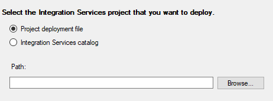
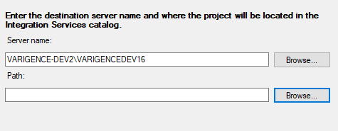
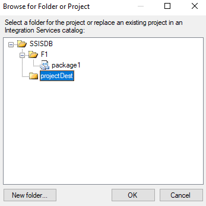
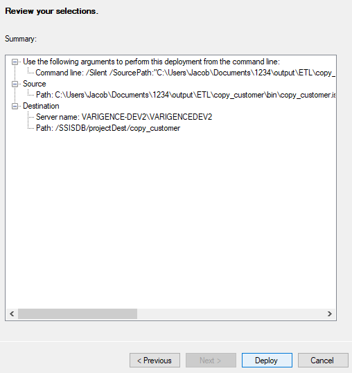

# Deployment Through the SSIS Deployment Wizard

<!-- TODO: Now walk-through yet for an SSIS Implementation.  
For a walk-through of creating a BimlFlex solution that targets SSIS, review the [Synapse Implementations](xref:bimlflex-synapse-implementation).
-->

You have generated your SQL Server Integration Services (SSIS) assets, and are ready to deploy. This document will discuss deployment using the SSIS Deployment Wizard to deploy the SSIS projects that were generated by BimlFlex. For information on how to deploy using the PowerShell, review our [Deployment Through PowerShell](xref:bimlflex-ssis-using-powershell).

## Launching the Wizard

In order to use the Deployment Wizard, the user must first locate and launch it. In order to do so, the user has two options.

1. Look up the term **SQL Server Deployment Wizard** in the Windows Search.
1. Locate the file named ISDeploymentWizard.exe under the SQL Server installation folder; for example: `C:\Program Files (x86)\Microsoft SQL Server\130\DTS\Binn`.

## Steps for Deployment

After launching the wizard, follow these steps.

1. Select the Integration Services project that you wish to deploy. Click the *Browse* button and locate the .ispac file that corresponds to the project that you wish to deploy. The desired .ispac file will be located in a path similar to the one listed below. [ProjectName] corresponds to the name of the project that you wish to deploy.

    `../output/[ProjectName]/bin/[ProjectName]_project.ispac`

    

1. Enter the destination server name and the folder that will house the project in the Integration Services catalog. Simply browse and select your desired server and then **Browse** and select your desired SSIS Folder. This value should typically be the same as your SSIS Folder value in your BimlFlex settings.

    

    >[!IMPORTANT]
    > The user must ensure that the SSIS catalog exists on the destination server.

    

1. Review and Deploy. Ensure that everything has been set up correctly and then click Deploy.

    

    Observe that the project has successfully deployed. Once the project has been deployed, the user should deploy the next project in solution.
