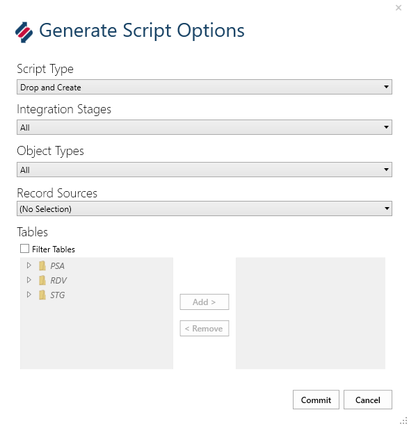

# SSIS with on-premises SQL Server

This document describes the steps and considerations for extracting data from a **Source** database and moving it through **Staging**, **Persisted Stage**, **Data Vault**, and **Business Data Vault** on an on-premise SQL Server.

## Source to Stage (STG) and Persisted Stage (PSA)

### Create BimlStudio Project and BimlFlex Customer Metadata

A prerequisite for this guide is that the BimlFlex project exists with Customer Metadata.

See [BimlFlex Initial Configuration](xref:bimlflex-getting-started-initial-configuration) for information on creating a BimlFlex project.

#### Configure BimlStudio Project Target Architecture

For on-premises SSIS project architecture, ensure that the BimlStudio project is enabled to use Project Deployment.


### BimlFlex Customer Metadata

In BimlFlex, start with applying Sample Metadata: `01 - Starting Point for MSSQL`. This scenario uses this sample metadata as a starting point for all examples.


#### Import the Source Metadata from AWLT2012

See [BimlFlex Importing Metadata](xref:bimlflex-concepts-importing-metadata) for more detail.


### Set up delete detection

If the project requires delete detection, it should be set up when configuring the project metadata.

- See [BimlFlex Delete Detection](xref:bimlflex-concepts-delete-detection) for more detail.


- Repeat previous steps
  - BimlStudio: Refresh Metadata
  - BimlStudio: Create and Deploy Table Scripts
  - BimlStudio: Build Package
  - Update LastLoadDate to allow re-retrieval of data:
  
```sql
UPDATE [BimlCatalog].[bfx].[ConfigVariable]
  SET [VariableValue] = '1900-01-01', PreviousValue = NULL
WHERE VariableName = 'LastLoadDate'
  AND SystemName = 'AWLT_SRC'
```

- Run Packages
  - 01_EXT_AWLT_SRC_Batch.dtsx
  - 01_DEL_EXT_AWLT_SRC_Batch.dtsx
- Now Test the record deletion

- Test Delete

```sql
DELETE FROM [AdventureWorksLT2012].[SalesLT].[Product] WHERE [Name] = 'Test Cycle'

-- Re-Run the Packages (01_EXT_AWLT_SRC_Batch and 01_DEL_EXT_AWLT_SRC_Batch) and Validate the Data
SELECT Color, * FROM [BFX_STG].[awlt].[Product] -- Should have no records
SELECT * FROM [BFX_STG].[awlt].[Product_DEL] -- Should have a single record with the correct ProductId

SELECT Color, * FROM [BFX_ODS].[awlt].[Product] WHERE [Name] = 'Test Cycle'  -- Should have at least one record with FlexRowChangeType = D
SELECT * FROM [BFX_ODS].[awlt].[Product] WHERE [Name] <> 'Test Cycle' -- Should not have changed from previous query
```

### Configure Project Parameters and Metadata for STG and PSA

Objects, Columns, Parameters, and Attributes may need to be modified. For examples of changes that can be made see the [First Project Walkthrough](xref:bimlflex-getting-started-first-project-walkthrough). For information on how to manipulate metadata see the [Metadata Editors Overview](xref:metadata-editors-overview).

### Accelerate and Publish Stage and Persisted-Stage Metadata

Accelerate and publish the STG and PSA metadata so that the project can be build and deployed. For information on how to accelerate and publish, see the [Data Vault Accelerator](xref:bimlflex-data-vault-accelerator).

### BimlStudio: Generate and Deploy DDL Scripts

Grab Create Table Scripts


Deploy Create Table Scripts


BimlStudio: Build SSIS packages for the target version


This will create a .dtproj which can be opened for debugging in your target Visual Studio version.

#### Deploy database artifacts through the SSDT project

DDL can also be deployed through the SSDT project. To deploy this way, go to the output folder created above and open the .dtproj file in the `EXT_AWLT_SRC` folder


#### Test run SSIS packages (Run 01_EXT_AWLT_SRC_Batch.dtsx), validate data loaded to target


#### Validate data in SQL Management Studio

Data results can be validated SSMS by querying the data from the STG and PSA databases.

```sql
SELECT * FROM [BFX_STG].[awlt].[Product]
SELECT * FROM [BFX_ODS].[awlt].[Product]
```

#### Validate logging happening to BimlCatalog/Logging schema

BimlCatalog will track actions taken during this process. Query the BimlCatalog Execution table to see the record of the Batch that was executed.

```sql
SELECT * FROM [BimlCatalog].[bfx].[Package] p
INNER JOIN [BimlCatalog].[bfx].[Execution] e
ON e.PackageID = p.PackageID
WHERE p.PackageName = '01_EXT_AWLT_SRC_Batch'
```

---

## Data Vault (DV)

After Stage and Persisted Stage steps have been completed - setup can begin for the Data Vault step of this process.

In this scenario, setting up the DV will include the following steps.

1. Configure the DV Project
1. Apply modeling overrides to the source metadata
    a. Object overrides
    b. Column overrides
1. Add a link source object and map it to the unit of work
1. Configure the system to accelerate LSAT entities
1. Split a satellite
1. Join links into a single unit of work
1. Publish metadata and create run BS scripts
1. Add a virtual hub entity as a staged query
1. Create Staging and Persistent Staging databases and tables using BimlStudio Script
1. Create a Virtual Hub as a Staged Query for the Culture column on from the staged `[awlt].[ProductModelProductDescription]` table
1. Create BDV database and tables using BimlStudio script
1. Build SSIS Packages for the target version
1. Deploy database artifacts through the SSDT project
1. Test run SSIS packages and validate the data that is loaded to the DV

### Configure the DV Project

1. Change the DV connection's connection type.
1. Enable acceleration of Linked Satellites.

#### Change the DV connection's connection Type

1. Navigate to **Connections**  
  
1. Select the BFX_DV Connection  
  
1. Change the Connection Type to "OLEDB" or "OLEDB with ELT" and save  
  

At this point, the DV can be configured to work with ETL or ELT. For ETL choose the standard Connection Type, i.e. "OLEDB". For ELT choose the connection type that specifies ELT, i.e. "OLEDB with ELT".

### Model Data Vault Metadata

Objects, Columns, Parameters, and Attributes may need to be modified. For examples of changes that can be made see the [First Project Walkthrough](xref:bimlflex-getting-started-first-project-walkthrough). For information on how to manipulate metadata see the [Metadata Editors Overview](xref:metadata-editors-overview).

### Accelerate and Publish

To complete the DV setup in BimlFlex, accelerate all tables and publish. For information on how to accelerate and publish, see the [Data Vault Accelerator](xref:bimlflex-data-vault-accelerator).

1. In the **Accelerator**, select all tables then click **Publish**  
1. In BimlStudio, generate the Create Table scripts again  
1. Run the generated scripts in SQL Server  
1. Build the BimlStudio Project  

#### Run SSDT Projects

The SSDT Projects can be used to deploy database artifacts and run SSIS packages.

---

## Business Data Vault (BDV)

The BDV is a set of materialized constructs that generally focus on either performance improvements or providing easier structures to query off of.  The two entities currently support are the **Point in Time** (PIT) and **Bridge** (BRG) structures.

BimlFlex implements these artifacts using tables for data storage, Stored Procedures for loading and SSIS packages for orchestration.

### Bridge (BRG) Tables

The BRG constructs allow multiple LNKs surrounding a HUB to be combined in one table, and optionally the business keys from the HUBs associated with the LNKs, minimizing the required joins.  This makes it easier to query from and can also lead to a significant performance increase depending on the size and configuration of the HUBs and LNKs.

> [!IMPORTANT]
> BimlFlex implements all BRG tables starting from a single business concept, i.e. HUB. Once a HUB is selected, you want to ensure you keep N-1 (or many-to-one) flow from the central business concept.  
>
> You can attach objects of HIGHER grain with no issues, however.  If your central business concept was for instance `Product`, going to `ProductCategory` is perfectly acceptable as it preserves the grain.  However, going in the opposite direction will likely not have the desired effect as you are breaking the fundamental grain of the business concept.

### Point In Time (PIT) Tables

For insert-only Data Vault solutions, the PIT constructs provide a convenient way to recreate timelines and end date records so that timeline-sensitive queries are easier to create. This is also useful when a HUB has multiple SATs attached and there is a requirement to query data from several of these SATs for a specific date and time.

### Model Business Data Vault Metadata

Make any necessary changes to the Business Data Vault Metadata. For more information about BDV and modeling changes that can be made, see the Business Data Vault Model section of the [First Project Walkthrough](xref:bimlflex-getting-started-first-project-walkthrough).

### Creation and Deployment of BDV Entities

Once the BDV entities are modeled we will need to deploy the structures.  For this we use BimlStudio.  By default, BimlStudio will attempt to build all our artifacts.  Before we can do that we will require that the entities exist else we will get an error when attempting to validate the SSIS packages.  This is resolved by first generating and executing the [Create Tables Script] before building.  BimlStudio will also build an SSDT project should you want the ability to deploy via DACPAC or publish directly from Visual Studio.  The following section outlines the steps required to add new BDV entities (PITs and/or BRGs) to the Data Vault.

> [!IMPORTANT]
> Please ensure you follow prior deployment guides for STG, PSA, and DV.

#### Manually Deploy Tables

If you are not in a CI/CD environment, or perhaps only testing, it can be quicker to manually deploy the artifacts.  This is done by using the **Generate Scripts** function inside BimlStudio.  Once generated you can then deploy these to a target server of your choice.

> [!WARNING]
> These scripts are `DROP AND CREATE` by default.  This means they are destructive.  If manually deploying tables please ensure you are in a database where it is safe to do so.

1. Open up your BimlFlex BimlStudio Project.  
1. Click the BimlFlex tab.  
  
  
   > [!IMPORTANT]
   > There is currently a bug in BimlFlex.  The intended steps are as follows but the BDV does not output with the below steps.  Until resolved (or if running an older bugged version) one should ignore steps 3 through 7.
1. Click the  button to access the Script Options Dialog.  
  
1. Under Integration Stages click the dropdown  
  
1. Click the `None` checkbox to clear selections  
  
1. Click the `Business Data Vault` checkbox.  
  
1. Click `Commit`  
1. Click the *Generate Scripts* button to show the dropdown menu.  
  
1. From the *Generate Scripts* dropdown box choose `Create Table Script`.  
1. Copy the outputted script.  
   > [!TIP]
   > [Ctrl] + [A] = Select All
   > [Ctrl] + [C] = Copy to Clipboard
1. Open SQL Server Management Studio (SSMS).  
   > [!NOTE]
   > Alternatively you could use any other preferred tool to execute DDL SQL statements.
   > Generated scripts are generated in the ANSI standard.
1. Paste the script from Step 9 into a new query window  
   > [!TIP]
   > [Ctrl] + [V] = Paste from Clipboard
1. Execute the script.  
   > [!TIP]
   > If using SSMS you can use the following key.
   > [F5] = Execute Query
1. Back in BimlStudio click the [Build & Deploy] tab.  
  
1. Click the **Build** button.  

#### Deploying Artifacts with SSDT

If you are working with a previously populated environment you will often not want to `DROP` artifacts and instead publish an incremental deployment.  As part of the build process, BimlStudio/BimlFlex will build an SSDT project to allow for customizable deployment.

Publishing projects via SSDT (or the built DACPAC) is the equivalent of running Create Table Scripts, Data Vault Default Insert Script, Data Vault Procedure Script by Source, and the Business Vault Procedure Script from the Generate Scripts utility for the **Data Vault** and **Business Data Vault**.

1. Open Visual Studio 2019 or SQL Server Development Tools (SSDT).  
   > [!TIP]
   > If you are unsure as to what version of SSDT you require, please refer to the link below.
   > [Download SQL Server Data Tools (SSDT) for Visual Studio](https://docs.microsoft.com/en-us/sql/ssdt/download-sql-server-data-tools-ssdt?view=sql-server-ver15)
1. Click File -> Open -> Project/Solution...  
1. Navigate to your root BimlStudio project folder.  
   > [!NOTE]
   > If you do not know your root project directory and have the project open do the following:
   > 1. Go to BimlStudio.
   > 1. Under Logical View or Project View, Right-Click your project.
   > 1. Choose Open in Windows Explorer.
   > 1. You are now in your project root directory.
   > 1. (Optional) Copy the path to the clipboard for quicker navigation in SSDT.
1. Open the `output` folder.  
1. Open the `SSDTS` folder.  
1. Open the folder with your `Customer GUID`.  
1. Open the folder for the `Version` you just built.  
1. Open the `BFX_DV` folder.  
1. Select the `BFX_DV.sqlproj` file and click **Open**.  
1. Navigate to the  Solution Explorer on the right.  
  
1. Right-Click the project `BFX_DV`.  
  
1. Select *Publish...* to get the Publish Database dialog box.  
  
1. Configure your *Target database connection* by clicking **Edit** to get the Connect dialog box.  
  
1. In the Connect dialog box expand the Connection Properties by clicking *Show Connection Properties*.  
  
1. Input the Server Name.  
   > [!NOTE]
   > If testing on your local machine this can be abbreviated at "."
1. Choose Authentication.  
   > [!NOTE]
   > The demo lab uses Windows Authentication.
1. Input the Database Name.  
   > [!NOTE]
   > The demo uses "BFX_DV".
1. Click **OK**.  
1. Click **Publish**  
   
1. The Data Tools Operations window should appear.  
   
1. Wait for deployment to complete.  
   
1. Deployment via SSDT complete.  

   > [!IMPORTANT]
   > It should be noted again that this is only for the DV / BDV layer.  This does not deploy any Staging (STG) or Persistent Staging (PSA) tables or artifacts.  Additionally, this is only for the tables and does not include any SSIS packages that may be required.

---

### Execution of SSIS Packages

Once the projects are built the next step in the process is to execute the packages and load the data.  The following sections will walk you through navigating to the default output folder, finding the projects and executing them.

> [!NOTE]
> This article will assume your output folder is in the default location.  This can be changed in the properties of the BimlStudio project itself.  You can find this by going to Logical View, Right-Click the BimlStudio project, and choosing *Properties*.  From here select *Build* on the left menu and look at the Output Path setting.

> [!IMPORTANT]
> If you are using settings besides the default proceed straight to Step 3 manually navigating to your custom output folder.

1. Open Visual Studio 2019 or SQL Server Development Tools (SSDT).

1. Click File -> Open -> Project/Solution...

1. Navigate to your root BimlStudio project folder.

   > [!NOTE]
   > If you do not know your root project directory and have the project open do the following:
   > 1. Go to BimlStudio.
   > 1. Under Logical View or Project View, Right-Click your project.
   > 1. Choose Open in Windows Explorer.
   > 1. You are now in your project root directory.
   > 1. (Optional) Copy the path to the clipboard for quicker navigation in SSDT.

1. Open the output folder.

1. Open the LOAD_BFX_DV folder.

1. Select LOAD_BFX_DV_Project.dtproj and click *Open*.

1. Run SSIS Packages
