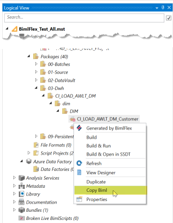
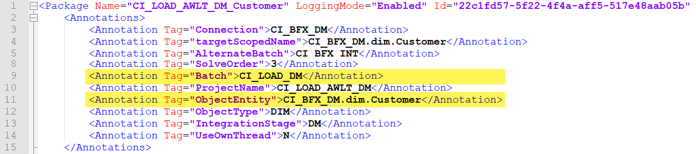
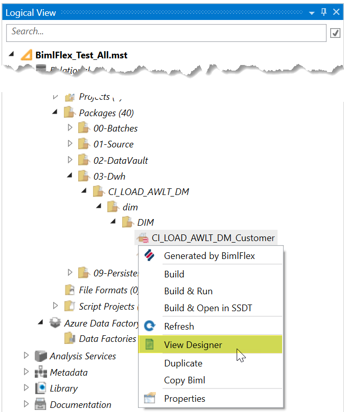
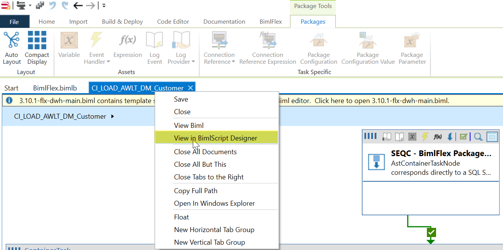

# How to find the Extension Point target

Sometimes you want to customize the package and add an `Extension Point` and you require two things, the name and target.

## Option 1

* If you know the `Extension Point` and just need the target you can `Right Click` the Object that you want to apply it too and click `Copy Biml`.

* Paste the `Biml` in `Notepad` or `Notepad ++`. We are using Notepad ++ and have set the language to `XML` to enable highlighting. 
* You can now copy either the `Batch` or `ObjectEntity` depending on your extension point scope.

## Option 2

* This is a bit more technical and require some knowledge of `Biml`. `Right Click` the Object that you want to apply it too and click `View Designer`.

* Right Click on the tab with the package name in this case `CI_LOAD_AWLT_DM_Customer` and then click `View in BimlScript Designer`

* On the `BimlScript` Tab click `Update Preview`.
* In the `Preview Expanded BimlScript` scroll to the place in the code where you would like to inject your `Extension Point` and you will see a `XML` comment with the target you can use.
* If you choose the objects parent name you will need to remember to set `CustomOutput.ObjectInherit = true;`

