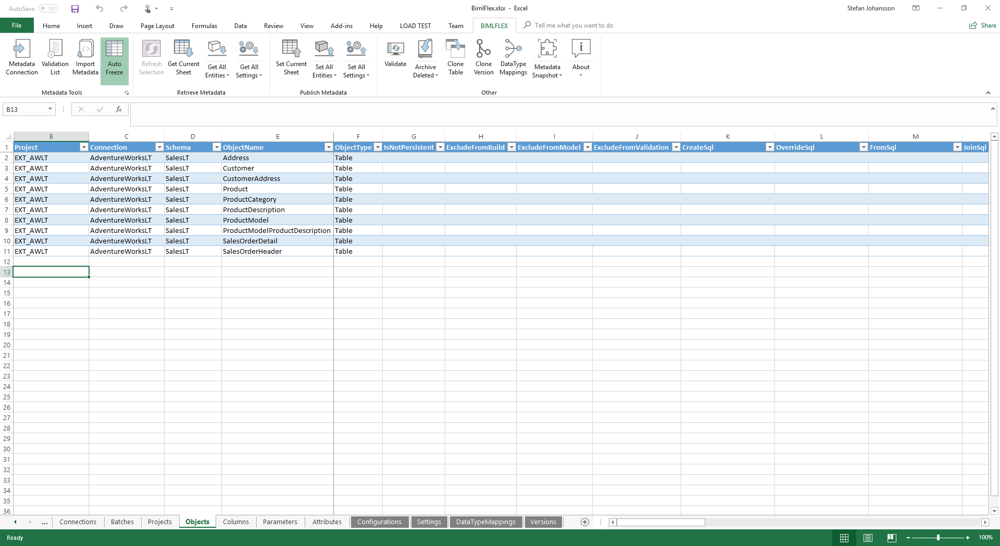
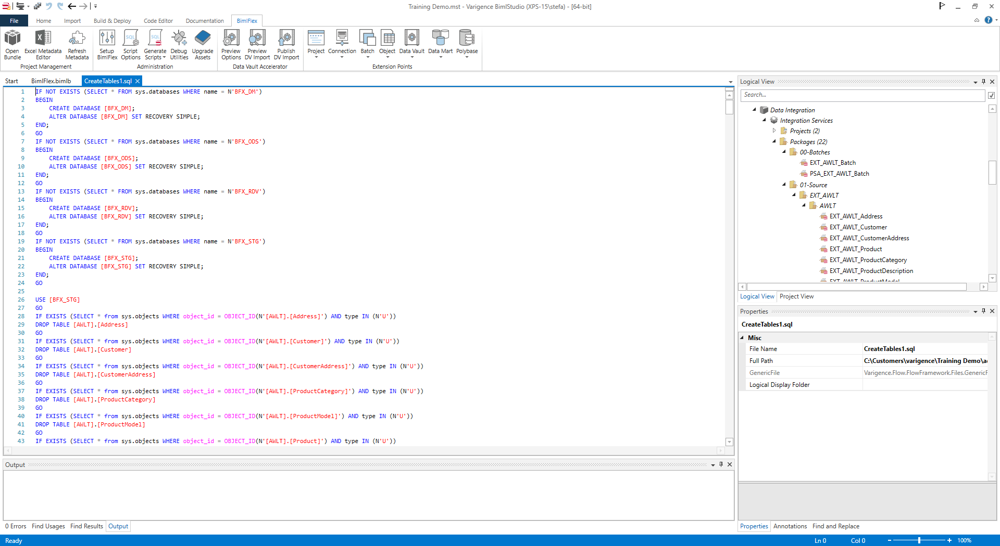
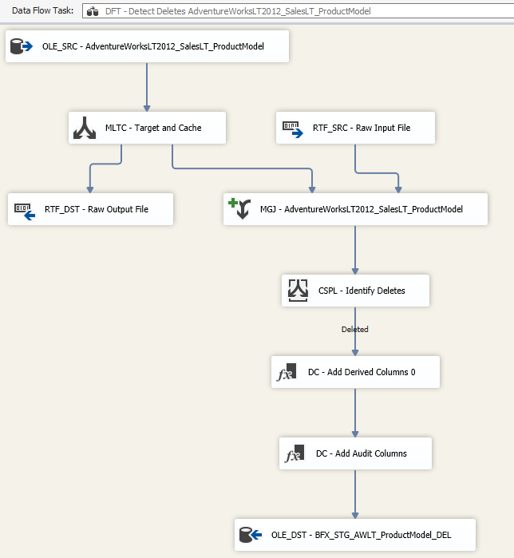

# BimlFlex Implementer Training

## Introduction

<small>Copyright &copy; Varigence 2018 - [Varigence](https://varigence.com) / [@varigence](http://twitter.com/varigence)</small>

note:
Welcome to this BimlFlex Implementer Training
This training will walk through the following content throughout x number of days

Series:

TODO: Update based on new structure

10 - Introduction and overview
     architecture and solution design (cloud vs on-prem, tables or blob storage etc)
     BimlFlex workflow
20 - tba
30 - setup and configuration of bimlflex env, settings and configurations of metadata
40 - modelling introduction and details for
     Soruce/Staging modelling, delta detaction, persistence logic
     Data Vault
     Data Marts/Dimensional modelling
     business data vault modelling
     pit/brg
50 - Source To Target implementations in BimlFlex
     source to staging 
     staging to data vault
     staging to dimensional/data mart
     modelling and implementation
     business vault
     pit/brg
     intermediary/abstraction layers with views. 
60 - ci/cd devops, deployment pipelines
70 - orchestration and load patterns
     scheduling, batches
     bimlcatalog orchestration, parameter values, logging auditing

---

# Agenda

|Day   |Agenda|
|---   |---   |
|Day 1 | Introduction |
|      | Setup|
|      | Source to Staging|
|      | Implementation labs|
|Day 2 | Source to Staging |
|      | Orchestration, executions, BimlCatalog|
|Day X | Data vault modelling primer|
|      | Model Data - Target State |
|      | ELM, ensemble logical modelling|
|      | Load Data Vault |
|      | Business Rules and constructs |
|      | Load Data Mart |

Based on EML, load source data and model/implement using BimlFlex  
Modelling in Visual Studio Code using PlantUML

---

# What is BimlFlex?

BimlFlex is a collection of templates, metadata definitions, and tooling that enables you to build an end-to-end data solution without ever writing a single line of code.

It is built on BimlStudio and uses the Biml language for extensions and bespoke code.

The BimlFlex workflow allows a modeler to organize metadata to fit business requirements and a developer to implement the solution using databases, SSIS packages and SQL artefacts

---

# The BimlFlex modelling experience

## Excel today

BimlFlex Currently integrates with Excel to provide the data modelling experience



---

# The BimlFlex modelling experience

## Next gen web-based app

BimlFlex is gearing up to support a web-based app for modelling that will allow for a more tailored experience

TODO: Add Image/screenshot


---

# The BimlFlex development experience

## BimlStudio

BimlFlex is built on BimlStudio, the development environment for Biml.  
It is a Visual Studio-like development environment that can build and generate SSIS Packages for ETL and SQL scripts for DDL and ELT



---

# Sample results

## SSIS Projects

Sample SSIS package part



---

# Sample results

## SQL DDL script for tables

```sql
USE [BFX_STG]
GO
IF NOT EXISTS (SELECT * FROM sys.schemas WHERE name = N'AWLT')
EXEC ('CREATE SCHEMA [AWLT] AUTHORIZATION [dbo]')
GO
IF NOT EXISTS (SELECT * from sys.objects WHERE object_id = OBJECT_ID(N'AWLT') AND type IN (N'U'))
CREATE TABLE [AWLT].[Address]
(
-- Columns Definition (abridged)
     [Address_BK] nvarchar(100) NOT NULL
,    [AddressID] int NOT NULL
,    [FlexRowEffectiveFromDate] datetime2(7) NOT NULL
,    [FlexRowAuditId] bigint NOT NULL
-- Constraints
,CONSTRAINT [PK_AWLT_Address] PRIMARY KEY CLUSTERED
(
  [Address_BK] Asc, [FlexRowEffectiveFromDate] ASC)
  WITH (PAD_INDEX = OFF,IGNORE_DUP_KEY = OFF) ON "default"
)
ON "default"
WITH (DATA_COMPRESSION = PAGE)
GO
```

---

# Sample results

## SQL Stored Procedure, PIT Load Process

```sql
CREATE PROC [rdv].[flex_PIT_Product]
    /* Placeholder for Initialize extensionpoint="RdvPitSql" (CustomOutput.RdvPitAddParameter) */
AS
SET NOCOUNT ON
DECLARE @Lag INT = -1
DECLARE @FlexRowEffectiveFromDate DATETIME2(7) = ISNULL((
            SELECT   DATEADD(DD, @Lag, MAX([FlexRowEffectiveFromDate]))
            FROM    [rdv].[PIT_Product]
            /* Do not reload the initial load. To reload the PIT it must be truncated */
            WHERE    [FlexRowEffectiveFromDate] > ISNULL((
                        SELECT   MIN([FlexRowEffectiveFromDate])
                        FROM     [rdv].[PIT_Product]
                        WHERE    [FlexRowEffectiveFromDate] > '0001-01-01 00:00:00.000'
                        ), '0001-01-01 00:00:00.000')
            /* Placeholder for Initialize extensionpoint="RdvPitSql" (CustomOutput.RdvPitDateWhereSql) */
```

---

# Thank You

## Let us know: #Biml

<br/>

BimlFlex sales: [sales@varigence.com](mailto:sales@varigence.com)

BimlFlex enterprise support: [bimlflex-support@varigence.com](mailto:bimlflex-support@varigence.com)

BimlFlex Documentation: [https://varigence.com/Documentation/BimlFlex](https://varigence.com/Documentation/BimlFlex)

<small>Copyright &copy; Varigence 2018 - [Varigence](https://varigence.com) / [@varigence](http://twitter.com/varigence)</small>