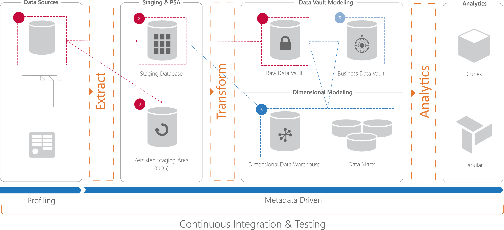

# BimlFlex Implementer Training

## Introduction

<small>Copyright &copy; Varigence 2018 - [Varigence](https://varigence.com) / [@varigence](http://twitter.com/varigence)</small>

note:
Welcome to this BimlFlex Implementer Training
This training will walk through the following content throughout x number of days

---

# The BimlFlex architecture

Overview of options for architectural layers

---

# Layers

data stored and organized in layers
layered approaches

staging for load deltas
persistent for historical loads
raw data vault for unaltered versions of modelled data from source
business data vault interpreted from raw
optimisation layers, pit, brg
dimensional model layer, presentation layer

---

# Paths and storage options

databases, one or many, location, load patterns
elt/etl
implementing business rules
staging and persistence as tables or blob storage files

Depending on the solution architecture and implementation choices made BimlFlex will move and store data in different locations using different approaches.

A common on-premises approach is to use SSIS to load data from source to SQL Server databases. All data in the Data Warehouse is stored in the SQL Server databases.

A common cloud approach is to use SSIS or other file generation approach, create flat files that are moved to Azure Blob storage and then read into Azure SQL Data Warehouse using PolyBase.

---

# Common architecture scenarios

* On-premises/Cloud VM SQL Server and SSIS ETL
* On-premises sources to Azure SQL Data Warehouse using SSIS and ELT
* Cloud implementations in Azure SQL Data Warehouse using ELT
* Cloud implementations in Snowflake

---

# Thank You

## Let us know: #Biml

 

BimlFlex sales: [sales@varigence.com](mailto:sales@varigence.com)

BimlFlex enterprise support: [bimlflex-support@varigence.com](mailto:bimlflex-support@varigence.com)

BimlFlex Documentation: [https://varigence.com/Documentation/BimlFlex](https://varigence.com/Documentation/BimlFlex)

<small>Copyright &copy; Varigence 2018 - [Varigence](https://varigence.com) / [@varigence](http://twitter.com/varigence)</small>