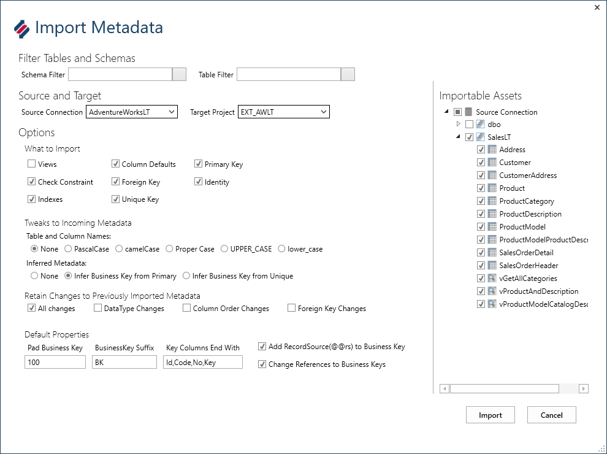

# BimlFlex Implementer Training

## BimlFlex Developer Workflow

<small>Copyright &copy; Varigence 2018 - [Varigence](https://varigence.com) / [@varigence](http://twitter.com/varigence)</small>

note:
Welcome to this BimlFlex Implementer Training
This training will walk through the following content throughout x number of days

---

# Developer Workflow

Import and model data, develop and extend in BimlStudio, run through pipeline to test and deploy

---

# Configuration and control

use the configurations and settings to control framework behavior

use connection definitions and projects to control solution architecture

---

# Metadata Ingestion

Import information about source tables into BimlFlex metadata through the import metadata function

Tweak imported metadata by adding Business Key definitions, references, expressions, data type mappings, custom SQL and more

---

# Modelling Data

Using Excel to model source data and data warehouse data. 

* Apply business rules and expressions to source queries and columns
* Model override names for staging and Data Vault layers
* Expand data types
* Configure Source to Target mappings
* Prepare for acceleration of source model to Data Vault
* Create load parameters

---

# Development and building in BimlStudio

Once metadata is organized, the processing can be expanded in BimlStudio.

BimlStudio provides a development environment for extending and changing the existing patterns through Extension Points. This allows custom logic to be applied when needed.

BimlStudio create all SQL artefacts, table definitions, stored procedures as well as build all SSIS projects and packages.

---

# Accelerating Data Vault objects

BimlFlex uses the accelerator to create Data Vault objects from source data structures when needed. This allows for rapid prototyping and model generation.

Tweak metadata to match the prepared ELM so that the sources populate the desired Data Vault model.

---

# Adding custom logic through Extension Points

The Extension Point framework allows the developer to add bespoke code to extend or change the behavior of the default patterns.

Common scenarios:

* Add project parameters to SSIS projects
* parameterize connection strings for connections

---

# Thank You

## Let us know: #Biml

 

BimlFlex sales: [sales@varigence.com](mailto:sales@varigence.com)

BimlFlex enterprise support: [bimlflex-support@varigence.com](mailto:bimlflex-support@varigence.com)

BimlFlex Documentation: [https://varigence.com/Documentation/BimlFlex](https://varigence.com/Documentation/BimlFlex)

<small>Copyright &copy; Varigence 2018 - [Varigence](https://varigence.com) / [@varigence](http://twitter.com/varigence)</small>