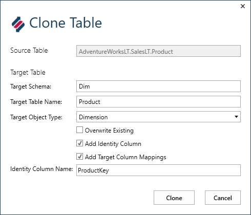

# Dimensional Model

## Supporting Videos

TODO: Coming Soon

## Supporting BimlFlex Documentation

@bimlflex-user-guide

## Implementing a Dimensional Model

### Overview

The dimensional model, Data Mart, is optimized for analytical tools, end user queries and for building models for Analysis Services cubes and tabular models.

This type of layer has many names, Information Mart, Data Mart, Kimball Model, Dimensional Model, Reporting Layer, Semantic Layer. They can be either Raw, without business rules applied, or refined with any number of filters, rules and data processing steps applied. BimlFlex allows the rapid creation of any of these constructs by applying a metadata driven modelling and generation process.

This article describes the creation of a classical dimensional model either on top of the staging layer for non-Data Vault implementations or on top of the Data Vault and Point In Time and Bridge constructs.

It follows the general dimensional approach of building Fact tables that contain metrics and connections to Dimension members and Dimension tables that contain descriptive attributes.

While the Raw Data Vault is loaded with uninterpreted data, the Dimensional model normally require that a set of Business rules are applied to the data so that it is fit for the required analytical purpose. In the process of creating the end to end solution it is common to also create raw versions of these artefacts that are used to refine the business rules used to create the final model.

In this process a set of Fact and Dimensional source views are created, based either on the staging tables or on the Data Vault and Point In Time and Bridge tables in the Data Vault layer. These are used to populate a dimensional model in a Data Mart as a presentation/reporting layer.

Querying the Data Vault layer is made easier by utilizing the Point In Time and Bridge tables. To also include relevant contextual data it is necessary to join from these constructs to any Satellite that contains effectiveness information as well as the metrics or attributes needed. By using the time slice information in the Satellites the relevant record for the event date time is added to the dimensional model.

### Architecture

The Dimensional model is created in the BimlFlex metadata in the form of a source to target mappings set of objects and columns. The source is generally implemented as a view on top of the existing staging or Data Vault constructs. For Data Vault, this includes tables from the Raw Data Vault, Business Vault constructs, Point In Time and Bridge tables and any extra required interpretation views and abstraction views that are required to feed the dimensional model.

For the BimlFlex trial, a set of views are created and used as the source for the dimensional model. These views can contain any number of business rules that are required for the Dimension and Fact table loads. In a production scenario the layered loads generally starts from the Raw Data Vault tables, implements a set of Business Data Vault constructs such as Satellites with Business Rules applied and Same As Links, implements a set of Point In Time and Bridge constructs and lastly manages a set of abstraction views that the dimensional model reads from.

### Querying the Point In Time and Bridge tables

Once the Point In Time and Bridge tables are created it is possible to query them. For a dimension destination the query normally gathers all attributes for an entity over time, with some attributes as type 1 change tracking and some as type 2. A fact source normally identifies an event that is stored in a Link or Satellite. The event can be defined by an event date time, such as the time a sale took place. This date time is then used to identify any additional attributes across the Satellites and their timelines.

Sample Dimension Query:

```sql
-- (c) Varigence 2018
-- Sample Dimension source view on top of PIT and Satellites

-- create schema if required
IF NOT EXISTS (SELECT * FROM sys.schemas WHERE name = N'rdvsrc') EXEC ('CREATE SCHEMA [rdvsrc] AUTHORIZATION [dbo]')
GO

-- purge existing view
IF EXISTS (SELECT * from sys.objects WHERE object_id = OBJECT_ID(N'[rdvsrc].[DimProduct]') AND type IN (N'U'))
DROP VIEW [rdvsrc].[DimProduct]
GO

-- create source view
CREATE VIEW [rdvsrc].[DimProduct] AS

    SELECT  p.PIT_Product_SK AS ProductKey ,
            p.Product_SK AS ProductSKey ,
            p.Product_BK AS ProductBKey ,

            -- Record effectiveness is derived from the Point In Time table. Use these for the Fact table lookup
            p.FlexRowEffectiveFromDate ,
            p.FlexRowEffectiveToDate ,

            --pick an approach for the Record Source if it is needed in the Dimensional Model
            COALESCE(sp.[FlexRowRecordSource], spp.[FlexRowRecordSource], 'Unknown') AS [RecordSource] ,

            -- derives the latest date time any satellite was updated.
            (SELECT MAX(LastUpdateDate)
                FROM (VALUES (sp.[FlexRowEffectiveFromDate]),(spp.[FlexRowEffectiveFromDate])) AS UpdateDate(LastUpdateDate))
            AS LastModified,

            -- add all required attributes from linked sattelites
            sp.[Name],
            sp.ProductNumber,
            sp.Color,
            spp.ListPrice

    FROM    rdv.PIT_Product p

            -- Left Join to include rows where Satellites have no data for a given Core Business Concept
            -- Join on the specific Surrogate key and the identified timeslice EffectiveFromdate for the Satellite
            LEFT OUTER JOIN [rdv].[SAT_Product_AWLT] sp ON p.SAT_Product_AWLT_Product_SK = sp.Product_SK
            AND p.SAT_Product_AWLT_FlexRowEffectiveFromDate = sp.[FlexRowEffectiveFromDate]

            LEFT OUTER JOIN [rdv].[SAT_Product_Price_AWLT] spp ON p.SAT_Product_AWLT_Product_SK = spp.Product_SK
            AND p.SAT_Product_AWLT_FlexRowEffectiveFromDate = spp.[FlexRowEffectiveFromDate];
GO

-- SELECT * FROM [rdvsrc].[DimProduct]
```

Sample Fact Query:

```sql
TODO: Add sample fact query
```

## Detailed Steps

The following detailed steps walks through the creation of the Dimensional Model from Data Vault

### Creating the source views for the dimensional model

The views used as sources for the dimensional model can either be managed and source controlled through the BimlFlex metadata or through the SQL Server Data Tools project for the databases. Use the approach most compatible with the deployment pipeline used. In the trial they are added to the Metadata through the Excel Sheet, so that they are included in the create table statements and are easily created either through the script option or through the generated SSDT project.

The views are imported in to BimlFlex as a source.

In the trial, for the Data Vault source, they are co-located with the Data Vault tables, in a separate `src` schema to indicate the are sources for further loading in to the data warehouse.

In the trial, for the 2 layer dimensional model from staging tables, they are created in the staging database, in a separate `src` schema to indicate the are sources for further loading in to the data warehouse.

It is also possible to place them in a roleplaying source database, the Data Mart database or the staging database for more or less obvious separation of concern.

Source Views

Data Vault Based:

TODO: Add links to script files

* [Customer Dimension](TODO)
* [Date Dimension View](TODO)
* [Product Dimension](TODO)
* [SalesOrder Fact](TODO)

Staging, 2-layer, Based:

TODO: Add links to script files

* [Customer Dimension](TODO)
* [Date Dimension View](TODO)
* [Product Dimension](TODO)
* [SalesOrder Fact](TODO)

### Creating the Date Dimension

The Date Dimension in the trial process uses a view to present the full dimension to the presentation layer. There are numerous considerations for date dimensions and its processing and updating. In this scenario, the Date dimension is a straightforward set of dates from the SalesOrder table, with a Smart Key and a few attributes.

This approach illustrates both Dimensions that aren't loaded through BimlFlex and Dimensions with Smart keys that don't need a lookup in the Fact table load. For Dimensions with an identity column Primary Key the Fact load needs to look up the Business Key Value in the dimension table to get the corresponding Integer key. For Smart Keys, the Value in the Dimension Table is deterministic and can be derived in the Fact table load without the need for the lookup. This is similar to the Hash keys used in the Data Vault, where a Satellite load doesn't need to look up the corresponding Hub key.

Sql view Definition

```sql
USE [BFX_DM]
GO
IF NOT EXISTS (SELECT * FROM sys.schemas WHERE name = N'Dim') EXEC ('CREATE SCHEMA [Dim] AUTHORIZATION [dbo]')
GO
IF EXISTS (SELECT * from sys.objects WHERE object_id = OBJECT_ID(N'[Dim].[Date]') AND type IN (N'V'))
DROP VIEW [Dim].[Date]
GO
CREATE VIEW [Dim].[Date]
AS
    SELECT DISTINCT
         CONVERT(INT, (CONVERT(VARCHAR(8), OrderDate, 112))) AS DateKey
        ,CONVERT(DATE, OrderDate) AS [Date]
        ,DATENAME(yyyy, OrderDate) AS [Year]
        ,DATENAME(month, OrderDate) AS [MonthName]
    FROM [BFX_RDV].[rdv].[SAT_SalesOrder_AWLT]
```

Note that the view is placed directly in the Data Mart using the Dim schema. It also has the `ExcludeFromBuild` flag set to `Y`. This will allow BimlFlex to include the object in the modelling without creating a load package for it. As it is a self-contained entity consisting of only the view definition it does not need an additional table or a load process. In most real-world scenarios the Date, Time and Period dimension requirements are more comprehensive and BimlFlex supports Date dimensions in tables loaded from a source similar to the other dimensions here. It also supports the normal post-processing steps for updating current flags and other house keeping. These more advanced steps are considered out of scope for the trial process

Source Object Metadata

| Project     | Connection | Schema | ObjectName     | ObjectType | IsNotPersistent | ExcludeFromBuild |
| ----------- | ---------- | ------ | -------------- | ---------- | --------------- | ---------------- |
| LOAD_BFX_DM | BFX_DM     | Dim    | Date           | Dimension  |                 | Y |

Source Column Metadata

| Connection | Object | ColumnName | DataType | Length | Precision | Scale | Ordinal | ChangeType | IsPrimaryKey | IsBusinessKey | IsAltBusinessKey | IsIdentity | IsNullable | IsNotPersistent | ExcludeFromModel | ModelOverrideName | ModelGrouping | ModelReference | DataTypeMapping | DefaultValue | SqlExpression | SsisExpression | IsDerived | SolveOrder |
| --- | --- | --- | --- | --- | --- | --- | --- | --- | --- | --- | --- | --- | --- | --- | --- | --- | --- | --- | --- | --- | --- | --- | --- | --- | --- | --- | --- | --- | --- | --- | --- | --- | --- | --- | --- | --- | --- |
BFX_DM | Dim.Date | DateKey   | Int32  |    |  |  | 1 | Key    | Y |   |   |  |   |  |  |  |  |  |  |  |  |  |  | 0 |
BFX_DM | Dim.Date | Date      | Date   |    |  |  | 2 | Type 1 |   | Y | Y |  | Y |  |  |  |  |  |  |  |  |  |  | 0 |
BFX_DM | Dim.Date | Year      | String | 30 |  |  | 3 | Type 1 |   |   |   |  | Y |  |  |  |  |  |  |  |  |  |  | 0 |
BFX_DM | Dim.Date | MonthName | String | 30 |  |  | 4 | Type 1 |   |   |   |  | Y |  |  |  |  |  |  |  |  |  |  | 0 |

### Importing the Dimensional model source metadata

Once the views are defined, import the metadata from these views using the Metadata Import Wizard in the BimlFlex Excel metadata management tool.

The source views are defined in the Raw Data Vault. Point the Import Metadata Wizard to the `BFX_RDV` Source Connection and the `LOAD_BFX_DM` Target Project.

Import the metadata from the views in the `src` schema.

Make sure the following options are specified:

* `What to Import`, `Views` needs to be checked as the source is a view
* `Tweaks to Incoming Metadata`, both `Table and Column Names` and `Inferred Metadata` should be set to `None`
* Neither `Add RecordSource(@@rs) to Businesss Key` nor `Change References to Business Keys` should be checked

Once the import is completed there will be 2 warnings per view. These point out that there are missing Business Keys and Primary Keys.

Add the flags for the relevant columns to define keys for the imported views. For the Trial the main Business Key column will be defined as Primary Key and Business Key for each object.

Source Object Metadata

| Project     | Connection | Schema | ObjectName     | ObjectType |
| ----------- | ---------- | ------ | -------------- | ---------- |
| LOAD_BFX_DM | BFX_RDV    | src    | dimCustomer    | Table |
| LOAD_BFX_DM | BFX_RDV    | src    | dimProduct     | Table |
| LOAD_BFX_DM | BFX_RDV    | src    | factSalesOrder | Table |

Source Column Metadata

| Connection | Object | ColumnName | DataType | Length | Precision | Scale | Ordinal | ChangeType | IsPrimaryKey | IsBusinessKey | IsAltBusinessKey | IsIdentity | IsNullable | IsNotPersistent | ExcludeFromModel | ModelOverrideName | ModelGrouping | ModelReference | DataTypeMapping | DefaultValue | SqlExpression | SsisExpression | IsDerived | SolveOrder |
| --- | --- | --- | --- | --- | --- | --- | --- | --- | --- | --- | --- | --- | --- | --- | --- | --- | --- | --- | --- | --- | --- | --- | --- | --- | --- | --- | --- | --- | --- | --- | --- | --- | --- | --- | --- | --- | --- |
| BFX_RDV | src.dimCustomer | Customer_SK | AnsiStringFixedLength | 40 |  |  | 1 | Type 1 | Y | Y |  |  |  |  |  |  |  |  |  |  |  |  |  | 0 |
| BFX_RDV | src.dimCustomer | Customer_BK | String | 100 |  |  | 2 | Type 1 |  |  |  |  |  |  |  |  |  |  |  |  |  |  |  | 0 |
| BFX_RDV | src.dimCustomer | FlexRowEffectiveFromDate | DateTime2 |  |  | 7 | 3 | Type 1 |  |  |  |  |  |  |  |  |  |  |  |  |  |  |  | 0 |
| BFX_RDV | src.dimCustomer | FlexRowEffectiveToDate | DateTime2 |  |  | 7 | 4 | Type 1 |  |  |  |  |  |  |  |  |  |  |  |  |  |  |  | 0 |
| BFX_RDV | src.dimCustomer | CustomerID | Int32 |  |  |  | 5 | Type 1 |  |  |  |  | Y |  |  |  |  |  |  |  |  |  |  | 0 |
| BFX_RDV | src.dimCustomer | NameStyle | Int32 |  |  |  | 6 | Type 1 |  |  |  |  | Y |  |  |  |  |  |  |  |  |  |  | 0 |
| BFX_RDV | src.dimCustomer | Title | String | 20 |  |  | 7 | Type 1 |  |  |  |  | Y |  |  |  |  |  |  |  |  |  |  | 0 |
| BFX_RDV | src.dimCustomer | FirstName | String | 100 |  |  | 8 | Type 1 |  |  |  |  | Y |  |  |  |  |  |  |  |  |  |  | 0 |
| BFX_RDV | src.dimCustomer | MiddleName | String | 100 |  |  | 9 | Type 1 |  |  |  |  | Y |  |  |  |  |  |  |  |  |  |  | 0 |
| BFX_RDV | src.dimCustomer | LastName | String | 100 |  |  | 10 | Type 1 |  |  |  |  | Y |  |  |  |  |  |  |  |  |  |  | 0 |
| BFX_RDV | src.dimCustomer | Suffix | String | 20 |  |  | 11 | Type 1 |  |  |  |  | Y |  |  |  |  |  |  |  |  |  |  | 0 |
| BFX_RDV | src.dimCustomer | CompanyName | String | 250 |  |  | 12 | Type 1 |  |  |  |  | Y |  |  |  |  |  |  |  |  |  |  | 0 |
| BFX_RDV | src.dimCustomer | SalesPerson | String | 500 |  |  | 13 | Type 1 |  |  |  |  | Y |  |  |  |  |  |  |  |  |  |  | 0 |
| BFX_RDV | src.dimCustomer | EmailAddress | String | 100 |  |  | 14 | Type 1 |  |  |  |  | Y |  |  |  |  |  |  |  |  |  |  | 0 |
| BFX_RDV | src.dimCustomer | Phone | String | 50 |  |  | 15 | Type 1 |  |  |  |  | Y |  |  |  |  |  |  |  |  |  |  | 0 |
| BFX_RDV | src.dimCustomer | PasswordHash | String | 250 |  |  | 16 | Type 1 |  |  |  |  | Y |  |  |  |  |  |  |  |  |  |  | 0 |
| BFX_RDV | src.dimCustomer | PasswordSalt | String | 20 |  |  | 17 | Type 1 |  |  |  |  | Y |  |  |  |  |  |  |  |  |  |  | 0 |
| BFX_RDV | src.dimCustomer | MainOfficeCity | String | 50 |  |  | 18 | Type 1 |  |  |  |  | Y |  |  |  |  |  |  |  |  |  |  | 0 |
| BFX_RDV | src.dimCustomer | ShipToCity | String | 50 |  |  | 19 | Type 1 |  |  |  |  | Y |  |  |  |  |  |  |  |  |  |  | 0 |
| BFX_RDV | src.dimProduct | Product_SK | AnsiStringFixedLength | 40 |  |  | 1 | Type 1 | Y | Y |  |  |  |  |  |  |  |  |  |  |  |  |  | 0 |
| BFX_RDV | src.dimProduct | Product_BK | String | 100 |  |  | 2 | Type 1 |  |  |  |  |  |  |  |  |  |  |  |  |  |  |  | 0 |
| BFX_RDV | src.dimProduct | FlexRowEffectiveFromDate | DateTime2 |  |  | 7 | 3 | Type 1 |  |  |  |  |  |  |  |  |  |  |  |  |  |  |  | 0 |
| BFX_RDV | src.dimProduct | FlexRowEffectiveToDate | DateTime2 |  |  | 7 | 4 | Type 1 |  |  |  |  |  |  |  |  |  |  |  |  |  |  |  | 0 |
| BFX_RDV | src.dimProduct | ProductID | Int32 |  |  |  | 5 | Type 1 |  |  |  |  | Y |  |  |  |  |  |  |  |  |  |  | 0 |
| BFX_RDV | src.dimProduct | ProductName | String | 100 |  |  | 6 | Type 1 |  |  |  |  | Y |  |  |  |  |  |  |  |  |  |  | 0 |
| BFX_RDV | src.dimProduct | ProductNumber | String | 50 |  |  | 7 | Type 1 |  |  |  |  | Y |  |  |  |  |  |  |  |  |  |  | 0 |
| BFX_RDV | src.dimProduct | Color | String | 20 |  |  | 8 | Type 1 |  |  |  |  | Y |  |  |  |  |  |  |  |  |  |  | 0 |
| BFX_RDV | src.dimProduct | StandardCost | Decimal |  | 38 | 8 | 9 | Type 1 |  |  |  |  | Y |  |  |  |  |  |  |  |  |  |  | 0 |
| BFX_RDV | src.dimProduct | ListPrice | Decimal |  | 38 | 8 | 10 | Type 1 |  |  |  |  | Y |  |  |  |  |  |  |  |  |  |  | 0 |
| BFX_RDV | src.dimProduct | Size | String | 10 |  |  | 11 | Type 1 |  |  |  |  | Y |  |  |  |  |  |  |  |  |  |  | 0 |
| BFX_RDV | src.dimProduct | Weight | Decimal |  | 38 | 8 | 12 | Type 1 |  |  |  |  | Y |  |  |  |  |  |  |  |  |  |  | 0 |
| BFX_RDV | src.dimProduct | DiscontinuedDate | DateTime2 |  |  | 7 | 13 | Type 1 |  |  |  |  | Y |  |  |  |  |  |  |  |  |  |  | 0 |
| BFX_RDV | src.dimProduct | ProductCategoryID | Int32 |  |  |  | 14 | Type 1 |  |  |  |  | Y |  |  |  |  |  |  |  |  |  |  | 0 |
| BFX_RDV | src.dimProduct | ProductCategoryName | String | 100 |  |  | 15 | Type 1 |  |  |  |  | Y |  |  |  |  |  |  |  |  |  |  | 0 |
| BFX_RDV | src.factSalesOrder | SalesOrder_SK | AnsiStringFixedLength | 40 |  |  | 1 | Type 1 | Y | Y | Y |  |  |  |  |  |  |  |  |  |  |  |  | 0 |
| BFX_RDV | src.factSalesOrder | SalesOrderHeader_BK | String | 100 |  |  | 2 | Type 1 |  |  |  |  |  |  |  |  |  |  |  |  |  |  |  | 0 |
| BFX_RDV | src.factSalesOrder | ShipToAddress_BK | String | 100 |  |  | 3 | Type 1 |  |  |  |  |  |  |  |  |  |  |  |  |  |  |  | 0 |
| BFX_RDV | src.factSalesOrder | Customer_BK | String | 100 |  |  | 4 | Type 1 |  |  |  |  |  |  |  |  |  |  |  |  |  |  |  | 0 |
| BFX_RDV | src.factSalesOrder | SalesOrderDetail_BK | String | 100 |  |  | 5 | Type 1 |  |  |  |  |  |  |  |  |  |  |  |  |  |  |  | 0 |
| BFX_RDV | src.factSalesOrder | Product_BK | String | 100 |  |  | 6 | Type 1 |  |  |  |  |  |  |  |  |  |  |  |  |  |  |  | 0 |
| BFX_RDV | src.factSalesOrder | FlexRowEffectiveFromDate | DateTime2 |  |  | 7 | 7 | Type 1 |  |  |  |  |  |  |  |  |  |  |  |  |  |  |  | 0 |
| BFX_RDV | src.factSalesOrder | FlexRowEffectiveToDate | DateTime2 |  |  | 7 | 8 | Type 1 |  |  |  |  |  |  |  |  |  |  |  |  |  |  |  | 0 |
| BFX_RDV | src.factSalesOrder | SalesOrderID | Int32 |  |  |  | 9 | Type 1 |  |  |  |  | Y |  |  |  |  |  |  |  |  |  |  | 0 |
| BFX_RDV | src.factSalesOrder | OrderDate | DateTime2 |  |  | 7 | 10 | Type 1 |  |  |  |  | Y |  |  |  |  |  |  |  |  |  |  | 0 |
| BFX_RDV | src.factSalesOrder | PurchaseOrderNumber | String | 50 |  |  | 11 | Type 1 |  |  |  |  | Y |  |  |  |  |  |  |  |  |  |  | 0 |
| BFX_RDV | src.factSalesOrder | SubTotal | Decimal |  | 38 | 8 | 12 | Type 1 |  |  |  |  | Y |  |  |  |  |  |  |  |  |  |  | 0 |
| BFX_RDV | src.factSalesOrder | TaxAmt | Decimal |  | 38 | 8 | 13 | Type 1 |  |  |  |  | Y |  |  |  |  |  |  |  |  |  |  | 0 |
| BFX_RDV | src.factSalesOrder | Freight | Decimal |  | 38 | 8 | 14 | Type 1 |  |  |  |  | Y |  |  |  |  |  |  |  |  |  |  | 0 |
| BFX_RDV | src.factSalesOrder | TotalDue | Decimal |  | 38 | 8 | 15 | Type 1 |  |  |  |  | Y |  |  |  |  |  |  |  |  |  |  | 0 |
| BFX_RDV | src.factSalesOrder | DateKey | Int32 |  |  |  | 16 | Type 1 |  |  |  |  |  |  |  |  |  |  |  |  |  |  |  | 0 |
| BFX_RDV | src.factSalesOrder | SalesOrderDetailID | Int32 |  |  |  | 16 | Type 1 |  |  |  |  | Y |  |  |  |  |  |  |  |  |  |  | 0 |
| BFX_RDV | src.factSalesOrder | OrderQty | Int32 |  |  |  | 17 | Type 1 |  |  |  |  | Y |  |  |  |  |  |  |  |  |  |  | 0 |
| BFX_RDV | src.factSalesOrder | UnitPrice | Decimal |  | 38 | 8 | 18 | Type 1 |  |  |  |  | Y |  |  |  |  |  |  |  |  |  |  | 0 |
| BFX_RDV | src.factSalesOrder | UnitPriceDiscount | Decimal |  | 38 | 8 | 19 | Type 1 |  |  |  |  | Y |  |  |  |  |  |  |  |  |  |  | 0 |
| BFX_RDV | src.factSalesOrder | LineTotal | Decimal |  | 38 | 12 | 20 | Type 1 |  |  |  |  | Y |  |  |  |  |  |  |  |  |  |  | 0 |

### Creating Dimensions and Facts from the source Metadata

The metadata imported from the views will not have any relationships defined as these are not provided by the views. Add the source relationships between the fact table source and the dimension source objects.

This will be created in the `ReferenceTable` and `ReferenceColumnName` columns on the Objects sheet. The Fact table reference Business Keys will reference their respective dimension main Business Key. This will allow the Fact table load to lookup the Business Key value and get the relevant id key from the dimension.

### Creating the destination metadata through the Clone Table feature

BimlFlex provides a `Clone Table` metadata creation tool for creating the destination dimension and fact tables.



Select the source object in the objects sheet and click the `Clone Table` button in the ribbon. Choose the object type (Fact or Dimension), define a destination schema and table name and choose to add an Identity Column to the destination. Checking the `Add Target Column Mappings` will populate the source to target column mappings between the source and destination objects.

TODO: add content

### Building the dimensional model SQL artefacts

With the metadata defined in the Excel metadata management tool, refresh the metadata in BimlStudio and create the SQL Artefacts as normal through the `Create Table Script`. The source views and destination tables will be included in the script.

Should the source views be managed through SSDT, deploy them as normal.

### Building the dimensional model SSIS load project

Once the metadata is complete and refreshed in the BimlStudio project and the tables and source views are available it is possible to build the load project. This is built, tested and deployed in the same way as the already created source extraction and Data Vault load projects.

Once the Batch package has been run the dimensional model in the Data Mart will be available for querying.
