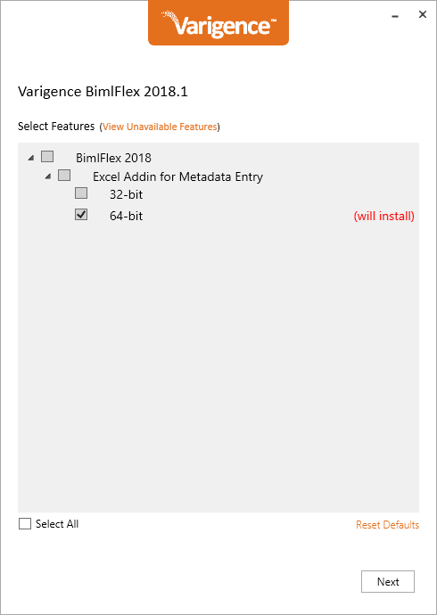

# Installing BimlFlex

## Supporting Videos

## Supporting BimlFlex Documentation

- @bimlflex-developer-installation
- @bimlflex-analyst-installation
- @bimlflex-server-installation

## BimlFlex

The BimlFlex installation installs the BimlFlex Excel-based metadata editor. This is a plugin for Microsoft Excel and will be visible as a separate tab in the Excel ribbon when the BimlFlex-enabled Excel workbook is opened from a BimlFlex project.

When installing it is important to match the Excel bitness version. Verify the Excel bitness version before starting the installation and only install the matching version of BimlFlex.

The first time the BimlFlex Excel file is opened from a BimlFlex project it will ask for a license key. Add the BimlFlex enabled license key from the trial email. The key is validated online and once validation completes it is possible to run the application.

## Detailed Steps

The following detailed steps walks through the installation of BimlFlex

### Download BimlFlex

Use the link in the trial email to download the installer

### Install BimlFlex

Run the installer to install the application. When presented with the choice of 32 and/or 64 bit installation, choose the version that matches your local Excel installation and install only that version.

### Enter product key

Once the BimlFlex Excel based metadata editor is started for the first time, enter your trial key to activate the product.