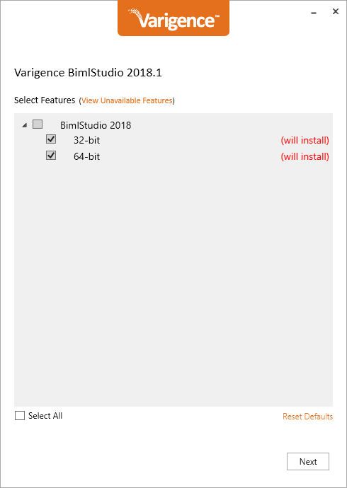

# Installing BimlStudio

## Supporting Videos

## Supporting BimlFlex Documentation

- @bimlstudio-user-guide
- @bimlflex-developer-installation
- @bimlflex-analyst-installation
- @bimlflex-server-installation

## BimlStudio

BimlStudio is the development environment for BimlFlex. The installation provides the platform for building and extending BimlFlex projects.

Building SSIS packages and projects also require the matching versions of Microsoft Visual Studio and Microsoft SQL Server Data Tools with SSIS support are available on the machine.

BimlStudio is available in 2 bitness flavors, 32 and 64 bit. For the trial, it is recommended that both versions are installed.

Once the installation is completed it is possible to start BimlStudio.

The first time it is opened it will ask for a license key. The trial license key is provided in the trial welcome email together with the download locations and documentation. Adding the license key enables the use of BimlStudio and the BimlFlex functions.

BimlStudio with a BimlFlex license key supports both BimlStudio projects and BimlFlex projects.

For the BimlFlex projects to work for the trial it is important that the license key used is enabled for BimlFlex and that the BimlFlex and BimlCatalog databases are created and available and that the BimlFlex Bundle and databases are updated through the Upgrade feature in BimlStudio.

## Detailed Steps

The following detailed steps walks through the installation of BimlStudio

### Download BimlStudio

Navigate to the [BimlStudio page](https://varigence.com/bimlstudio) to download, or use the link in the trial information email to download the installer.

### Install BimlStudio

Run the installer to install the application. When presented with the choice of 32 and/or 64 bit installation, choose to install both versions.

### Enter product key

Once BimlStudio is started for the first time, enter your BimlFlex enabled trial key from the trial welcome email to activate the product.

> [!NOTE]
> If you are using an existing BimlStudio key or have requested a trial key through BimlStudio, update the key to the BimlFlex trial key through the Account options in BimlStudio.