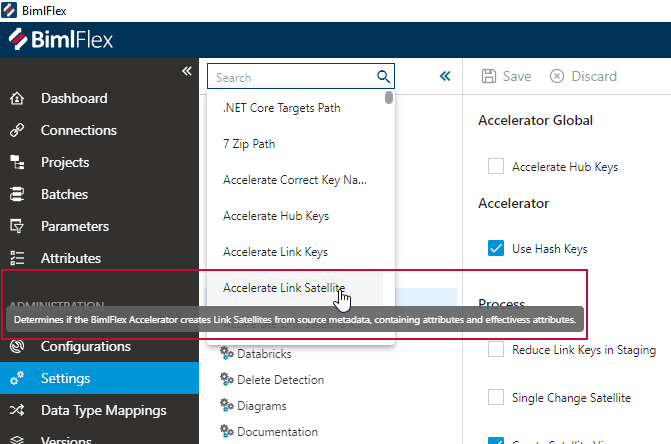

# Setting Editor

[!include[Settings](../includes/_incl-header-setting.md)]

## Overview

 **Settings** can be found under Administration in the application menu.

> [!NOTE]
> The [Settings Reference Documentation](xref:bimlflex-reference-documentation-settings-index) serves as a complete guide for all settings available in the BimlFlex App.

## Setting Groups

Settings within the BimlFlex Applicationare organized into categories, **Setting Groups,** such as Azure, Core, DataVault, Snowflake, etc. Each setting group contains settings that share a common purpose or area.

Hovering the mouse pointer over individual settings will display tooltips relating to some, along with brief explanation as to how settings will impact the solution.

The Settings Group pane also contains a search field. The search field contains a drop down menu of all settings, organized alphabetically, and allows users to search directly for specific settings by name.

When using the search bar, if a user hovers over a specific search term the tooltip relating to that setting will also be displayed. The information displayed in the tooltip from the global search bar will the same as if the user hovered over the actual setting field, as referenced above.

Searching for a specific setting will automatically navigate the user to the respective **Setting Group** and highlight the specific setting within, guiding the user to the exact location needed.

 "Search Term Highlight")

> [!TIP]
> For users who are unsure of the *specific* setting they need, beginning a search with "*" will allow users to search setting descriptions as well as setting titles.
> This may assist in guiding users to their desired setting based on associated terminology used in their search.

When applicable, settings that involve editing SQL code will appear in a window that mirrors standard SQL input styling and syntax.

Settings that are "Yes or No" selections will be presented with a checkbox to indicate their setting.

Settings that contain required values will be outlined in red.

## Command Bar Buttons

The buttons in the command bar allow actions to be taken on the setting that is active in the editor.

| Icon                                       | Action  | Description                                                                                                  |
| ------------------------------------------ | ------- | ------------------------------------------------------------------------------------------------------------ |
| 

    | Save    | This will save any changes displayed in the Settings editor. The **Save** button is only enabled if there are changes in the form. |
| 

 | Discard | This will **Discard** any unsaved changes and revert to last saved form. |

## Setting Overrides

**Setting Overrides** ('overrides') are used for detailed configuration of how settings apply to specific areas of the solution. For example, to disable a setting globally but enable it for a specific **Project** or **Object**.

Setting overrides can be added and referenced in the setting editor. They will be listed in the **Overrides Section** of the editor for the selected setting group.

The setting overrides are presented in a grid view, and overrides can be selected here for editing or deletion. The override will show the scope for which the override will be applied, such as project and object, the involved setting and the setting value.

> [!NOTE]
> Setting Overrides are saved in BimlFlex as **Attributes**. The [**Attribute Editor documentation**](xref:bimlflex-attribute-editor) provides information on attributes and how to manage them.

### Adding a Setting Override

To add a setting override, click  Add in the top right of the overrides section, and fill out the **Add Setting Override** form.

The fields that are used in the setting override form are defined in the table below.

| Setting Override Field Name | Description          |
| --------------------------- | --------------------------- |
| Attribute Type              | Defines the scope for when the override is applied.                                                                      |
| Overridden Setting          | Specifies the setting that will be overridden.                                                                           |
| Attribute Property          | The setting value that applies to the override. For example 'Y' or 'N'. The exact possible values depend on the setting for which the override is created.                   |
| Description                 | Optional description of the setting override.                                                                            |

### Editing or Deleting a Setting Override

To manage a setting override, click the checkbox in the first column of the overrides grid. This will show the `Edit` option. This will only be visible if a single override has been selected.

Clicking the `Edit` button will open the **Edit Setting Override** form, which also allows the archiving / removal of the setting override.

Alternatively, as setting overrides are managed as **Attributes** in BimlFlex, it is possible to manage them from the **Attribute Editor**. Please refer to the [Attribute Editor](xref:bimlflex-attribute-editor) documentation for additional information.
