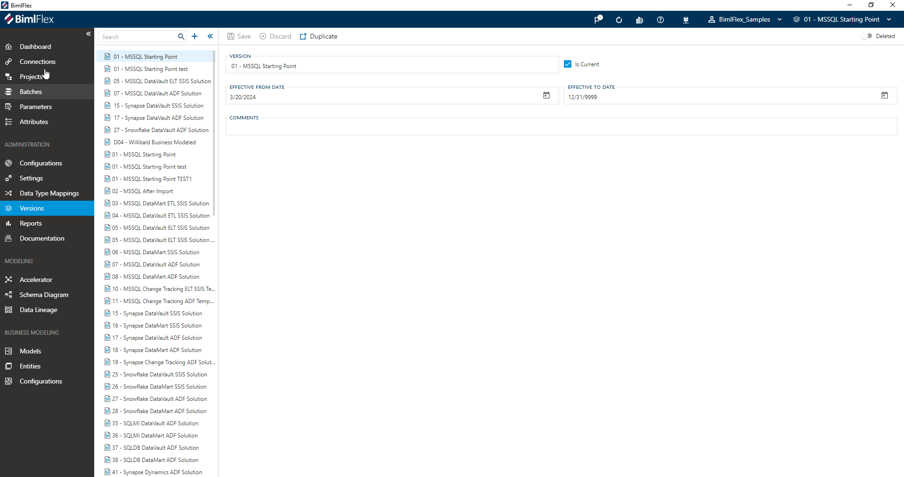
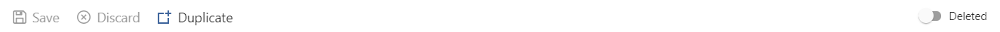

# Version Editor

[!include[Versions](../includes/_incl-header-version.md)]

## Overview

 **Versions** can be found under Administration in the application menu.

> [!NOTE]
> Detailed descriptions of all **Version Editor** fields and options are available in the [Reference Documentation](xref:bimlflex-reference-documentation-connection-entity).

## Action Buttons

The buttons in the command bar allow actions to be taken on the selected **Version**.

| Icon | Action | Description |
| ---- | ------ | ----------- |
| 

 | Save | This will save any changes displayed in the Versions form.  The **Save** button is only enabled if there are changes in the form. |
| 

 | Discard | This will **Discard** any unsaved changes and revert to last saved form. |
| 

 | Duplicate | This will create a duplicate of the selected **Version**.  A Duplicate Parameter Dialog will appear asking for a *Version Name* and a new **Version** will be created using all of the selected **Version**'s current properties. Please note that the metadata itself will *not* be copied to the new version this way, for this feature please use the **Clone Version** option available in the [BimlFlex dashboard](xref:bimlflex-dashboard) |
| 

 | Deleted | This will soft-delete the currently selected **Version**. This version will only be visible if *Show Deleted* is enabled in BimlFlex settings. |
