# Dashboard

[!include[Dashboard](../includes/_incl-header-dashboard.md)]

## Dashboard Top Selections

At the top of the Dashboard are buttons to navigate to three of the most principal features within BimlFlex.

- **Import Metadata** will navigate to the Import Metadata screen for your Source Connection.  
- **Accelerated Modeling** will navigate to the Accelerator metadata editor screen.  
- **Business Modeling** will navigate to the integrated Business Modeling editor screen.

## Project Lineage

The **Project Lineage** pane displays the current **Projects** and **Connections** for the currently selected customer.
This pane also displayed the mapped architecture of the source connections, staging layers, data vault, and data marts.
The number of Objects, Hubs, Links, and Satellites are displayed in between the architecture stages.

Clicking on any of the **Projects** or **Connections** within the Project Lineage pane will navigate the user directly to the respective metadata editor screen.

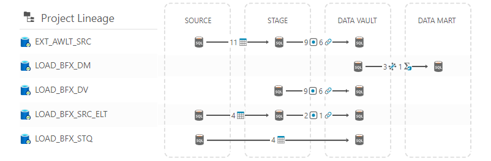

## Operational Reports

**Operational Reports** will display the status of their package runs at a high level, allowing users to observe details and errors in failing packages, and those which were run successfully. Clicking **Operational Reports** will navigate the user to the **Operational Reports** editor screen.

>[!NOTE]
> Depending on the Source Connection, "Operational Reports" will appear as "Latest Package Runs" if using a cloud-based source, such as Azure Data Factory.
>
> 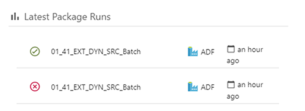

## Recent Connections

The Recent Connections pane on the dashboard will display the most recently updated **Connections**. It can be found in the bottom left of the dashboard window.

## Recent Connections Pane Overview

The **Recent Connections** pane displays the most recently updated **Connections** to allow for quick access and modification of **Connections**.

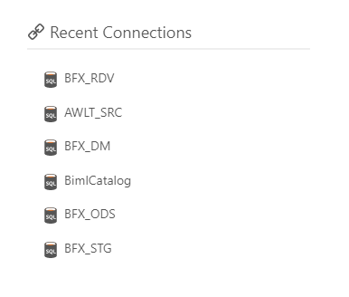

- The type of **Connection** is represented by the **Connection** icon
- Click the name of the **Connection** to navigate to the **Connections** page
- Hovering over a **Connection** name will show when the most recent change was made
- Hover over a **Connection** and click the ellipses for the quick menu options

## Connections Quick Menu

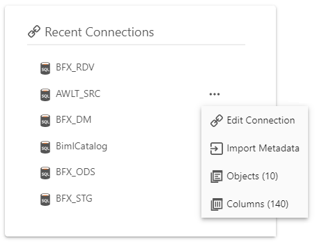

- Click  **Edit Connection** to navigate to the **Connection Editor**
- Click  **Import Metadata** to navigate to the Import Metadata screen for your Source Connection. This link will only appear for **Connections** with a Source System Integration Stage.
- Click  **Objects** to navigate to the **Objects** page filtered to **Objects** associated with the **Connection**. The number displayed is the number of **Objects** related to the **Connection**
- Click  **Columns** to navigate to **Columns** related to the **Connection**. The number displayed in parentheses is the number of **Columns** related to the **Connection**

## Recent Objects

The **Recent Objects** pane on the dashboard will display the most recently updated **Objects**. It can be found on the bottom of the BimlFlex dashboard.

## Recent Objects Pane Overview

The **Recent Objects** pane displayed the most recently updated **Objects** to allow for quick access and modification of **Connections**.

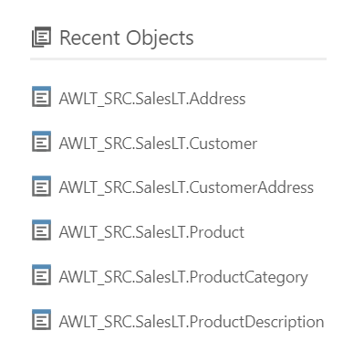

- Click the name of the **Object** to navigate to the **Object** Editor screen
- Hover over an **Object** and click the ellipses for the quick menu options

## Recent Objects Quick Menu

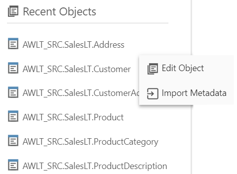

- Click  **Edit Object** to navigate to the **Object** metadata editor screen.
- Click  **Import Metadata** to navigate to the Import Metadata screen for your Source Connection.

## Action Buttons

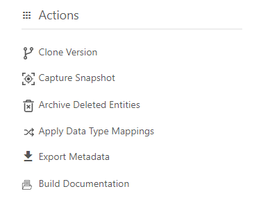

### Clone Version

Clone the current version to a new version.

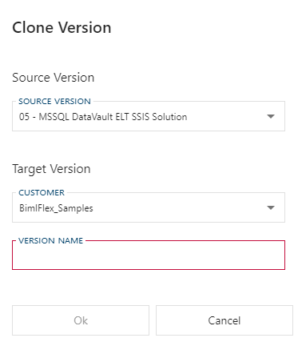

### Snapshots

Hover over **Capture Snapshot** and click the ellipses for more options.

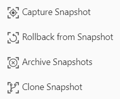

* Capture - Capture a snapshot of the current version's metadata.
* Rollback - Rollback this version from a previous metadata snapshot.
* Archive - Archive (delete) snapshot based on snapshot type and age.
* Clone - Clone a snapshot to a Customer and Version. Create a new version or override an old version.

### Archive Deleted Entities

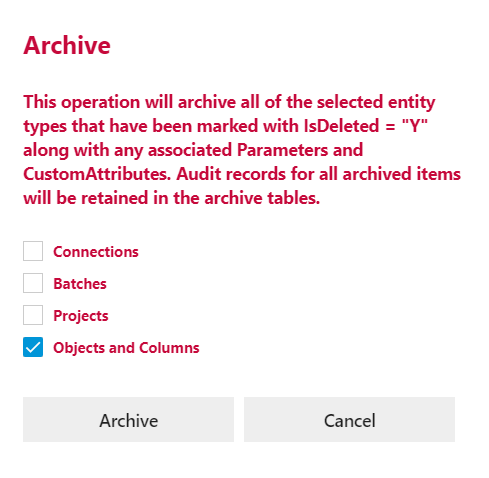

Archive deleted entities of the selected types. Be aware that this action cannot be undone.

### Apply Data Type Mappings

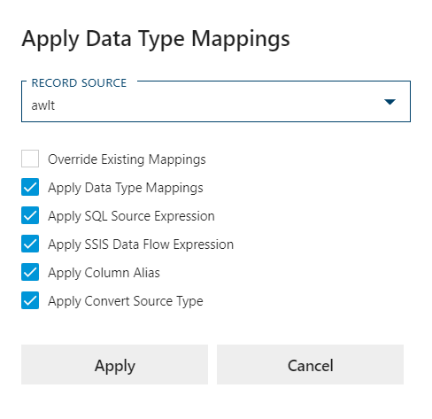

The Data Type Mappings are added to all columns for a specific `Record Source`

See [More info](xref:bimlflex-data-type-mappings).

## Export Metadata

Export metadata creates a zipped file which includes the current version's metadata and an info file. This is especially useful for support purposes.

## Getting Started

Getting Started contains info and complete sets of Metadata examples to quickly get you up and running with the BimlFlex App.

### Load Sample Metadata

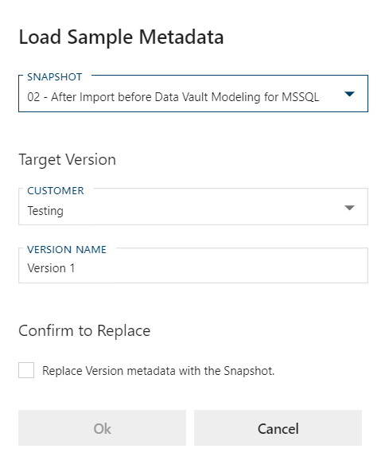

Contains complete sets of Metadata to serve as an example for users to refer to. These examples are also useful when following along with the Getting Started Videos.

[More info](xref:bimlflex-sample-metadata) about the various Sample Metadata sets.

### Load Defaults

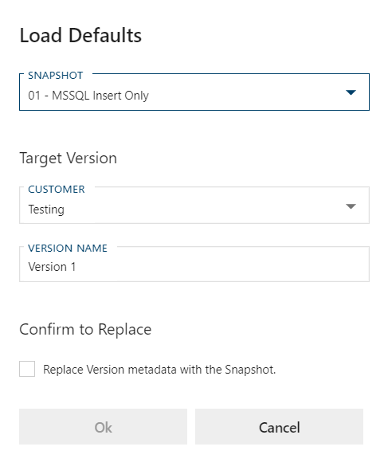

Set the specified defaults on the selected target version. Unlike the Load Sample Metadata this does not override the target version metadata.

### BimlFlex User Guide

Link to this documentation from within the dashboard.

### Release Notes

Opens the BimlFlex side pane with Release Notes for the current and most recent update.