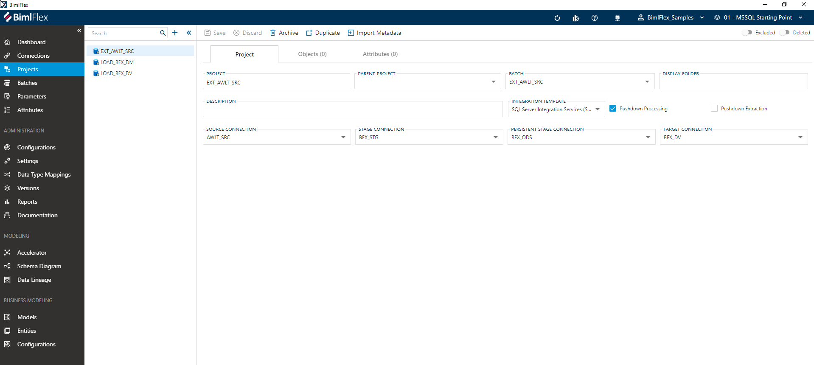
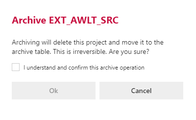

# Project Editor

[!include[Projects](../includes/_incl-header-project.md)]

## Overview

The following sections describe the user interface elements of the **Project Editor**, and how they are used to author and manage BimlFlex **Projects**.

> [!NOTE]
> Detailed descriptions of all **Project Editor** fields and options are available in the [Reference Documentation](xref:bimlflex-reference-documentation-project-entity).

## Project Tab

The **Project Tab** is the first tab in the **Project Editor**, and it is selected by default. The project tab focuses on general connection information and configuration. This tab is used to define and create the project itself.

### Action Buttons

|Icon|Action|Description|
|-|-|-|
|

|Save|This will persist changes made to the **Project** modified in the designer. `Ctrl+S` can also be used as a shortcut.|
| 

 | Discard | This will discard any unsaved changes, and revert to last saved form.|
|

|Archive|Archive will remove the **Project** from the active metadata repository, and move it to the metadata archive. Clicking **Archive** displays the [Archive Connection Dialog](#archive-project-dialog).|
|

|Duplicate|This will create a duplicate of the selected **Project**.  A prompt will appear for creating a new **Project** using all of the selected **Project**'s current properties.|
|

|Import Metadata|This will bring up the **Metadata Importer**. Refer to the [Import Metadata](xref:bimlflex-concepts-importing-metadata) guide for more information.|
| 

 | Excluded | This will determine if the **Project** and all associated entities will be excluded from processing and validation along with the rest of the solution. This is designed to be paired with the `Use My Exclusions (Locally)` global setting to allow for multiple developers to work on different functional areas without deleting or globally excluding entities. |
|

|Deleted|This will soft delete the currently selected **Project**. This will remove the **Project** and all associated entities from processing and validation. For information on how to add excluded or deleted items back to the scope, please read our [tips and tricks section](xref:bimlflex-tips-and-tricks-overview#restoring-an-excluded-or-deleted-entity).|

### Additional Dialogs

#### Archive Project Dialog

Confirmation box warning against the dangers of archiving.  You are required to confirm by both the check box and the *Ok* button.

>[!WARNING]
> Archiving is a permanent removal of the selected entity from its associated table in the BimlFlex Database. The best practice is to first use the _deleted_ flag (soft delete) as an indication that the connection may need to be removed.

### Allowed Values

#### Integration Templates

[!include[Integration Templates](../../eference-documentation/static-data/_enum-integration-template.md)]

## Objects Tab

The **Objects Tab** provides quick access to all **Objects** included in the **Project**, as per the configuration **Connections**.

[!include[Objects Tab](../includes/_incl-tab-objects.md)]

## Attributes Tab

The **Attributes Tab** provides a view of any **Configurations** or **Settings** overrides that have been applied to the directly to the selected **Project**.

[!include[Attributes Tab](../includes/_incl-tab-attributes.md)]
