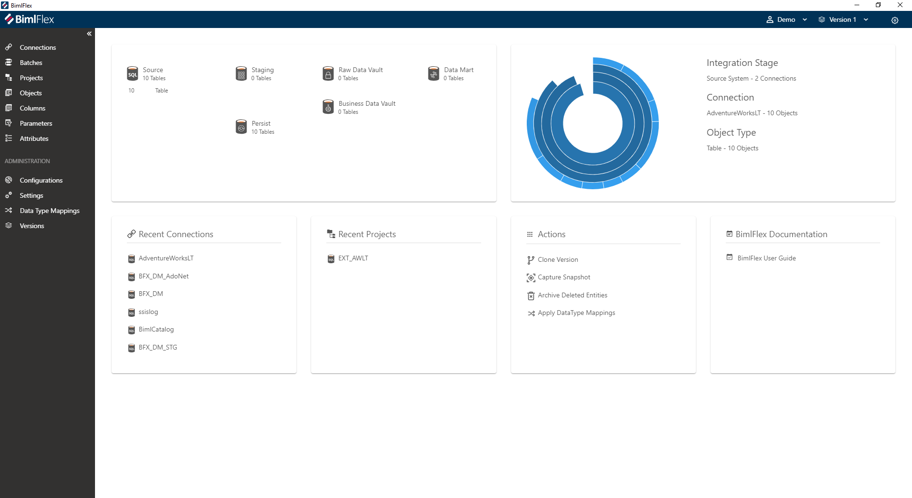
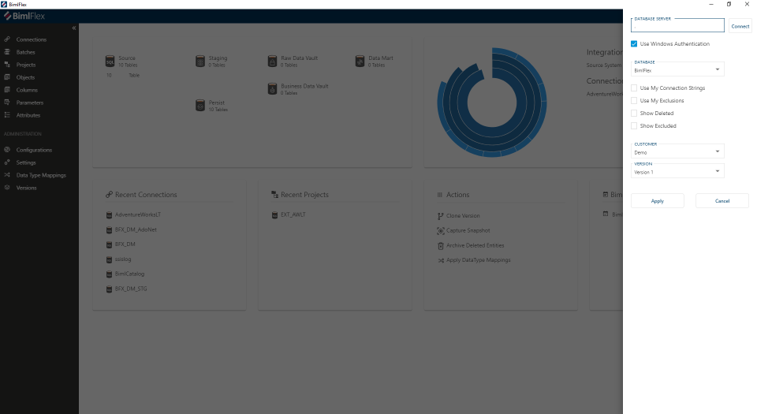

# BimlFlex App

The BimlFlex App provides a user experience for managing metadata and BimlFlex projects.

## Overview

The BimlFlex App connects to the BimlFlex metadata repository and allows management of the metadata through a user-friendly experience. Use the BimlFlex App to manage the BimlFlex metadata.

## Installation

Download and run the consolidated BimlFlex installer to add the application to the computer. See @bimlflex-release-notes for the latest release notes and the download link.

## Configuration

Configure the App to connect to the BimlFlex database through the configuration pane opened by the cog on the right-hand side.

Specify the database server, database, login information for the metadata database to connect and work with metadata projects. Set up and upgrade the BimlFlex metadata database through the BimlFlex installer.

## Uninstallation

Uninstall Bimlflex and the BimlFlex App as normal, through the Program and Features part of the Control Panel or the Apps & features page in modern Windows.
