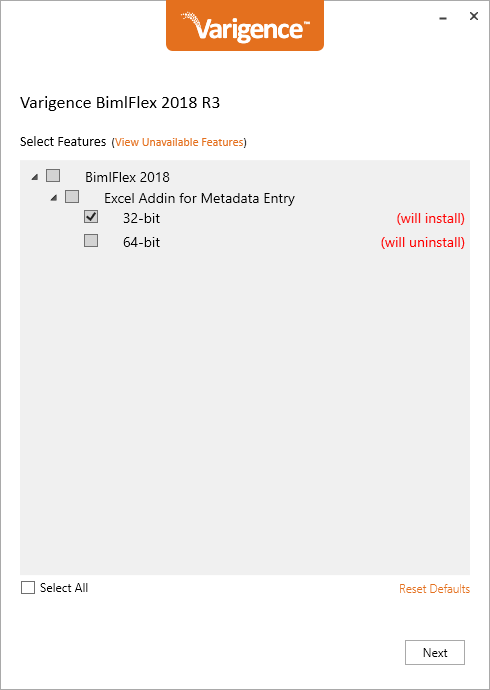
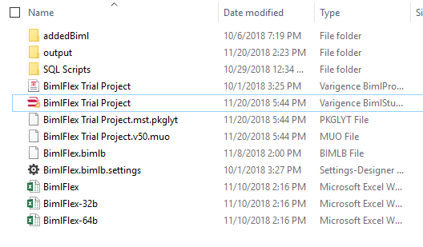

# Change the BimlFlex Excel bitness

Both Microsoft Office Excel and the BimlFlex Excel installation comes in 2 bitness flavors, 32 bit and 64 bit. The installed BimlFlex version needs to match the bitness of the installed version of Excel.

A template Excel application file is placed in the BimlFlex project folder when the project is created. This Excel file is either a 32 bit or a 64 bit version.

The template file to use is specified in the new project wizard

If there is a bitness mismatch the BimlFlex Excel installation will display a Microsoft Excel based Error message when opening the Excel file.

This error might be due to the BimlFlex installation being the wrong bitness or due to the project having been created by an installation with a different bitness.

## Changing the bitness of the BimlFlex installation

First check the local Excel installation bitness. Follow the Microsoft guidelines here to navigate to the correct dialog in Excel to validate the installed bitness version:
[https://support.office.com/en-us/article/About-Office-What-version-of-Office-am-I-using-932788B8-A3CE-44BF-BB09-E334518B8B19](https://support.office.com/en-us/article/About-Office-What-version-of-Office-am-I-using-932788B8-A3CE-44BF-BB09-E334518B8B19)

Once the local bitness is known, rerun the BimlFlex installer and choose to install the correct version and uninstall the superfluous version.

Once the installation completes and the only installed version of BimlFlex matches the bitness of Excel the new Project wizard will generate valid projects from the correct templates.

For existing projects the existing Excel file needs to be updated to the correct bitness.

## Changing the bitness of the Excel file in the project folder

For scenarios where there is already a BimlFlex project created and the bitness of the Excel template file is mismatched to the local installation it it possible to update the file used.

For scenarios where a team of developers are collaborating and have different Excel bitness for their local Excel installations it is possible to populate the project folder with several Excel files.

For scenarios where an incompatible template file bitness was used, it is possible to replace the BimlFlex.xlsx file in the project folder with a template file of the correct bitness from the installation template location.

The BimlStudio user interface button for the `Excel Metadata Editor` will only open the local Excel file called `BimlFlex.xlsx`. It is possible to co-locate Excel files with different bitness in the folder and manually open the correct file for the local bitness installation.

For projects using source control for the project it is possible to do an initial commit with the most common bitness file and then exclude the Excel file from the repo. This will allow new users to pull/clone the template file and replace it when necessary without causing unnecessary source control issues.

The template location for the Excel files are:

* 32-bit: [`%programfiles(x86)%\Varigence\BimlFlex\5.0\BimlFlex.xlsx`](file://%programfiles(x86)%/Varigence/BimlFlex/5.0/)
* 64-bit: [`%programfiles%\Varigence\BimlFlex\5.0\BimlFlex.xlsx`](file://%programfiles%/Varigence/BimlFlex/5.0/)

Copy the correct template file from the correct bitness location to the project folder. Either replace the existing file or create a copy with a bitness-version-specific file name.

Use the correct bitness file for the local installation and BimlFlex Excel will work as expected.