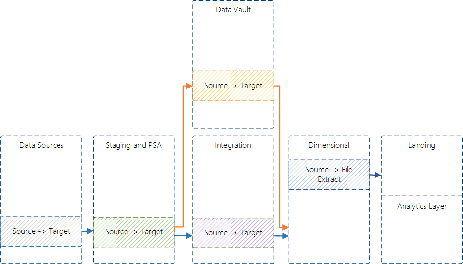
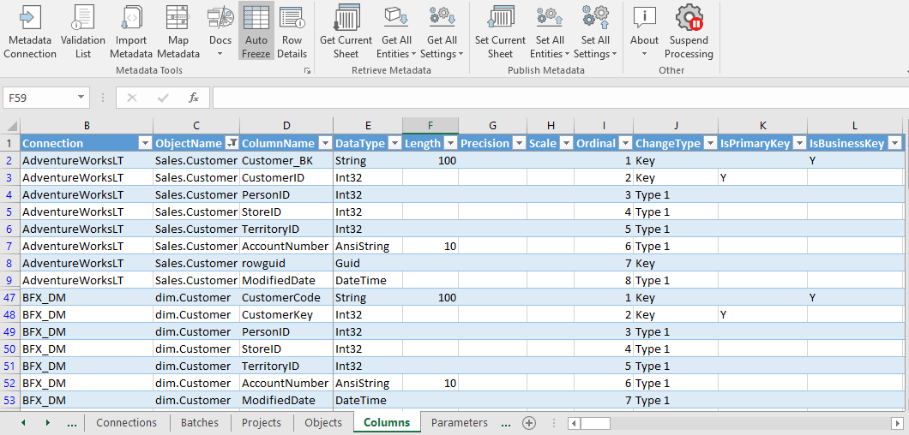
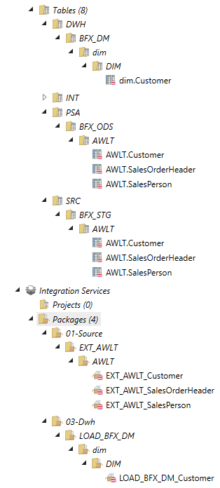
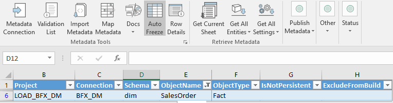
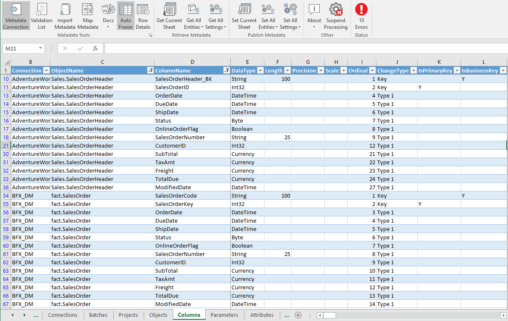
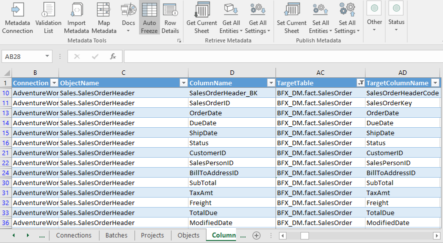
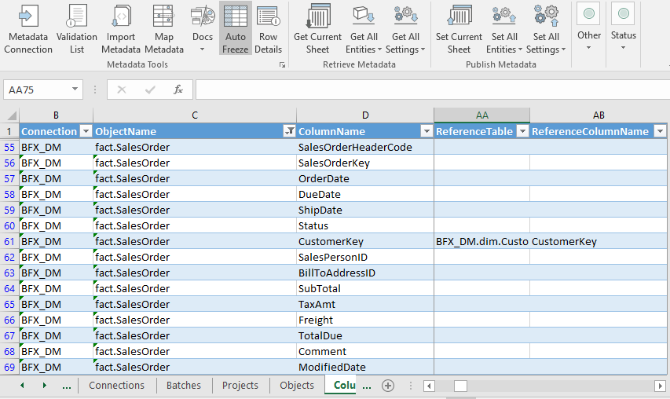
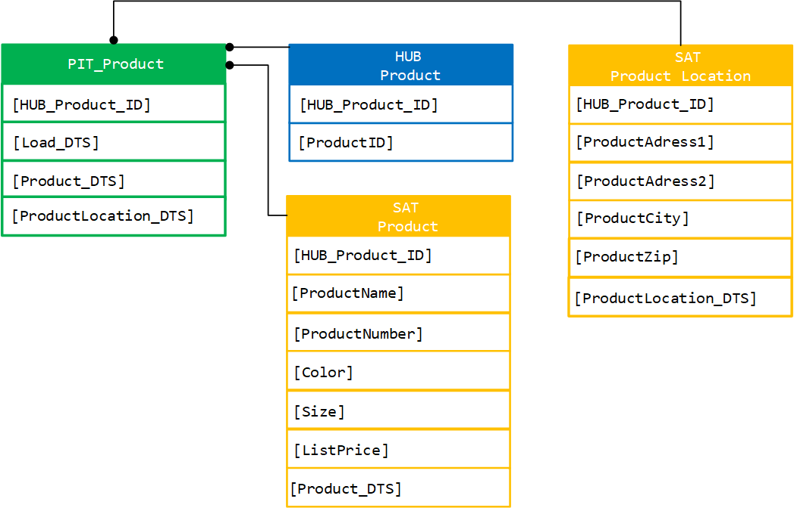
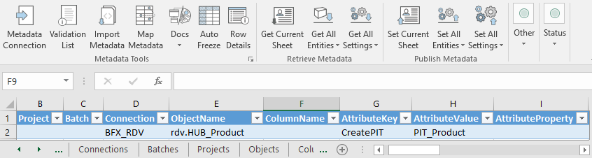
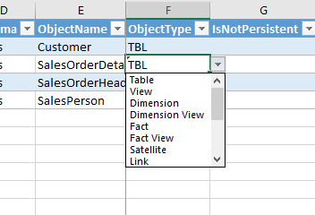

# Data Mart Templates

This document covers the process to implement a Data Mart layer using BimlFlex.

content include

* Integration to Data Mart and related ETL patterns used in BimlFlex
* Implementation scenarios
* loading data out of Data Vault and into a Data Mart via Point in Time tables and Bridge tables.

## Integration to Data Mart

### Introduction

The metadata required to build the Data Mart is similar to any other source to staging project. The ETL pattern that BimlFlex will use for the output will change.

### Common Architectures and The Data Mart as a Whole

This implementation guide covers the modeling and implementation of star schema facts and dimensions. It doesn’t cover Kimball architecture as a concept. Best practices and basic dimensional implementation constructs, like date and time dimensions are required but considered out of scope for this documentation.

In terms of common architectures, this document begins as the point where a user wants to load the Data Mart and the previous layers of their architecture have already been determined. However, it should be stated that users can implement almost any standardised architectures.

The most common of these two is the following items.

### BimlFlex Fact Loading Pattern

Below is a diagram showing the output ETL structure that BimlFlex uses load fact tables in a Data Mart. The optional metadata settings and extension points are signified by shaded rectangles and dotted rectangles. The standard BimlFlex components are shown in solid colours.

Note that the pattern shows that the orchestration components are applied. More [information on the orchestration is documented here](orchestration.md)

**\[SQL – Initialize Staging\]** Inside the main sequence container begins by truncating the target staging table. This staging table will eventually be loaded inside the component `[DFT – LOAD Fact]`.

**\[DFT – LOAD Fact\]** is the main data flow and will convert the column data types as per usual in `[DCV – Transform Datatypes]` while logging any errors using `[ERR - Add Error Description]` and `[AUD – Log Error Rows]`.

**\[LKP – DIM Foreign Key\]** This component will perform a look up to see if the matching Dim record for this fact record exists in the corresponding table in the Data Mart.

**\[DER – Foreign Key Defaults\]** This derived column component will add a column to store a foreign key populating it with a foreign key if it exists and if not, a default surrogate key will be obtained in the following component `[SCR_TR – Inferred Foreign Key]`.

**\[DER – Add Audit Columns\]** This component includes the BimlFlex auditing columns that contain values such as execution IDs.

**\[MLTC - Initial Fact\]** This multicast component determines if a given load is, in fact, the first load of a particular fact, in which case the new rows will go directly to the target destination. These rows are directed to `[OLE_DST - FACT]`.

**\[CSPL – Determine CDC\]** Here the component checks if an incoming row is Type1 or Type2. If it's determined that a row is of a particular type, then the method of CDC and insertion will be different in the following components

**\[OLE\_DST - Insert Fact\]** Finally changed and new rows are stored in the fact table.

**\[SQL – Merge Fact\]** Will be loading all the data into their final target tables from the data in the initial staging tables.

This pattern is not too dissimilar to a source to staging pattern. Key differences are that while the data is being processed by the data flow task, surrogate keys are being handled.

In the control flow, note that the final step is a SQL merge task. The merge take the incoming rows that have been loaded into the Fact’s staging table and perform on final comparison before either inserting or updating the target Fact table.

#### BimlFlex Dimension Loading Pattern

Below is the output of BimlFlex ETL used to load dimension tables in the Data Mart. This is prior to using any optional metadata settings or extension points, which signified by shaded rectangles the dotted rectangles. The standard BimlFlex pattern also applies auditing and logging which is also shown.

The particulars of the dimension loading pattern are that whether the data is type one or type two is taken into account, along with whether it should be directly inserted in a new load. Hashing is also being employed to better detect changes in the column data. More on these details below.

**\[SQL – Initialize Staging\]** The main sequence container begins by truncating the target staging table. This staging table will eventually be loaded inside the component **\[DFT – LOAD Dimension\]**.

**\[OLE\_SRC – Select Source\]** To obtain the source columns, an OLEDB source component will be used in this example.

**\[RC – Select Source\]** For auditing purposes the row count of the previous selection is logged in the BimlCatalog database.

**\[DCV – Transform Datatypes\]** This component will be inserted into the ETL structure if a user specifies to convert the data types of the incoming columns before the rows are loaded into their destination table.

**\[DC – Add Alternate Columns\]** Add alternate columns component will include any extra derived columns in the data flow. An example of this would be defining both a SqlExpression and SsisExpression in the metadata combined with providing a ColumnAlias will bring the column into the pipeline as the alias name. `[DC – Add Derived Columns <SolveOrder>]` will do the same but taking in consideration the solve order of the columns.

**\[LKP – DIM Foreign Key\]** this component performs a lookup on the Dim record’s foreign keys in the corresponding tables that the Data Mart is using

**\[DER – Foreign Key Defaults\]** Will add a column to store a foreign key, populating it with a foreign key if it exists and if not a default surrogate key will be obtained in the following component.

**\[SCR\_TR – Inferred Foreign Key\]**
Next, there are two custom components that take the hash value of the dimension row. `[HSH – Type1/2 DIM Columns]` This is useful for improving the performance of an architecture that is required to compare changes in each dimension row. This is especially relevant in Type 2 dimensions.

**\[LKP – DIM Foreign Key\]** This component will perform a look up to see if the matching fact record for this dimension exists in the corresponding table in the Data Mart.

**\[DC – Surrogate Defaults\]** This derived column component will add a column to store a foreign key populating it with a foreign key if it hasn’t received a foreign key from the previous lookup component.

**\[CSPL – Determine CDC\]** Here there is a check if an incoming row is Type1 or Type2. If it's determined that a row is of a particular type, then the method of CDC and insertion will be different in the
following components

**\[ALL – DIM Changes\]** Unions all the new and changed columns of the particular type of CDC for type 1 or type 2.

**\[MLTC - Initial Dim\]** This multicast component determines if a given load is, in fact, the first load of a particular Dimension, in which case the new rows will go directly to the target destination. These rows are directed to `[OLE_DST – Insert DIM]`. If it is not an initial load the new and changed rows will be set to the Dimension’s staging table first `[OLE_DST – Stage DIM]` to be merged into the destination table in a later component.

**\[SQL – Merge Dimension\]** Will be loading all the data into their final target tables from the data in the initial staging tables.

This second pattern for loading dimension tables has some similarities and some differences to the fact loading pattern. First, hashing is being applied. Hashing is used to accurately check for updates to rows, note that this is being applied to dimension rows only. Lastly, the different Type 1 or Type 2 rows are split into different pipelines and being counted by the Biml orchestration framework.

#### Implementing a Data Mart

### Connections and Projects

When beginning to structure a Data Mart loading project in BimlFlex, there are certain metadata entities required in order to Build the solution.

The connection has to be defined with the Integration Stage properly defined.

Below is an example connection to the Data Mart.

A Batch is required, this controls the number of threads used and if orchestration is used.

Here the Batch is named `LOAD_BFX_DM`, short for Load BimlFlex Data Mart.

The Project can be defined once the Connection and the Batch has been defined.

There are a few options for Project metadata and how a Data Mart project is loaded. These options are outlined in the table below.

The project architecture and the source for the Data Mart depends on the solution architecture. If Data Vault methodology is being used, the source wwill be a connection pointing at the Data Vault. If a two tier implementation is used (Source to Staging to Data Mart), this connection is the staging database connection.

|Attribute Name    | Example Project Attributes |
|---------------   |----------------------------|
|Project           |LOAD\_BFX\_DM|
|Source Connection |BFX\_STG/BFX\_DV|
|Stage Connection  ||
|Persistent Stage Connection (Optional)||
|Target Stage Connection|BFX\_DM|
|Target Connection (destination of the data: DW, DV etc)|BFX\_DM|
|Batch Name|BFX\_DM|
|Parent Batch (Optional)||
|Integration Template|Source -> Target|

The example is using the Source to Target Integration Template. BimlFlex uses the Connection metadata Integration Stage set earlier, `Data Mart`, to derive what BimlFlex ETL pattern to apply.

### Dimension Object and Columns

once the prerequisite metadata is completed the Objects can be added.

In the above example above there is a new Customer dimension being defined in the first row. The object type is Dimension and its connection is pointing to the Data Mart.

The next step is to do Source to Target mapping of columns from the source table to the destination dimension.

In the following example the columns of the source table Customer are in the Sales schema.

At this point, a user will want to define the columns of the Customer dimension.

Below is an example of the columns a user would define in the customer dimension.

Note that the columns are fairly similar but they have been set in such a way that the business key in the source table will line up with the CustomerCode column and the primary key of the source will be the CustomerKey of the dimension table.

This ia one pattern avaialble when modeling star schemas. Each business key in source becomes the `Code` column in the Data Mart and each Data Mart table will include a unique integer key which is the `Key` column. The keys used can either be sequence numbers from Identity columns, or for Data Vault sources, the Hashed Surrogate Keys generated in the Data Vault entities or Bridge and Point In Time tables.

Once Source and Target metadata is available the mapping between them can be completed.

Below is an example of the Source to Target definitions of the `Sales.Customer` columns.

Refresh the metadata in BimlStudio to review, build and test.

### Fact Object and Columns

Similar to above the fact metadata steps are very similar to before, the example resumes at the point of creating the fact object because the fact itself can use the same Data Mart loading project as specified in
the previous examples.

Below is a sample of the fact object metadata, note that the first column Project has the same `LOAD_BFX_DM` project.

From here, the main objective is to definite the columns in the new Fact table and do Source to Target mappings for these columns. In this example, the `SalesOrderHeader` will be the source of the Fact.

Now the key will be to link the fact source columns and the target fact table and target columns as shown in the previous customer dimension example.

Now that the source, destination and target column metadata in place, there is one more item to cover regarding modelling Data Marts in BimlFlex and that is the use of foreign keys.

In the Data Mart, generally, each foreign key points from fact to dimension. In the loading pattern, the foreign key is set by performing a lookup on the business key in a dimension, taking the corresponding dimension’s key and then setting that as the foreign key in the fact.

BimlFlex still automates all this functionality for us but the user still needs to indicate how this is done. This is done by setting the reference columns of the fact table in metadata.

The example below will demonstrate how to add a foreign key to the customer dimension.

Note that since there is a foreign key pointing to the customer dimension key, the Fact’s CustomerID column should be renamed to CustomerKey.

Refresh the metadata in BimlStudio to review, build and test.

### Point in Time Tables and Bridge Tables

#### Introduction

Point in time tables and bridge tables are ancillary tables used to make querying from a data vault significantly easier and more efficient. How these tables are utilised is more dependent on each individual BI
solution but how they are implemented in BimlFlex is fairly straight forward. This example will point out the Hubs and Links of interest and BimlFlex generate the necessary components.

#### Bridge tables Introduction

The purpose of a bridge table is to ease the work involved in transforming and accessing data in a data vault, especially when attempting to load this data in the Data Mart. As the name implies a bridge table joins across multiple entities in the data vault and brings them together into one table. Bridge tables deal in Hubs and Links and the reason being is that generally a bridge table is needed because in the Data Mart layer it is expected to make use of the relationships that exist in the source systems, however in the data vault these relationships are decomposed across potentially multiple Hubs and Links.

The above example shows a bridge table on the left joining two hubs and a link table together, one row in the bridge table will contain all the surrogate keys needed to start querying across these entities without a large amount of SQL being needed.

#### Configuring a Bridge Table

Now that it has been shown why a user may want a bridge table, let’s focus on how to join these various entities in the data vault and bring the relevant keys together in a bridge table.

Fortunately, configuring and deploying a bridge table is a fairly simple process. BimlFlex is able to bring together all the data vault tables required in a given bridge table by inspecting the metadata behind the scenes that should at this stage already be in place.

Creating a bridge table requires a user to know a couple of things about a given entity within the data vault. The first action a user needs to take is to choose the primary Hub. This means that of the set of hubs being joined together, which one are will be chosen to be the starting point. In the example, the Hubs product and product category are joined together. To do this the user will need to include the product and product category Link.

Note that as in the screen above, CreateBridge is used to indicate what is happening with these columns. In the AttributeKey column, a user can name the Bridge table and In the AttributeValue column, a user can indicate the primary Hub and chose which other Hubs need to be added with their surrogate keys to the bridge table. This is done by entering in the keywords IsPrimaryHub and AddKey for which Hubs that need to be added to this bridge table. Once this metadata is in place all is required, then, is to inspect, build and test this new structure through BimlStudio.

#### Point in Time Tables Introduction

Similar to how a bridge table brings together related data across different entities in the data vault, the Point In Time (PIT) tables job is to bring together all the contextual satellite data where each row represents a time slice. This is particularly helpful when attempting to extract historical data into the Data Mart. The way a pit table does this is by joining all the relevant surrogate keys across all the satellites surrounding one Hub and aligns these rows based on the date time stamp.

#### Configuring a Point In Time Table

To configure a Point in Time (PIT) table, the user needs to select the Hub that they want to create the point in time table for. BimlFlex will find all the related satellites to this hub and create the point in time
table necessary to bring all the items together.

Creating a PIT table is straightforward. BimlFlex is able to obtain the majority of its required attributes from the existing Data Vault metadata. In order to create a PIT table for a given Hub, all that is needed is the name of the Hub and the connection for its Data Vault.

Using the Product entity as an example, the connection is `BFX_RDV` for the Raw Data Vault and the object name is `rdv.HUB_Project`. Set the attribute key to `CreatePIT` and the attribute value to the name of the PIT table.

Only adding the Hub to the configuration will include all its Satellites in the PIT. if a subset of the Satellites are to be included, add these Satellite tables to the attributes with the same PIT table name.

Refresh the metadata in BimlStudio to review, build and test.

#### Implementing Business Rules

In terms of implementing business rules, a user can apply business rules either in the business vault or in the presentation layer depending on the overall architecture. In terms of the object type to contain these
rules, they can either be implemented in views or in extension points. Fortunately, in BimlFlex this doesn’t change the source to target template style in any significant way. If a user chooses to implement business rules in views, the object type of the source object can change a source to be a variety of items.

The decision as to where to implement business rules doesn’t necessarily change the process of implementation in BimlFlex.

Below is an example of the variety of source types available, note that view or regular tables are acceptable.

When implementing business rules through extension points, this will generally be done in the form of a post process that is entered in especially for a given object package. Post process extension points get
executed at the end of a particular load. This approach is less common than storing business rules in a view but is just as feasible.

#### Next Steps

Once the presentation layer is completed, consideration should be made towards the approach taken in the analytical layer. The final part of this solution will be to use a tool to deliver this data to decision
makers within the organisation in a format that allows them to perform a proper analysis of the organisation's data.

Possible options are to; create cubes or tabular models for Excel, Power BI and classical reporting, reporting views for Reporting Services or snow flakes for MicroStrategy, flat views for Qlik and Tableau etc.