# Data Vault Templates

This document outlines the creation and management of Data Vault artefacts in BimlFlex.

The Data Vault can be accelerated using the BimlFlex Data Vault Accelerator that is [described in its own document](data-vault-accelerator.md). This document focuses on the process of manually creating Data Vault artefacts by manipulating metadata.

## Setup

This document assumes the BimlFlex product has been [installed](developer-installation.md) and [configured](initial-setup-and-configuration.md) and that the [AdventureWorksLT](https://msftdbprodsamples.codeplex.com/) sample metadata is ready to be imported to a new empty customer.

The walkthrough will use the Product and Product Category entities from the [AdventureWorksLT](https://msftdbprodsamples.codeplex.com/) source to demonstrate Data Vault concepts.

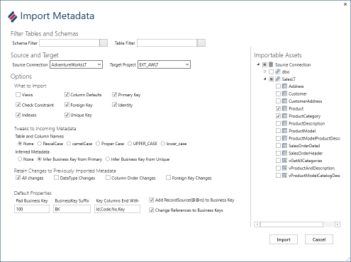

## Data Vault review

It is important to consider the Data Vault design and modelling principles while building the Enterprise Data warehouse. There are several books and training courses available on the subject of Data Vault modelling. Varigence provides a Data Vault modelling and implementation course that combines theoretical knowledge about the Data Vault approach with implementation guides using BimlFlex.

## The Data Vault Pillars

It can be prudent to revisit the Data Vault modelling pillars as defined by the CDVDM, The Data Vault modelling certification definition.

* Data Vault Models are built entirely upon Hubs, Links and Satellites
* Data Vault Hubs and Links contain no descriptive attributes
* Satellites contain all descriptive attributes (all context, details, time slices, etc.)
* Data Vault Hubs contain no Foreign Keys/relationships
* Satellites contain one-and-only-one Foreign Key/relationship (for the Hub or Link to which it is attached)
* All relationships represented in a Data Vault are manifest through Link Tables
* Satellites can attach directly to one-and-only-one Hub or Link
* Data Vault Hubs and Links all use a Sequence ID or Hash for a primary key

## Base Data Vault constructs

BimlFlex generates the required artefacts to populate Hubs, Links, Satellites etc from its metadata.

### Hubs

Hubs maintain a distinct list of business keys. The business key and the Hub table, as well as the source and source to target mapping are defined in the metadata repository.

The Hub Entity is at the center of the **Core Business Concept**, CBC, and should be derived from **Enterprise Wide Business Keys**, EWBK’s. A Hub is not necessarily the same as a Primary Key in the source system.

To be able to integrate across systems and versions the actual Business terms used should be identified and used as keys for the Hubs.

For the business key, it is recommended to use a wide Unicode/nvarchar datatype. That accommodates most data coming from any source. It also allows new sources to be integrated that might not adhere to the earlier assumed datatype of the Hub business key. The hub should accommodate all incoming data without judging, therefore it is recommended to use the most forgiving data type available.

Descriptive attributes about the business key in the Hub are stored in attached Satellites.

### Links

Links maintain relationships between two or more Hubs. The Link is also a distinct set of all occurrences of the combination of hubs ever seen. These relationships have their effectiveness maintained through (Link) Satellites.

Some Links need to emulate the Foreign Key constraints in their source, this is managed by defining **Driving Keys** for the Link Satellite.

The Link forms the base for the **Unit of Work**, UOW. The UOW defines the required granularity to properly identify the relationship; the UOW forms the grain of the relationship.

### Satellites

A Satellite is connected to either a Hub or a Link and maintain descriptive information about the Hub or Link. Satellites are the bearer of all descriptive attributes, context information and time-slice history in the Data Vault model.

An example is the effectiveness of a relationship, when a link is created from a relationship between two entities in the source it will create two Hub rows and a Link row (if some of the Hub records already exist those existing rows will be reused). The Link Satellite tracking effectiveness will have a row added that describes when the event was first discovered from the source. Should the source remove the relationship, the Link Satellite will be closed off by adding a new row with a deleted indicator describing the delete event.

Another example is the management of descriptive attributes. For a Product stored in the Product Hub there will be Satellites storing the information about the Product. Should the List Price be changed in the source the Satellite will have another row added with this new data and the old record for the old price will be end dated as no longer current.

## More on Hubs

The Hub is the distinct set of business keys from the source. It is an add only table. Any effectiveness or descriptive attributes are tracked in attached Satellites.

The required metadata for a Hub is divided into the objects tab and the columns tab in the metadata editor. For the Source to Target Mapping the source and the target table and columns needs to be defined and mapped.

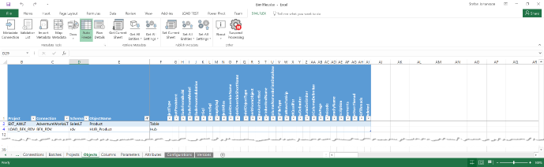

The source table can be any metadata construct. The normal use case would be to read from the staging tables of an external source. Once new data had been staged the Raw Data Vault process will load the data into the destination Hub table.

The object tab only requires the objects to be defined. The destination table is marked as Hub to indicate the entity type. The naming convention needs to be applied to the Object Name as it is manually added.

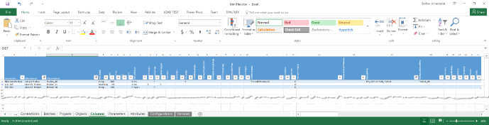

Only the business key needs to be mapped to the target Hub. The source table provides the source key columns and the destination Hub has a Business key and a Surrogate Key defined.

### Surrogate Key

For the Hub Surrogate Key, the data type will be `AnsiString (40)`, a text representation of the SHA1 Hash bytes. BimlFlex currently support SHA1 hashing. The SK data type must match the output of the hashing algorithm.

### Business Key

The Hub business key needs to accommodate the data from the existing sources as well as being able to accommodate changes in the existing sources and new sources added later. The CBC/EWBK represented by the Hub is designed to integrate multiple systems. To support this, it is most common to use text representation, either using text or Unicode. The key length needs to accommodate any reasonable business key that can be foreseen. The only reason to use a smaller key representation is performance. If Hub business key length is a performance concern it is recommended to invest in better performing systems rather than minimize key length.

The default key length generated by BimlFlex using the Data Vault Accelerator is String/NVARCHAR(100). For the demo we will create a business key from the integer representation of the ProductID in the source as a String/NVARCHAR(100).

The Business key is added to the source table as a new column. It uses the `FlexToBk(ProductID)` custom SSIS Expression to build the business key. The default settings will concatenate the business keys together with the tilde `~` as the default concatenation character. The `Product_BK` only has a single column mapped but if we added an additional one it would create a composite key with the columns concatenated.

`FlexToBk(ProductID)` will generate `Product_BK` from the ID only (example: `680`)

`FlexToBk(Name,ProductNumber)` will generate `Product_BK` from the Name concatenated with the ProductNumber (example: `HL Road Frame - Black, 58~FR-R92B-58`) with the concatenation separator injected between (the `~`)

### BimlFlex Build

Once the metadata is pushed from the Excel metadata editor to the repository it is possible to refresh the metadata into BimlFlex.

BimlFlex will indicate the tables and the SSIS artefacts that will be created. Reviewing the artefact list in the solution explorer will indicate if the solution will match expectations.

Once the solution is built through BimlStudio the normal output artefacts from the staging, persistent staging, table and database creation will include a new project with the Raw Data Vault load batch and Hub ETL process.

BimlFlex groups Raw Data Vault loads by source table. The generated Product Hub will be included in a package called `LOAD_BFX_RDV_Product_AWLT.dtsx` in the SSIS project called `LOAD_BFX_RDV`.

The Hub load process will consist of a single Data Flow going from the source `Product` staging table to the destination `HUB_Product` table

Illustrated here is the Hub load flow:

For all Hubs in the Data Vault model, the source and destination table metadata is required. The column mappings include a business key column mapped to the destination hub and a defined destination Hub with a business key column and surrogate key column. The metadata directive `FlexToBK(key column)` is used to build Business keys.

### Multiple key columns

Some Hub designs require multiple source key columns to define the Hub through the Business Key. Sources with key overlap might need a system or source string added, multiple source keys might need to be combined to form a distinct Hub business key.

> Deriving the business keys for the CBC/EWBK’s is one of the most important design exercises in modelling the Data Vault. This guide does not include details on the required analysis and design process.

For these columns BimlFlex concatenates them into a single string and separates them with the configured separator `~` as described above.

## Link

The Link Entity is the distinct set of relationships between the involved Hubs. As the Hub, it is an add only table and any effectiveness or attributes should be tracked in a connected Link Satellite.

Two or more Hubs are required to build a Link. The Product source table used for the Hub has a relationship to the Product Category table, representing the category of a product. The Product Category will require a Hub for the Link to be built. The Product Category table also has a hierarchy with a parent category. This provides an interesting scenario as that Link will reference the same Hub twice and therefore will need roleplaying names.

Links are built from the metadata for a single table so if there is a requirement to add data or attributes from different tables they have to be joined into the source table in the source metadata.

It is recommended that sources provide all the required metadata for relationships between entities to be built using the identified business keys.

For this guide the technical Id’s from the source are used.

For the metadata objects tab the new Hub and the Link needs to be added

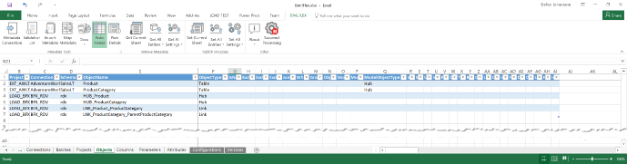

The source now includes the `ProductCategory` table and the `rdv` objects include both the Hubs and the two Links.

The default naming convention used by the Accelerator is to create the Link name as the relationship between the Hubs. This works in the example scenario but for Links will more Hubs attached the name most likely needs to be adjusted to use a more concise convention. The recommendation is to use the convention consistently and have as explicitly meaningful names as possible.

The columns metadata needs to include the mapping for the new hub as well as the Links.

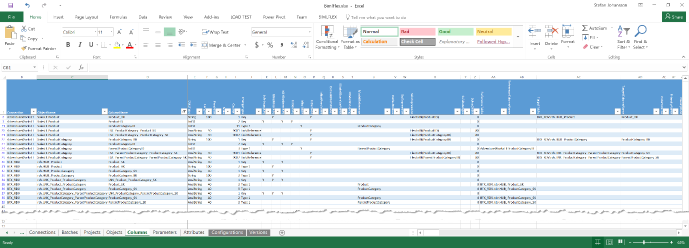

The Source tables need the Link keys for reference. The default naming convention uses `LSK_Entity_Entity_SK` naming style. The source tables have the keys for the Links added as well as the Hub keys for the relationships. The LSK column has the Link table as target table specified.

As before the Hub have a BK and an SK column.

The Link Data Vault entries have a Link SK as well as an entry for each participating Hub. The entries for the participating Hubs have an entry in the `ReferenceTable` and `ReferenceColumnName` to identify the Hubs.

Building the solution from this metadata will generate two load packages in the Data Vault project, one each for the source tables. In each package will be loads for the Hub and the Link.

Illustrated here is the Link load flow:

## More on Satellites

Satellites can be attached to either a Hub or a Link, to differentiate the Satellites attached to Links are called Link Satellites and prefixed with LSAT compared to Hub Satellites that uses SAT.

The Satellite concept is the same for both entity types. The columns and load patterns are the same. They both track changes over time. The common use for the Hub Satellite is to track descriptive attributes and their changes over time and the effectiveness of the Hub. When a Product gets deleted from the source system it will not be removed from the Hub, it will have a row in the Satellite indicating that the status of the Product is now deleted.

Link Satellites most common use case is to track effectiveness of the relationship. The Link Satellite can also have attributes. The Link Satellite attributes can sometime be attached to a Hub with a separate Satellite instead. This document does not include the modelling considerations of this, BimlFlex supports Link Satellite attributes.

The source data for the sample model contains descriptive attributes for both Product and Product Category. There are no descriptive attributes for the Link relationships so the Link Satellites will only track effectiveness of the relationships.

### Hub Satellites

The required Source Object metadata is already in the metadata model, the Satellites attributes are read from the same source as the Hub. The destination Satellite tables/entities are added by adding the names and setting the Object Type to Satellite or Link Satellite

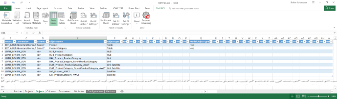

The default naming convention uses the same name for the Satellite as the Hub or Link it is attached to with an additional suffix indicating the source system. It is recommended to use a consistent naming convention for all artefacts. The suffix naming suggests that additional Satellites can be added to the Hubs from other sources.

Only under very, very specific circumstances is it recommended to load data into the same Satellite from multiple different sources and even then it is always possible to still load to separate destinations. The Data Vault model supports an unlimited number of Satellites attached to Hubs and Links, this should be embraced in the modelling so that the agility and flexibility to integrate changes and new sources are maximized.

The Columns metadata requires additional data for all attributes for the Satellites. Once multiple source tables and attributes are added to the metadata editor it is helpful to filter the columns to only display the required data. The Excel headers are normal table headers and support both filtering and sorting. Note that any filtering and sorting choices are removed when the metadata is refreshed.

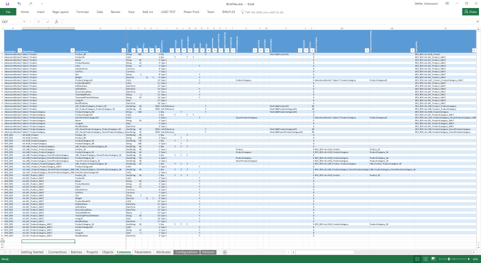

Illustrated here is the Satellite load flow

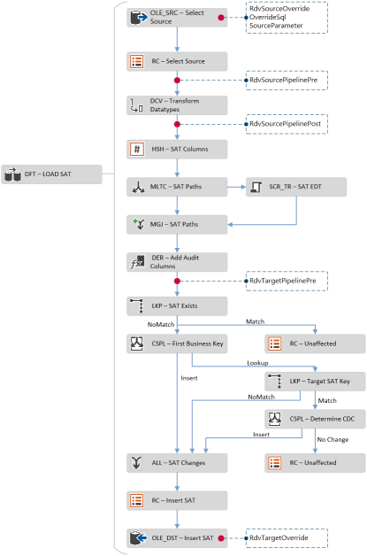

## Driving Keys

All Data Vault Links are many to many relationships. If there is a Foreign Key relationship between two entities in the source, that behavior might need to be maintained in the Data Vault.

An example is the relationship in AdventureWorksLT between a Product and its Product Category. By definition, the source system only allows product to be part of a single Category at a given point in time. If the product is moved from a category to another it will cease to be part of the previous category.

Since links can maintain any number of relationship this behavior needs to be enforced by rules. In the Metadata Attributes tab it is possible to define Driving Keys for Link Relationships. These keys define which parts of the Link drive the changing of existing relationships.

For the Product to Product Category Link this is maintained by the `LSAT_Product_ProductCategory_AWLT` Link Satellite table.

The Accelerator and the BimlFlex framework will automatically apply Driving Key type relationships for any Links derived out of a Hub, as they are based on Foreign Keys in the source and by definition imply a Driving Key scenario. This will be automatically included in the SSIS package, no separate attribute will be added in the Attributes Sheet.

If a Driving Key behavior needs to be manually defined, such as from a Link type source table, an attribute is added to the Attributes Tab.

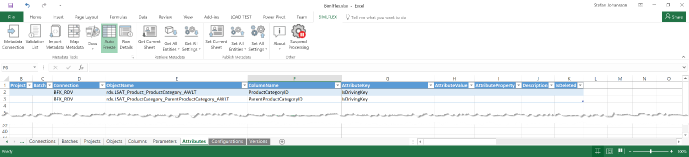

The Data Vault build logic will include the required processing in the Link Satellite to maintain data consistency throughout load by adding and closing relationships, emulating the behavior of the single Foreign Key relationship from the source.

## Multi Active Satellites

Multi Active Satellites are satellites with an additional key attribute meaning multiple version of the Satellite can be active/valid at a given time. This is used when there are no other straightforward ways to model a situation with multiple active records at the same time.

Multi Active Satellites are created by adding a Multi Active Key to the Satellite definition.

Multi Active Satellites break the formal Data Vault design and modelling pattern and it is recommended to use the default patterns if possible. An extra Hub roleplaying the Multi Active attribute can possibly be added to the UOW/Link to implement a similar behavior.

For sources that have multiple changes to the same row at the same time it is easier to define the order and override the `RowEffectiveFromDate` value to reflect that order instead of implementing Multi Activeness.

## The BimlFlex generated Data Vault Entity Load SSIS Project

The generated project for loading into the Data Vault will include packages for each source entity. The Entity load package will include all Data Vault loads from the source table. Depending on the defined metadata the generated project will include different parts.

As an example, the following Packages have been generated using increasing amount of metadata.

### Single Hub load ETL flow sample

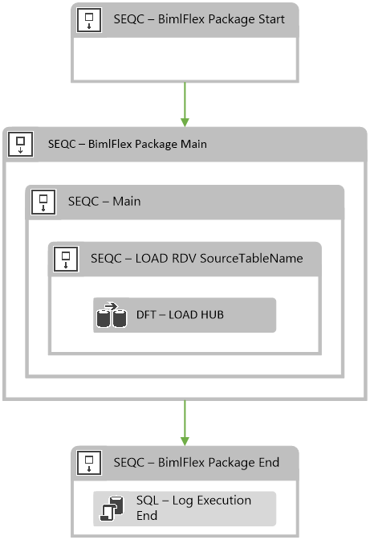

This package only includes the Hub entity load of the `HUB_Product` destination.

### Full ETL flow sample

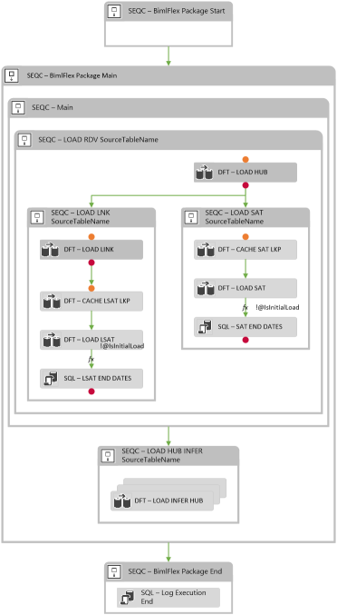

The completed package that loads Hub, Link, Satellites and Link Satellites.