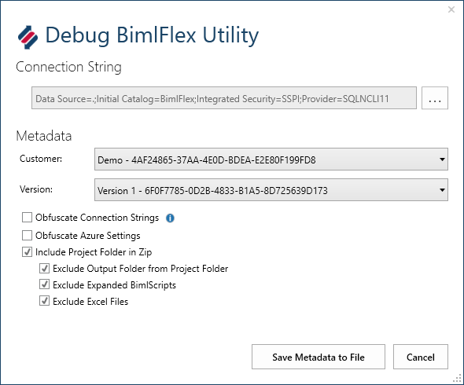

# BimlFlex Debug Utilities

Use the `Debug BimlFlex Utility` function to create a metadata and project file to send to Varigence BimlFlex support. This might be required in certain scenarios where the support team requires the project metadata and project files and extension points to be able to answer any questions

Access the Debug BimlFlex Utility through the BimlFlex Ribbon tab in BimlStudio. Connect to the metadata database and choose the relevant Customer and Version. Check the `Include Project Folder in Zip` to also add the project files and extension points to the generated archive file.

Saving the metadata to file creates a zip file that can be sent to the BimlFlex enterprise support team.