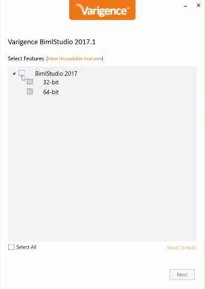

# Developer Installation

Developer installations provide the complete developer and SSIS generation environment for building BimlFlex solutions.

Other Installation Types are:

* [Analyst](analyst-installation.md)
* [Server](server-installation.md)

## Installation Media

Varigence provides two installers:

1. BimlToolsSetup\_(Version).exe
2. BimlFlexSetup\_(Version).exe

## BimlTools Setup Installation Wizard

The BimlTools Setup installation file contains the BimlStudio application.

Run the BimlTools installation and choose what options to install.

To be able to build out 64 b packages the corresponding 64 b Ssis components needs to be available (e.g. through a local Sql Server installation). If only the 32 b SSDT BI/Visual Studio development tools are installed BimlStudio will only be able to build out in 32 b. To be able to run the 64 b BimlStudio version and still build successfully, install both BimlStudio versions and choose to build 32 b from the 64 b version.

## BimlFlex Setup Installation Wizard

The BimlFlex Setup Installation file contains the BimlFlex add-ins, BimlFlex Excel Add-in and BimlFlex SSIS Custom Components.

Run the BimlFlex installation and choose what options to install.

Developers need to have both BimlStudio and the BimlFlex components installed.

## SSIS Components

The Varigence Custom SSIS Components are required for building and testing the SSIS Packages for developers opening the generated SSIS packages in Visual Studio and for running the packages on an SSIS Server.

## Uninstallation

If the Applications or components require uninstallation, they can use the standard "Uninstall a Program" option in Control Panel, Programs, Programs and Features.