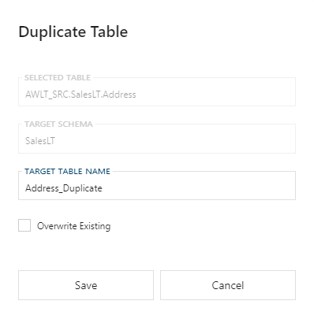

#### Duplicate Table Dialog

This will create a copy of the selected **Object** and properties along with a copy of all the **Columns**.

> [!IMPORTANT]
> **Attributes** and **Parameters** are not copied over.

##### Duplicate Table Options

| Option | Description |
| ------ | ----------- |
| Overwrite Existing | When enabled if the **Object** or associated **Columns** already exists, the **Object** and/or **Columns** will be overridden with current settings.  When disabled only not existing entities will be created. |
