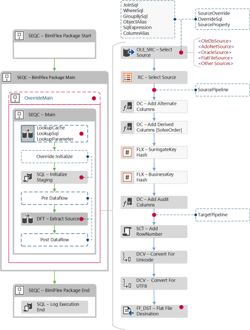

# Export To File

An outline for using BimlFlex to export data out of a database into files.
The export process supports the following template patterns:

* source to file
* source to zip file

These templates provide the necessary ETL transformations and destination components needed to successfully extract to a file.

## File Options

There are several file format options available for file exports.
Extension Points can override the behavior for custom requirements.

The Objects metadata spreadsheet in BimlFlex Excel contains the following settings for file formats.

### Flat File Types

|Attribute Name|Description|
|--- |--- |
|Delimited|Fields in row are delimited by character|
|FixedWidth|Each field/row has a fixed width|
|RaggedRight|The last field in row can have variable width, delimited by new row character|

### Data Rows to Skip

This is the count of rows from the start of the file to the header row or the start of data.

### TextQualifier

What character delimits the text in a given column. E.g. `"text"`, `'text'`, etc.

### Delimiters

Column and row delimiters and Last Column Delimiter

|Attribute Name|Description|
|--- |--- |
|CRLF|Carriage Return, Line Feed - ASCII 13, 10|
|CR|Carriage Return - ASCII 13|
|LF|Line Feed - ASCII 10|
|Semicolon|;|
|Comma|,|
|Tab|HT - ACSII 09|
|VerticalBar|||
|UnitSeparator|US - ASCII 31|
|Custom|Any valid custom delimiter|

### Code Page

The code page to use for the generated file. This is a standard SSIS attribute. Reference the following Microsoft documentation for more information:

[MSDN - Code Page Identifiers](https://msdn.microsoft.com/en-us/library/windows/desktop/dd317756.aspx)

## Source to File

### ETL Pattern Overview

The File Extract template extracts data from the data warehouse or other database source into a flat file destination.

The components and ETL pattern are similar to a regular source to target pattern. There are additional metadata requirements for defining the destination file.

### Adding Source to File Metadata

### Connections

The first step is setting up the connection attributes that are relevant to setting a flat file connection. In the source to file scenario, this would be the intended destination connection. For connections ensure to choose "Staging" as the Integration stage. Some example connection attributes that mimic this are shown below

|Attribute Name|Example Project Attributes|
|--- |--- |
|Name|TransactionsFile|
|ConnectionString|C:\\ExportFiles|
|Catalog|Transactions|
|ConnectionType|FILE|
|SystemType|"File Delimited"\\"File Ragged Right"\\"Excel"|
|IntegrationStage|Staging|
|RecordSource|TF|
|FilePath|C:\\ImportFiles\\|
|FilePattern|Transactions\*.\*|
|NoOfThreads|0|

### Batches

The second metadata entity that a user will need to fill in is the Batch entity. The Batch for a project is the parent package that executes the child packages that in turn perform the data load. Add a new batch with an appropriate name, number of threads, and option whether or not to use orchestration. An example of this batch metadata is shown below

### Projects

Below is a screen shot of an example project. Generally, it will follow the usual source to target metadata with a couple of differences. In this case, ensure that `Source -> File Extract` is defined for the integration template. This is important as it indicates to the BimlFlex framework what the type of project is an its purpose.

### Objects and Columns

Now to add both the source file definition and the target table definition in the objects metadata spreadsheet. Below is an example of the target transactions file that is intend to be loaded to. Note that, so far, specified in the first row, are the column names, the type of flat file, whether to skip any empty rows at the beginning of the file, row delimiter type, column delimiter, line delimiter or last column delimiter, code page and finally whether the file is Unicode or not. Supplying BimlFlex with this metadata will ensure the correct file formats are being loaded further on in the development and build stages.

Each destination File defined in the objects sheet require all destination columns to be defined.

Each source column need to be mapped to its respective destination column. This is done by adding the TargetTable and TargetColumnName attributes to the columns for the source table.

Once the metadata has been set in BimlFlex Excel, refresh the solution metadata in BimlStudio, build the solution and test.

## Source to Zip File

BimlFlex provides a separate template for destinations that require the generated file to be zipped. In addition to the previous file export template, this adds a file compression step at the end of the control flow.

### ETL Pattern Overview

### 7-Zip Application

The default BimlFlex templates use the open source and freely available 7-zip application for compressing files. The main reason is that it is freely available to use within a commercial environment, without registration or licensing. It also has an excellent command line interface that can be used through automation tools like SSIS.

A prerequisite for using the export to compressed file template is to have 7-Zip installed on the server running the packages.

7-Zip can be downloaded from [http://www.7-zip.org](http://www.7-zip.org)

## Adding Source to Zip File Metadata

### Connections

Assuming there already exist various layers in the data warehouse to extract from, the first thing to do is to create a new flat file connection in BimlFlex Excel. Some example connection attributes are shown below:

|Attribute Name|Example Project Attributes|
|--- |--- |
|Name|TransactionsFile|
|ConnectionString|C:\\ExportFiles\\Compressed|
|Catalog|Transactions|
|ConnectionType|FILE|
|SystemType|"File Delimited"\\"File Ragged Right"\\"Excel"|
|IntegrationStage|Staging|
|RecordSource|TF|
|FilePath|C:\\ExportFiles\\ Compressed\\|
|FilePattern|Transactions\*.\*|
|NoOfThreads|0|

#### Batches

The second metadata entity that needs to be defined is the Batch entity. The Batch will be the parent package the executes any child packages that actually export data. So, in this case, a new batch with the appropriate name. Select the number of threads to load with and whether or not to use orchestration.

### Projects

The next step is to add a project. Below is a screenshot of an example project. It will generally follow the usual source to target metadata. In this case, ensure that `Source -> Zip File Extract` is chosen for the integration template. This will indicate to BimlFlex that there are extra requirements around loading to a file and compressing it etc.

### Objects and Columns

Both the source definition and target definition are required in the objects metadata spreadsheet tab. Below is the definition of a sample target object in BimlFlex Excel.

To finish implementing this pattern, the column definitions for the destination are required. In this case, the Transactions table. They need to be pointed to the destination file.

This is done by filling in the target object and target object columns from the columns that define the source table, in this case, the Transactions source table.

Finally, refresh the BimlFlex metadata in BimlStudio, build and test.

## Requirements

7-zip must be installed on the server that is intended to host the SSIS packages. This is the current compression tool that BimlFlex uses as part of its standard source to zip file template.