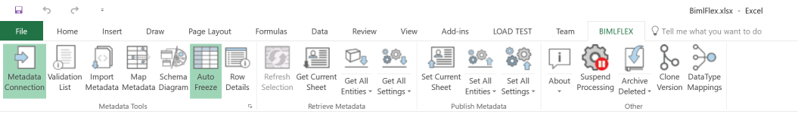
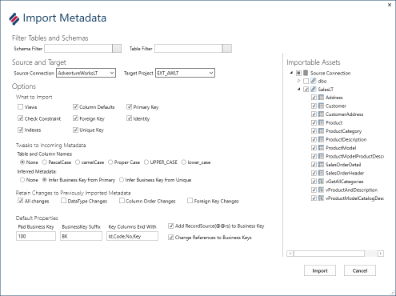
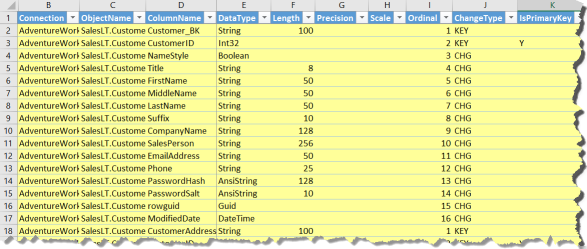
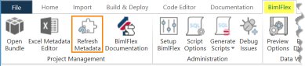
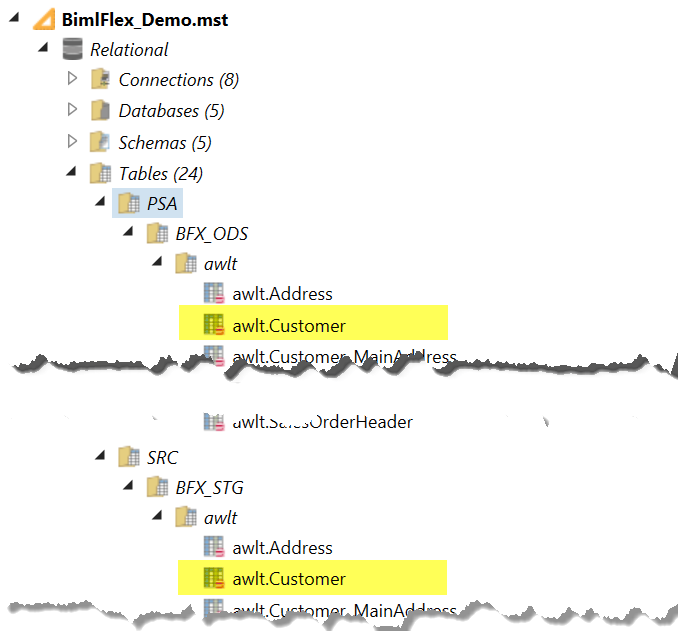

# Importing Metadata

The primary source BimlFlex uses to generate Data Warehousing and Business Intelligence assets is metadata. Metadata is most commonly in the form of objects with corresponding attributes.

Although it is relatively straightforward to define individual metadata objects, it can take considerable time and effort to create, update and maintain the number of objects that would typically be involved in an enterprise data warehouse solution.

The BimlFlex Excel Add-in provides an import tool that connects to a database source and populates the BimlFlex database with metadata.

This tool can be used in any scenario where a schema is available, and there is a need to bring that metadata into a BimlFlex project. If a change happens in the source, the metadata can be imported again to update the model.

## Watch Recordings

### 02. BimlFlex - Importing Metadata

In this session, we look at importing metadata using BimlFlex. The metadata is published and committed and persisted in the meta vault repository.

### Locating the tool

In the BimlFlex Excel Add-in, BimlFlex tab, in the metadata tools group, is the button `Import Metadata`. This opens the Import Metadata dialog.

### Import Metadata UI

There are a number of options for importing metadata. Align these options with the solution architecture and metadata conventions.

The example source is the AdventureWorksLT database, using the project `EXT_AWLT` as the target for imported metadata.

On the left-hand side are all the main options. Use these to control the behavior of the import, such as what object types to import, naming conventions to apply and what to retain if the metadata has been imported before.

### Metadata Options Definitions

A brief overview of the UI.

#### Filter Tables and Schemas

The Schema Filter and Table Filter can be used to limit the Assets made available/visible for import. This is useful if a subset of available tables will be imported or if new tables are added to an existing repository. Filtering also improves performance when connecting to and importing large database schemas.

#### Source and Target

|Option Name|Definition|
|--- |--- |
|Source Connection|Name of the connection that points to the data source the project is extracting from. The Connection is defined in the Connections tab in the Metadata.|
|Target Project|Name of the previously defined project that will use this metadata as its source in the source to target loading. The Project is defined in the Project tab in the Metadata.|

#### What to Import

Allows inclusion or exclusion of certain object types in the imported metadata. The database objects available to be chosen include:

* Views
* Column Defaults
* Primary Keys
* Check Constraints
* Foreign Keys
* Identities
* Indexes
* Unique Keys

#### Tweaks to Incoming Metadata

Options that can override the format of incoming metadata. Align these options with organizational standards and best practices.

##### Table and column names

Options to apply naming conventions to imported metadata.

* None - This will retain the source system default naming conventions.
* PascalCase - E.g. "CustomerAddress"
* camelCase - E.g. "customerAddress"
* Proper Case - E.g. "Customer Address"
* UPPER\_CASE - E.g. "CUSTOMER\_ADDRESS"
* lower\_case - E.g. "customer\_address"

##### Inferred Metadata

Infers Business Keys from column constraints

* None - Nothing
* Infer Business Key from Primary Key
* Infer Business Key from Unique Key

#### Retain Changes to Previously Imported Metadata

Controls if existing metadata should be retained during the import of metadata.

* All Changes, Don’t override anything.
* Data Type Changes
* Column Order Changes
* Foreign Key Changes

#### Default Properties

This controls default behavior of inferred Business Keys.

* Pad Business Keys (Amount) – defines business key width
* BusinessKey Suffix - Optionally add a suffix onto column name to indicate what is a business key
* Key Columns End With – When inferring keys, what substring to look for at the end of a column name - Id, Code, No, Key or any custom string added

### Importable Assets

The Importable Assets list is read from the Source Connection. Choose items that should be included in the metadata import

The metadata will then be imported into the currently open metadata spreadsheet.

Note that this has not yet been committed to the metadata repository, these are unsaved rows of metadata.

After review, commit the imported metadata to the BimlFlex metadata repository by clicking `Set All Entities` from the publish metadata section.

## Verify Imported Metadata in BimlStudio

Open the BimlFlex project in BimlStudio or press the `Refresh Metadata` button if already opened.

Verify that the newly imported objects is visible under the `Relational -> Tables -> SRC` folder and the `Integration Services -> 01-Source` folder.

### Tables

### SSIS Packages

