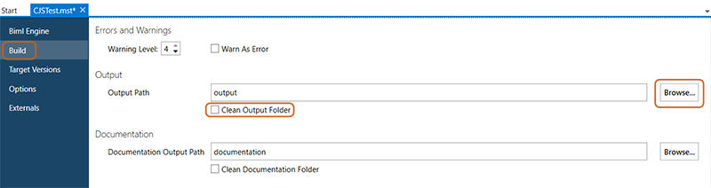

In the build section, the output locations and options for built artifacts. Use these settings to direct where the output artifacts will be created.

To access or configure the project's output path, click *File* then *Output Settings*. Select *Build* from the left side of the menu.

The desired output path may be entered manually in the `Output Path` field. Alternatively, click the *Browse...* button to locate and select the output folder from the path selection dialog that appears.

Select or deselect the `Clean Output Folder` option, as desired.

Cleaning the output folder will scrub the folder of any old files, so that the folder only contains assets related to the most recent build.
