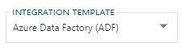

BimlFlex [**Projects**](xref:bimlflex-project-editor) define exactly how data is intended to be processed, through which steps in the architecture, and by using what technology.

The project configuration includes the specification of the involved [**Connections**](xref:bimlflex-connection-editor), for example as a `source` or `target` connection. The exact configuration of these stages drives the way the data logistics are generated by the BimlFlex engine. In other words, a project directs how data is processed through the data solution.

Each project requires an [**Integration Template**](xref:bimlflex-metadata-static-values#integration-templates), which specifies for which target technology the data logistics processes will be generated. A project is also associated to a [**Batch**](xref:bimlflex-batch-editor) to generate a batch process executable for the targeted technology (integration template).

All [**Objects**](xref:bimlflex-object-editor) belonging to the connections configured in the project will be subject to the selected integration template. This means that, for example, if you use a connection as a source that data logistics will be generated for _all_ objects associated with this (source) connection.

Projects are created and edited using the [**Project Editor**](xref:bimlflex-project-editor) in the [BimlFlex Application](xref:bimlflex-editors-overview).

In the BimlFlex design workflow, a project is typically the third component to configure - after having created the connections and batch to reference the project to.

At this stage, depending on the project configuration and assuming objects have been imported for the source connection, executable data logistics can already be generated for a number of patterns.
