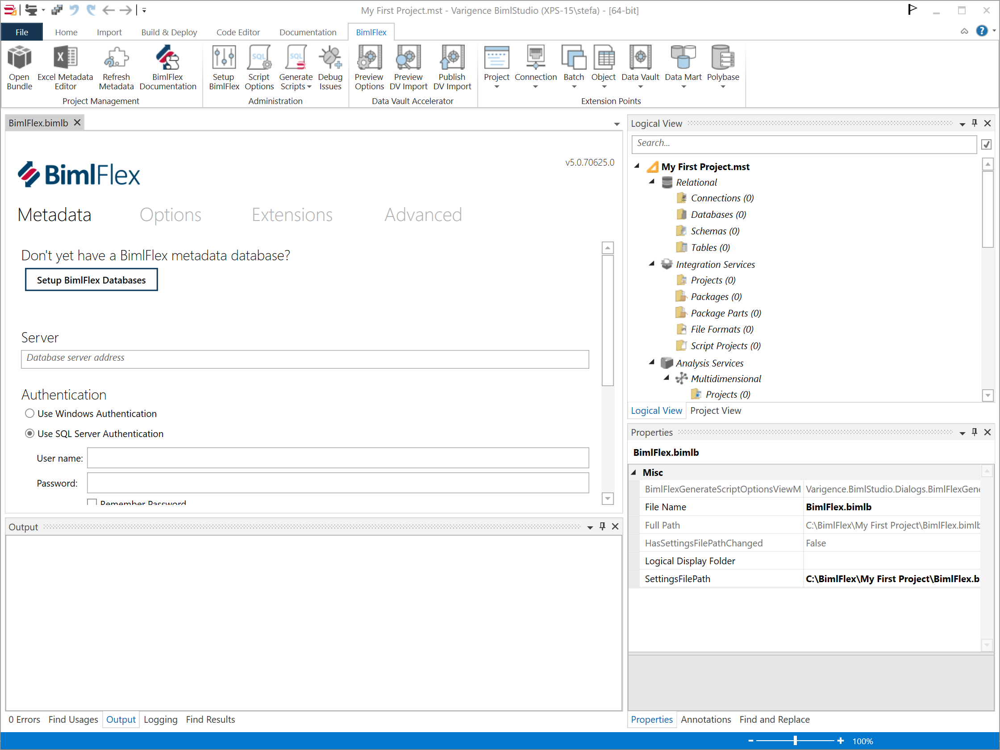
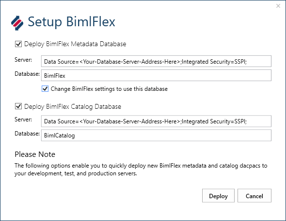
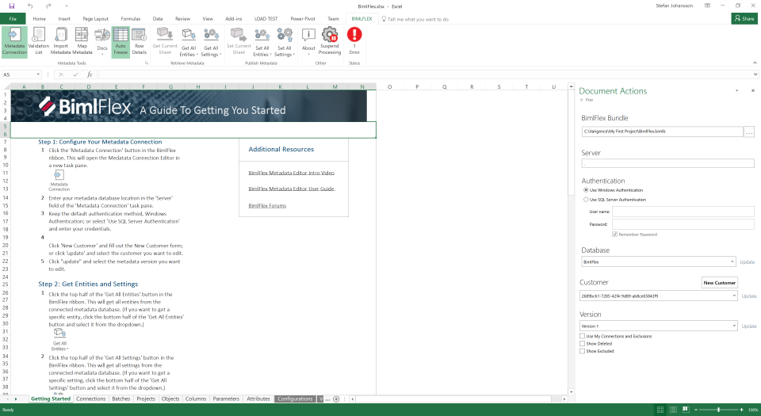
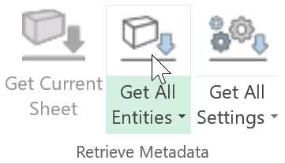
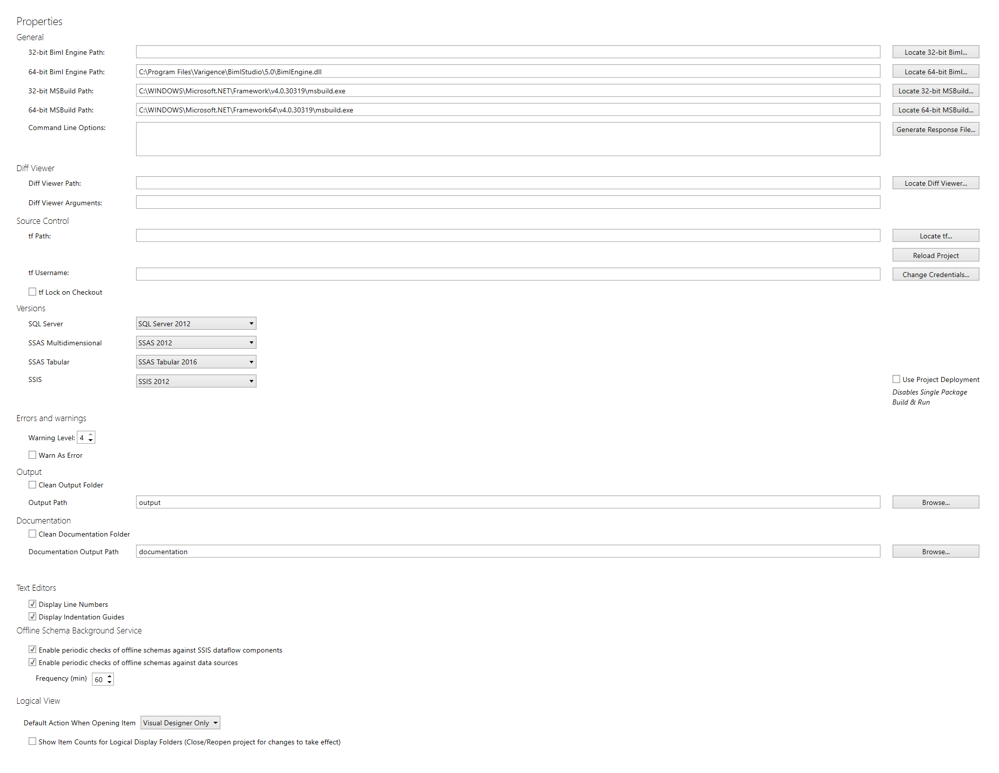
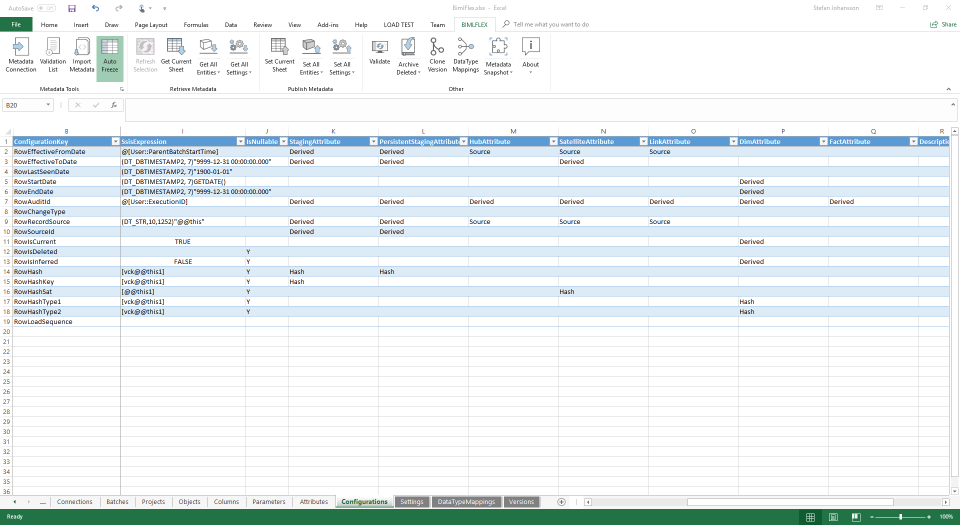

# Initial Setup and Configuration

The setup includes the necessary steps to set up the environments, including:

* the projects
* the databases
* the components

that are required for the full BimlFlex framework to work.

Once the BimlStudio and BimlFlex installations are completed, it is time to set up the environment for a BimlFlex project.

The development side is focused around the BimlStudio-based BimlFlex project. Open the BimlStudio Application and create a new, empty project.

The first time a new installation starts it requires the License Key. This key is provided as part of the engagement with Varigence. 

If the key is missing, please contact Varigence BimlFlex Support at [bimlflex-support@varigence.com](mailto:bimlflex-support@varigence.com).

## Watch Recordings

### 01. BimlFlex - Initial Configuration

In this session, we go through the initial configuration of the BimlFlex project. We will cover the initial deployment of BimlFlex and BimlCatalog databases, create our first metadata instance.

<iframe width="853" height="480" src="https://www.youtube.com/embed/qhDTwv-jYKc?rel=0" frameborder="0" allowfullscreen></iframe>

## Creating the BimlFlex project

From the start page, create a new BimlFlex project


Options for creating a new BimlFlex Project.


The project creation options include project file name and location and also the templates for the BimlFlex Bundle and the Excel Add-in file. These are stored in the default installation locations of the software:

### 32-bit installations

```
Bundle: C:\Program Files (x86)\Varigence\BimlStudio\5.0\BimlFlex.bimlb
Excel Add-in: C:\Program Files (x86)\Varigence\BimlFlex\5.0\BimlFlex.xlsx
```

### 64-bit installations

```
Bundle: C:\Program Files\Varigence\BimlStudio\5.0\BimlFlex.bimlb
Excel Add-in: C:\Program Files\Varigence\BimlFlex\5.0\BimlFlex.xlsx
```

The Bundle contains the logic, Biml scripts, and code that enables the BimlFlex features in BimlStudio. The Excel Add-in is the Excel spreadsheet with the Add-in code for the Metadata editor.

The Bundle and the Excel Add-in are versioned and are copied to the destination folder with the other project files. That means different versions of the bundle and the Excel Add-in can be used depending on the project. It also means they can be updated by just exchanging these files for new versions.

Once the project is created, it is possible to open it directly from the folder or by opening the project file from BimlStudio.



### Set up Databases

The next step is to create or connect to the BimlFlex databases. BimlFlex uses a metadata database and an orchestration catalog database. All metadata generated in BimlFlex is stored in the metadata database. A metadata database can contain many projects (customers) and versions.

The orchestration catalog database contains run-time information about package executions, auditing and logging of any errors encountered.

Create the required BimlFlex databases by clicking Setup BimlFlex in the Ribbon.



The default naming convention for the database names can be overridden to identify projects or environments.

To be able to complete this step, the account used to access the database engine needs the necessary rights to create and configure the new databases.

It is also possible to deploy the databases through the BimlFlex Support Utility Application or by implementing Dacpacs.

### Setting up a Customer

Once the databases are available, it is time to create a customer. The Customer entity holds a separate set of metadata in the database and can be used to identify different projects, versions, customers, variations.


The customer is represented internally in the database with a GUID, so if metadata is reused or manually managing the data in the database, it is possible to specify it here. For typical creation, it is recommended to auto-generate it.

A Customer can have multiple versions of the related metadata. An initial Version is created with the Customer but throughout a project, it is possible to work with multiple different versions.

Once the Project, Databases, Customer, and Version are setup the Excel-based Metadata Editor can be opened to populate the Project with metadata.

### Setting Up the Excel Metadata Editor

The Excel-based Metadata Editor is opened from the BimlFlex Ribbon tab in BimlStudio. The editor provides a familiar and productive metadata management environment.



The BimlFlex Excel metadata editor comes with an additional Excel tab in the Ribbon for interacting with BimlFlex. The first step is to open the metadata connection pane and connect to the BimlFlex metadata database (default name BimlFlex).

Once the connection is defined the metadata can be read into Excel. The master data is stored in the database and the working set is cached and displayed in Excel. The data is not updated in real time, so for collaborative projects, it is important to commit changes to the database and keep communicating within the team.

Retrieve all metadata into Excel by clicking the `Get All Entities` and `Get All Settings` buttons in the Excel UI.



The first time an empty customer is opened there is an option to create sample metadata.

This helps guide the first projects and provides a base set of metadata to build on.


Once the metadata entities and settings are refreshed, it is possible to review the sample data and default settings.

## Configuration

This step includes the required and optional configurations available for the BimlFlex framework.

### BimlStudio Project configuration

BimlStudio project options include settings such as the target SQL Server and SSIS versions and project or package deployments for SSIS. Most of these are optional to change, but the target version and deployment method needs to be correct for the packages to run on the destination server.



### Metadata configuration

The Configurations and Settings sheets in the Metadata Editor contains  options for the generation and behaviour of the project.

This is described in more detail in:

* @bimlflex-metadata-configurations
* @bimlflex-metadata-settings


