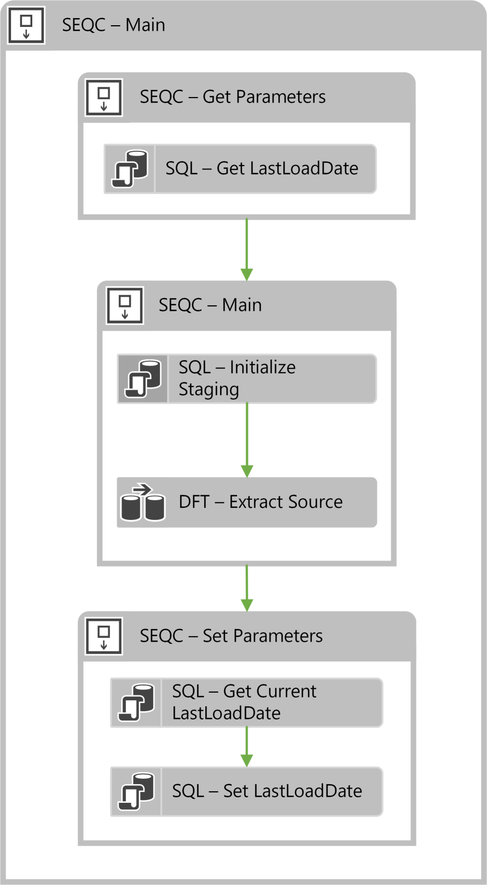

# Parameters

Parameters for load queries are added either as metadata in the Parameters sheet or via Extension Points. For high watermark delta loads and similar simple parameters adding the Parameter to the metadata will generate and include all required logic to the load process.

Extension Points can be added for more complex parameters that require custom logic.

Parameters added to a project, batch package or regular package can be used as any other SSIS parameter. BimlFlex applies standard practices for using parameters but supports any custom use of added parameters.

## Basic Parameters

The most common scenario is to add parameters to a source query or add parameters that hold details about the particular BI solution. The approach used for these scenarios are different.

When the parameter metadata is entered into BimlFlex Excel Add-in, BimlFlex uses the `[BimlCatalog]` database to manage parameterized source queries. Parameters are persisted in `[BimlCatalog].[ssis].[ConfigVariable]` and logged to `[BimlCatalog].[ssis].[AuditLog]`.

Here is an example of a parameter being stored in the `BimlCatalog` database in the `[ssis].[ConfigVariable]` table.

| SystemName | ObjectName                            | VariableName | VariableValue | ExecutionID |
| ---------- | ------------------------------------- | ------------ | ------------- | ----------- |
| AW_SRC     | AW_SRC.Sales.SalesPerson.ModifiedDate | LastLoadDate | 20/09/2015    | 109         |

## Parameters in BimlFlex Excel

When a parameter is added to an object in BimlFlex Excel Add-in, the metadata will be managed the BimlFlex framework and used to generate all the required components to track and update the value defined. Below demonstrates how a data parameter has been incorporated into a source to target loading package. Note that this load starts and ends with sequence containers that are specifically for managing this new parameter.



Using the above process, a package that tracks the maximum ID as a parameter can be rerun any number of times. Each time BimlFlex will store the maximum value and update it as it increases over time.

The process starts before the main container. The first control flow task looks up any relevant parameters. LookupParameter is used to check the catalog table `[BimlCatalog].[ssis].[ConfigVariable]` for the parameter that matches the current object being loaded.

The parameter value will be injected in to the source query in the normal data flow as a `WHERE` clause using the specified logic from the metadata.

After the load the Set Parameters tasks will get the new value for the parameter and update the `[BimlCatalog].[ssis].[ConfigVariable]` table.

## Defining and overriding the parameter behavior

There are several metadata fields to manage load parameters.

### Parameter Operator

This defines the operator used in the `WHERE` clause in the source select query. For a high watermark load pattern, the `>` is commonly used to load data with a higher value than the last time.

### Parameter Default

The parameter load value to use the first time the load happens, when there is no existing parameter value stored in the BimlCatalog database. For high watermark scenarios this is commonly a valid value guaranteed to be lower than any existing data, such as `1900-01-01` for dates. When adding dates in Excel, use the text-defining prefix so the data is kept as text rather than transformed into Excels internal date format, `'1900-01-01`.

### Parameter Data Type

The Data Type to use for the parameter. For Dates, this is commonly defined as `String` as SSIS sometimes finds it easier to deal with string representations.

### ParameterSql

The SQL Query to use to derive the new parameter value, commonly used to get the max value from the loaded data and use that as the from parameter value in the next load.

sample metadata definition to get the max column value in date format

```sql
MAX(CONVERT(VARCHAR(10), @@this, 121))
```

### ParameterToName, ParameterToOperator, ExecuteSqlOnSource

Useful for windowed loads or when it is not possible to derive the new parameter from the destination. When loading to Blob files it is not possible to query the created file to get the new parameter value, so this allows the from and to to be derived and applied in the source query using only the source data.

### ParameterColumnExpression

Used to override the column part of the WHERE clause in the source query to tweak the column expression. Useful when extra logic is required for the filter.

Example expression

```sql
COALESCE(ModifiedDate, CreatedDate)
```

### ParameterOverride

Used to override the parameter part of the WHERE clause in the source query to tweak the column expression. Useful when extra logic is required for the filter.

Example expression

```sql
DATEADD(dd, -3, ?)
```

## Parameters in Extension Points

Extension Point-based parameters are available for more complex scenarios where the logic needed for the flow and parameter isn't easily injected through the normal parameter process.

It also supports specifying Project level Parameters that are commonly available in all packages in the project.

### Extension Point Project Parameters

Add Extension Points in BimlStudio.

More details on Extension Points are in the [Extension Points](extension-points.md) documentation


The newly created file contains some sample scripts:

```biml
<#@ extension bundle="BimlFlex.bimlb" extensionpoint="ProjectParameter" target="ProjectName" #>
<!-- You can find more details on the Varigence website. https://www.varigence.com/Documentation/Language/Element/AstParameterNode -->
<!-- The below example configures parameters that will be used in combination with Connection Expressions-->
<Parameter Name="ServerName" DataType="String" IsRequired="true">localhost</Parameter>
<Parameter Name="UserName" DataType="String" IsRequired="true">varigence</Parameter>
<Parameter Name="UserPassword" DataType="String" IsRequired="true">P@ssw0rd!</Parameter>
```

The directives are required for the Extension Point. An additional attribute for the target of the Extension Point needs to be specified. For a project parameter it is the name of the project it targets.

Once the Project Parameter is defined through the Extension Point it can be reused throughout the project in either metadata or additional Extension Points as needed.

### Extension Point Package Parameters

Package Parameters only affect the individual package it targets. Package parameters can be used when a single package requires bespoke logic that doesnt fit the existing parameter logic. These parameters can be used for any logic and might not need to be persisted in the BimlCatalog database.

Add Extension Points in BimlStudio


The newly created file contains some sample scripts:

```biml
<#@ extension bundle="BimlFlex.bimlb" extensionpoint="PackageVariable" target="ObjectName"#>
<#@ property name="table" type="BimlFlexModelWrapper.ObjectsWrapper" #>
<!-- You can find more details on the Varigence website. https://www.varigence.com/Documentation/Language/Element/AstVariableNode -->
<!-- Variables can also be added to all the packages for the Batch using the PackageVariable combined with CustomOutput.ObjectInherit = true; -->
<#* CustomOutput.ObjectInherit = true; *#>
<Variable Name="TenantCode" DataType="String">UNK</Variable>
<Variable Name="CurrentModifiedDate" DataType="String" Namespace="User">1900-01-01</Variable>
```

The directives are required for the Extension Point. An additional attribute for the target of the Extension Point needs to be specified. For a package parameter it is the name of the package it targets.

Once the Package Parameter is defined through the Extension Point it can be reused throughout the Package in either metadata or additional Extension Points as needed.