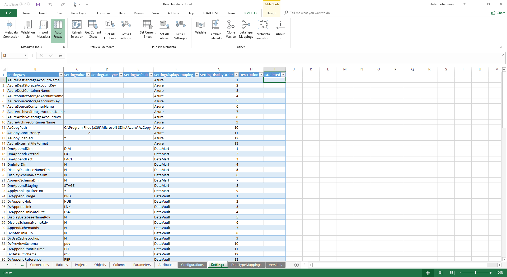

# Metadata and framework settings in BimlFlex

This document outlines the metadata and framework settings available in BimlFlex.

These  Settings drive the behavior of the BimlFlex product.

By changing them, the produced artifacts can adapt to support requirements for file locations, naming conventions, data conventions etc.

The Settings defaults are the Varigence recommended values and there is no need to change or configure unless there is a requirement to change specific behaviors. Align these settings with the organizations best practices and environmental requirements.

The  Settings are available in the Settings sheet in the BimlFlex Excel Add-in.



## Metadata column overview

|Key|Value|
|--- |--- |
|Configuration Key|the Configuration Key, the internal key BimlFlex refers to, cannot be changed|
|Configuration Value|the Configured Value, can be updated to support a different design pattern or behaviour|
|Configuration Datatype|the data type the configuration Value uses. Needs to be a valid data type definition|
|Configuration Default|the Configuration Key’s Default Value|
|Configuration Grouping|BimlFlex Internal Grouping of configurations|
|Configuration Order|BimlFlex Internal Ordering of configurations|
|SSIS Expression|the SSIS Expression used to derive the value. Needs to be a valid SSIS Expression. Uses the shorthand @@this to define the current entity|
|Is Nullable|Defines If the attribute is nullable Valid Enumeration {Empty, Y, N}|
|Staging Attribute|Valid Enumeration {Ignore, Derived, Source, Default, Target, Hash}|
|Persistent Staging Attribute|Valid Enumeration {Ignore, Derived, Source, Default, Target, Hash}|
|Hub Attribute|Valid Enumeration {Ignore, Derived, Source, Default, Target, Hash}|
|Satellite Attribute|Valid Enumeration {Ignore, Derived, Source, Default, Target, Hash}|
|Link Attribute|Valid Enumeration {Ignore, Derived, Source, Default, Target, Hash}|
|Dim Attribute|Valid Enumeration {Ignore, Derived, Source, Default, Target, Hash}|
|Fact Attribute|Valid Enumeration {Ignore, Derived, Source, Default, Target, Hash}|
|Description|An optional description for custom attributes or definitions. The default configurations are described in this document|
|Is Deleted|Flag to set if a custom attribute has been entered but is now no longer needed and should be considered deleted. Valid Enumeration {Empty, Y, N}|

## Standard Settings

### RootPath

#### Description

The **RootPath** defines the default Root Path folder of the BimlFlex solution.

#### Example

```
C:\Varigence\BimlFlex
```

#### Valid Value

A valid path

#### Default Metadata information

|Key|Value|
|--- |--- |
|Configuration Value|C:\Varigence\BimlFlex|

### ImportPath

#### Description

The **ImportPath** defines the default folder path for file import.

#### Example

```
C:\Varigence\Import
```

#### Valid Value

A valid path

#### Default Metadata information

|Key|Value|
|--- |--- |
|Configuration Value|C:\Varigence\Import|

### ExportPath

#### Description

The **ExportPath** defines the default folder path for file exports.

#### Example

```
C:\Varigence\Export
```

#### Valid Value

A valid path

#### Default Metadata information

|Key|Value|
|--- |--- |
|Configuration Value|C:\Varigence\Export|

### UseBimlCatalog

#### Description

The **UseBimlCatalog** defines whether or not to use the BimlFlex Catalog database for SSIS package orchestration and logging.

#### Example

```
Y
```

#### Valid Value

Enumeration {Y,N}

#### Default Metadata information

|Key|Value|
|--- |--- |
|Configuration Value|Y|

### ConfigurationPath

#### Description

The **ConfigurationPath** key defines the default path for configurations

#### Example

```
C:\Varigence\Configurations
```

#### Valid Value

A valid path

#### Default Metadata information

|Key|Value|
|--- |--- |
|Configuration Value|C:\Varigence\Configurations|

### 7ZipPath

#### Description

The **7ZipPath** key defines the file path/location of the 7-Zip application that is used for zipping/compression of files. The 7-zip executables are needed for zip-related operations. The 7-Zip application is open source and available to use without license cost.

More information and downloads: <http://www.7-zip.org/download.html>

#### Example

```
C:\Program Files\7-Zip
```

#### Valid Value

A valid path to the 7-Zip executable

#### Default Metadata information

|Key|Value|
|--- |--- |
|Configuration Value|C:\Program Files\7-Zip|

### AzCopyPath

#### Description

The **AzCopyPath** key defines the file path/location of the AzCopy application used to copy files to Azure storage.

#### Example

```
C:\Program Files (x86)\Microsoft SDKs\Azure\AzCopy
```

#### Valid Value

A valid path to the AzCopy executable

#### Default Metadata information

|Key|Value|
|--- |--- |
|Configuration Value|C:\Program Files (x86)\Microsoft SDKs\Azure\AzCopy|

### KeyEndsWith

#### Description

The **KeyEndsWith** key defines the text the metadata import uses to identify key columns that aren’t technically identified as keys in the source. Add any source specific key identifiers to enable automatic identification of key columns.

#### Example

```
Id,Code,No,Key,Cd
```

#### Valid Value

Any valid comma separated list of SQL or SSIS Strings

#### Default Metadata information

|Key|Value|
|--- |--- |
|Configuration Value|Id,Code,No,Key|

### SuffixOrPrefixColumn

#### Description

The **SuffixOrPrefixColumn** key defines the behaviour when defining column names. Use Suffix or Prefix to define if the column identifiers are added after or before the column names in the solution.

#### Example

```
S for Suffix will generate Entity_SK
P for Prefix Will generate SK_Entity
```

#### Valid Value

Enumeration {P, S}

#### Default Metadata information

|Key|Value|
|--- |--- |
|Configuration Value|S|

### SuffixOrPrefixObject

#### Description

The **SuffixOrPrefixObject** key defines the behaviour when defining object names. Use Suffix or Prefix to define if the object identifiers are added after or before the object names in the solution.

#### Example

```
S for Suffix Will generate Entity_HUB
P for Prefix Will generate HUB_Entity
```

#### Valid Value

Enumeration `{P, S}`

#### Default Metadata information

|Key|Value|
|--- |--- |
|Configuration Value|P|

### UseRecordSourceAsAppend

#### Description

The **UseRecordSourceAsAppend** Key specifies if the record source should be appended to the object name

#### Example

```
N
```

#### Valid Value

Enumeration `{Y, N}`

#### Default Metadata information

|Key|Value|
|--- |--- |
|Configuration Value|N|

### UseRecordSourceAsSchema

#### Description

The **UseRecordSourceAsSchema** Key specifies if the record source should be used as the schema for objects. As an example, the default behaviour means a source table called Product from the record source AWLT will be created as AWLT.Product in the Staging Area

#### Example

```
Y
```

#### Valid Value

Enumeration `{Y, N}`

#### Default Metadata information

|Key|Value|
|--- |--- |
|Configuration Value|Y|

### UseColumnModelOverride

#### Description

The **UseColumnModelOverride** Key specifies if the model override for column should be used instead of the source names for columns in the Staging and Persisted Staging areas. The recommended, and default behaviour, is to use source names for Staging and only use override names in the Data Vault/later layers.

#### Example

```
N
```

#### Valid Value

Enumeration `{Y, N}`

#### Default Metadata information

|Key|Value|
|--- |--- |
|Configuration Value|N|

### UseObjectModelOverride

#### Description

The **UseObjectModelOverride** Key specifies if the model override for objects should be used instead of the source names for objects in the Staging and Persisted Staging areas. The recommended, and default behaviour, is to use source names for Staging and only use override names in the Data Vault/later layers.

#### Example

```
N
```

#### Valid Value

Enumeration `{Y, N}`

#### Default Metadata information

|Key|Value|
|--- |--- |
|Configuration Value|N|

### HashBusinessKey

#### Description

The **HashBusinessKey** Key specifies if the Business Key should be hashed. This is implemented by default for Data Vault regardless of setting but can be specified for other modelling approaches.

#### Example

```
N
```

#### Valid Value

Enumeration `{Y, N}`

#### Default Metadata information

|Key|Value|
|--- |--- |
|Configuration Value|N|

### ConcatenatorBusinessKey

#### Description

The **ConcatenatorBusinessKey** Key specifies the value to use as filler between business keys when concatenating them. Single business keys are created from multiple source columns through concatenation to maintain a single business key. When concatenating it is important to be able to distinguish between similarly formed inputs. E.g. concatenating ABC and DEF without the concatenator will make it the same as AB + CDEF (`ABCDEF`). The concatenator will maintain the two as different and distinct entities (`ABC~DEF` vs. `AB~CDEF`). Using a concatenator is required to maintain data integrity but the value can be configured to support an existing process, design pattern or specific requirement.

#### Example

```
~
```

#### Valid Value

any valid string value usable for string parsing

#### Default Metadata information

|Key|Value|
|--- |--- |
|Configuration Value|~|

### BusinessKeyNullValue

#### Description

The **BusinessKeyNullValue** Key specifies the defined value to use for null values in the business key.

#### Example

```
~NULL~
```

#### Valid Value

Any valid and safe SQL and SSIS String

#### Default Metadata information

|Key|Value|
|--- |--- |
|Configuration Value|NVL|

### AppendBusinessKey

#### Description

The **AppendBusinessKey** Key specifies the string to append to the Business Key Columns. Prefixing or suffixing is specified by the SuffixOrPrefixColumn configuration

#### Example

```
BK = BusinessKeyColumnName_BK
```

#### Valid Value

Any valid and safe SQL and SSIS String

#### Default Metadata information

|Key|Value|Datatype|
|--- |--- |--- |
|Configuration Value|BK|DataType="AnsiString" Length="40"|

### AppendSurrogateKey

#### Description

The **AppendSurrogateKey** Key specifies the string to append to the Surrogate Key Columns. Prefixing or suffixing is specified by the SuffixOrPrefixColumn configuration

#### Example

```
SK = KeyColumnName_SK
```

#### Valid Value

Any valid and safe SQL and SSIS String

#### Default Metadata information

|Key|Value|Datatype|
|--- |--- |--- |
|Configuration Value|SK|DataType="AnsiString" Length="40"|

### AppendRecordSource

#### Description

The **AppendRecordSource** Key specifies if the Record source should be appended to object names

#### Example

```
N
```

#### Valid Value

Enumeration {Y, N}

#### Default Metadata information

|Key|Value|
|--- |--- |
|Configuration Value|N|

### AppendSchemaDm

#### Description

The **AppendSchemaDm** Key specifies if the Schema should be appended in the Data Mart layer

#### Example

```
N
```

#### Valid Value

Enumeration {Y, N}

#### Default Metadata information

|Key|Value|
|--- |--- |
|Configuration Value|N|

### AppendSchemaRdv

#### Description

The **AppendSchemaRdv** Key specifies if the Schema should be appended in the Data Vault layer

#### Example

```
N
```

#### Valid Value

Enumeration {Y, N}

#### Default Metadata information

|Key|Value|
|--- |--- |
|Configuration Value|N|

### AppendSchemaPsa

#### Description

The **AppendSchemaPsa** Key specifies if the Schema should be appended for the Persistent Staging layer when colocated in the Staging database

#### Example

```
ods
```

#### Valid Value

Any valid and safe SQL and SSIS String

#### Default Metadata information

|Key|Value|
|--- |--- |
|Configuration Value|ods|

### AppendSchemaStg

#### Description

The **AppendSchemaStg** Key specifies if the source schema should be appended to the object name. this is useful for when a source has multiple schemas with the same object name repeated across these schemas. To be able to distinguish between them in the Staging Area the schema name needs to be added. The default process disregards the schema for simplicity in the naming. An example where this might be needed is when loading all tables from the WideWorldImporters demo database where the same table name is repeated across multiple schemas.

#### Example

```
N
```

#### Valid Value

Enumeration {Y, N}

#### Default Metadata information

|Key|Value|
|--- |--- |
|Configuration Value|N|

### AppendDomain

#### Description

Should Domain be added

#### Example

```
N
```

#### Valid Value

Enumeration {Y, N}

#### Default Metadata information

|Key|Value|
|--- |--- |
|Configuration Value|N|

### DisplayDatabaseNameStg

#### Description

Should the Database name be added to the Staging Layer

#### Example

```
N
```

#### Valid Value

Enumeration {Y, N}

#### Default Metadata information

|Key|Value|
|--- |--- |
|Configuration Value|N|

### DisplaySchemaNameStg

#### Description

Should the source schema name be added to the Staging Layer

#### Example

```
N
```

#### Valid Value

Enumeration {Y, N}

#### Default Metadata information

|Key|Value|
|--- |--- |
|Configuration Value|N|

### LookupCachePath

#### Description

The **LookupCachePath** Key specifies the path for cache files for the lookup process when it is using external persistence of cache data.

#### Example

```
C:\Varigence\Cache
```

#### Valid Value

Any valid and safe path

#### Default Metadata information

|Key|Value|
|--- |--- |
|Configuration Value|C:\Varigence\Cache|

### DisplayDatabaseNameRdv

#### Description

The **DisplayDatabaseNameRdv** Key specifies if the database name should be added to the Rdv layer

#### Example

```
N
```

#### Valid Value

Enumeration {Y, N}

#### Default Metadata information

|Key|Value|
|--- |--- |
|Configuration Value|N|

### DisplaySchemaNameRdv

#### Description

The **DisplaySchemaNameRdv** Key specifies if the source schema name should be added to the Rdv Layer

#### Example

```
N
```

#### Valid Value

Enumeration {Y, N}

#### Default Metadata information

|Key|Value|
|--- |--- |
|Configuration Value|N|

### LookupAddFilterTable

#### Description

The **LookupAddFilterTable** Key specifies if table filter should be added to the lookup

#### Example

```
N
```

#### Valid Value

Enumeration {Y, N}

#### Default Metadata information

|Key|Value|
|--- |--- |
|Configuration Value|N|

### DisplayDatabaseNameDm

#### Description

The **DisplayDatabaseNameDm** Key specifies if the objects database name should be displayed in the Data Mart.

#### Example

```
N
```

#### Valid Value

Enumeration {Y, N}

#### Default Metadata information

|Key|Value|
|--- |--- |
|Configuration Value|N|

### LookupTablePattern

#### Description

The **LookupTablePattern** Key specifies the lookup naming convention used for SSIS table lookup.

#### Example

```
lkp.ReferenceColumnName
```

#### Valid Value

Any valid and safe SQL and SSIS String

#### Default Metadata information

|Key|Value|
|--- |--- |
|Configuration Value|"lkp." + column.Name.MakeSsisSafe|

#### DisplaySchemaNameDm

#### Description

The **DisplaySchemaNameDm** Key specifies if the objects schema name should be displayed in the Data Mart.

#### Example

```
N
```

#### Valid Value

Enumeration {Y, N}

#### Default Metadata information

|Key|Value|
|--- |--- |
|Configuration Value|N|

### DmAppendDim

#### Description

The **DvAppendDim** Key specifies the string to append to Dimension objects in the Data Mart. Prefixing or suffixing is specified by the SuffixOrPrefixObject configuration

#### Example

```
DIM = DIM_DimensionEntityName
```

#### Valid Value

Any valid and safe SQL and SSIS String

#### Default Metadata information

|Key|Value|
|--- |--- |
|Configuration Value|DIM|

### DmAppendFact

#### Description

The **DvAppendFact** Key specifies the string to append to Fact objects in the Data Mart. Prefixing or suffixing is specified by the SuffixOrPrefixObject configuration

#### Example

```
FACT = FACT_FactEntityName
```

#### Valid Value

Any valid and safe SQL and SSIS String

#### Default Metadata information

|Key|Value|
|--- |--- |
|Configuration Value|FACT|

### DmAppendExternal

#### Description

The **DvAppendExternal** Key specifies the string to append to External objects in the Data Mart. Prefixing or suffixing is specified by the SuffixOrPrefixObject configuration

#### Example

```
EXT = EXT_ExternalEntityName
```

#### Valid Value

Any valid and safe SQL and SSIS String

#### Default Metadata information

|Key|Value|
|--- |--- |
|Configuration Value|EXT|

### DmAppendStaging

#### Description

The **DvAppendStaging** Key specifies the string to append to Staging objects in the Data Mart. Prefixing or suffixing is specified by the SuffixOrPrefixObject configuration

#### Example

```
STAGE = STAGE_DimensionEntityName
```

#### Valid Value

Any valid and safe SQL and SSIS String

#### Default Metadata information

|Key|Value|
|--- |--- |
|Configuration Value|STAGE|


### DvAppendBridge

#### Description

The **DvAppendBridge** Key specifies the string to append to Bridge objects. Prefixing or suffixing is specified by the SuffixOrPrefixObject configuration

#### Example

```
BRD = BRD_BridgeEntityName
```

#### Valid Value

Any valid and safe SQL and SSIS String

#### Default Metadata information

|Key|Value|
|--- |--- |
|Configuration Value|BRD|

### DvAppendHub

#### Description

The **DvAppendHub** Key specifies the string to append to Hub objects. Prefixing or suffixing is specified by the SuffixOrPrefixObject configuration

#### Example

```
HUB = HUB_EntityName
```

#### Valid Value

Any valid and safe SQL and SSIS String

#### Default Metadata information

|Key|Value|
|--- |--- |
|Configuration Value|HUB|

### DvAppendLink

#### Description

The **DvAppendLink** Key specifies the string to append to Link objects. Prefixing or suffixing is specified by the SuffixOrPrefixObject configuration

#### Example

```
LNK = LNK_LinkName
```

#### Valid Value

Any valid and safe SQL and SSIS String

#### Default Metadata information

|Key|Value|
|--- |--- |
|Configuration Value|LNK|

### DvAppendLinkSatellite

#### Description

The **DvAppendLinkSatellite** Key specifies the string to append to Link Satellite objects. Prefixing or suffixing is specified by the SuffixOrPrefixObject configuration

#### Example

```
LSAT = LSAT_LinkName
```

#### Valid Value

Any valid and safe SQL and SSIS String

#### Default Metadata information

|Key|Value|
|--- |--- |
|Configuration Value|LSAT|

### DvAppendReference

#### Description

The **DvAppendReference** Key specifies the string to append to Reference objects. Prefixing or suffixing is specified by the SuffixOrPrefixObject configuration

#### Example

```
REF = REF_ReferenceEntityName
```

#### Valid Value

Any valid and safe SQL and SSIS String

#### Default Metadata information

|Key|Value|
|--- |--- |
|Configuration Value|REF|

### DvAppendSatellite

#### Description

The **DvAppendSatellite** Key specifies the string to append to Satellite objects. Prefixing or suffixing is specified by the SuffixOrPrefixObject configuration

#### Example

```
SAT = SAT_EntityName
```

#### Valid Value

Any valid and safe SQL and SSIS String

#### Default Metadata information

|Key|Value|
|--- |--- |
|Configuration Value|SAT|

### DvPreviewSchema

#### Description

The **DvPreviewSchema** Key specifies the default schema to use for Data Vault Accelerator generated preview objects

#### Example

```
pdv
```

#### Valid Value

Any valid and safe SQL schema name

#### Default Metadata information

|Key|Value|
|--- |--- |
|Configuration Value|pdv|

### DvDefaultSchema

#### Description

The **DvDefaultSchema** Key specifies the default schema to use for Data Vault objects

#### Example

```
rdv
```

#### Valid Value

Any valid and safe SQL schema name

#### Default Metadata information

|Key|Value|
|--- |--- |
|Configuration Value|rdv|

### DvAppendPointInTime

#### Description

The **DvAppendPointInTime** Key specifies the string to append to Point in time objects. Prefixing or suffixing is specified by the SuffixOrPrefixObject configuration

#### Example

```
PIT = PIT_EntityEventName
```

#### Valid Value

Any valid and safe SQL and SSIS String

#### Default Metadata information

|Key|Value|
|--- |--- |
|Configuration Value|PIT|

### DvSnapshotFromDate

#### Description

The **DvSnapshotFromDate** Key specifies the Data Vault Snapshot from/start date

#### Example

```
0001-01-01 00:00:00.000
```

#### Valid Value

Any valid and safe SQL and SSIS date datatype and date expression

#### Default Metadata information

|Key|Value|Datatype|Default|
|--- |--- |--- |--- |
|Configuration Value|SnapshotFromDate|DataType="DateTime2" Scale="7"|0001-01-01 00:00:00.000|

### DvSnapshotToDate

#### Description

The **DvSnapshotToDate** Key specifies the Data Vault Snapshot to/end date

#### Example

```
9999-12-31 00:00:00.000
```

#### Valid Value

Any valid and safe SQL and SSIS date datatype and date expression

#### Default Metadata information

|Key|Value|
|--- |--- |
|Configuration Value|SnapshotToDate|
|Configuration Datatype|DataType="DateTime2" Scale="7"|
|Configuration Default|9999-12-31 00:00:00.000|

### DvSnapshotIncremental

#### Description

The **DvSnapshotIncremental** Key specifies if the Data Vault Snapshot feature should provide incremental snapshots.

#### Example

```
Y
```

#### Valid Value

Enumerator {Y, N}

#### Default Metadata information

|Key|Value|
|--- |--- |
|Configuration Value|Y|

### DvSnapshotLastModifiedDate

#### Description

The **DvSnapshotLastModifiedDate** Key specifies the Data Vault Snapshot last modified date

#### Example

```
0001-01-01 00:00:00.000
```

#### Valid Value

Any valid and safe SQL and SSIS datatype and expression

#### Default Metadata information

|Key|Value|
|--- |--- |
|Configuration Value|LastModifiedDate|
|Configuration Datatype|DataType="DateTime2" Scale="7"|
|Configuration Default|0001-01-01 00:00:00.000|

### EnableRollbackStg

#### Description

The **EnableRollbackStg** Key specifies if the Staging Area should accommodate the orchestration rollback feature. This will roll back a failed previous load when identified by the orchestration engine. Note that the Staging Area is truncated on load using the normal load pattern making rollback here irrelevant.

#### Example

```
N
```

#### Valid Value

Enumerator {Y, N}

#### Default Metadata information

|Key|Value|
|--- |--- |
|Configuration Value|N|

### EnableRollbackPsa

#### Description

The **EnableRollbackPsa** Key specifies if the Persistent Staging Area should accommodate the orchestration rollback feature. This will roll back a failed previous load when identified by the orchestration engine.

#### Example

```
N
```

#### Valid Value

Enumerator {Y, N}

#### Default Metadata information

|Key|Value|
|--- |--- |
|Configuration Value|N|

### EnableRollbackRdv

#### Description

The **EnableRollbackRdv** Key specifies if the Raw Data Vault should accommodate the orchestration rollback feature. This will roll back a failed previous load when identified by the orchestration engine.

#### Example

```
N
```

#### Valid Value

Enumerator {Y, N}

#### Default Metadata information

|Key|Value|
|--- |--- |
|Configuration Value|N|

### EnableInitialRecordRdv

#### Description

The **EnableInitialRecordRdv** Key specifies if the Raw Data Vault should produce initial records for entities. This is useful when an unbroken timeline is needed to support equijoins, inner joins on Hubs/Links to Sats regardless of the effectiveness dates used. With this configuration set to No, a satellite load of a new business key will only add a single row to the Raw Data Vault table. The effectiveness will be from the batch load date time to end of time. With the configuration set to Yes the Satellite load process will add 2 rows, the additional one will be a zero or ghost row with an effectiveness from start of time to the batch load date time.

#### Example

```
N
```

#### Valid Value

Enumerator {Y, N}

#### Default Metadata information

|Key|Value|
|--- |--- |
|Configuration Value|N|

### EnableEndDateRdv

#### Description

The **EnableEndDateRdv** Key specifies if the Raw Data Vault should end date loaded information. This is useful to simplify reads out of the Data Vault. The end dating will change the end data of the previous row to the load date of the new row and the new row will have an end date equal to the end of time specification. The process will also maintain a isCurrent flag for rows meaning it is trivial to derive the current valid set of data. The end dating process adds time and effort to the load processing time and can therefore be configured if needed. Setting this to No can potentially increase performance when loading in to the Data Vault.

#### Example

```
N
```

#### Valid Value

Enumerator {Y, N}

#### Default Metadata information

|Key|Value|
|--- |--- |
|Configuration Value|Y|

### SsisMaxConcurrentExecutables

#### Description

The **SsisMaxConcurrentExecutables** Key specifies the number of SSIS control flow executables that can run in parallel. The default value of -1 translates to the number of logical processors plus 2 concurrent tasks. This value can be tweaked to optimise performance in certain scenarios.

#### Example

```
10
```

#### Valid Value

A valid Integer value

#### Default Metadata information

|Key|Value|
|--- |--- |
|Configuration Value|-1|

### SsisEngineThreads

#### Description

The **SsisEngineThreads** Key specifies the SSIS property with the same name. this defines the number of engine threads SSIS will use. This value can be tweaked to optimise performance in certain scenarios.

#### Example

```
10
```

#### Valid Value

A valid Integer value

#### Default Metadata information

|Key|Value|
|--- |--- |
|Configuration Value|10|

### SsisMaximumInsertCommitSize

#### Description

The **SsisMaximumInsertCommitSize** Key specifies the SSIS property with the same name. this defines the maximum insert commit size to use in a bulk operation. This value can be tweaked to optimise performance in certain scenarios.

#### Example

```
2147483647
```

#### Valid Value

A valid integer value

#### Default Metadata information

|Key|Value|
|--- |--- |
|Configuration Value|2147483647|

### SsisRowsPerBatch

#### Description

The **SsisRowsPerBatch** Key specifies the SSIS property with the same name. this defines the number of rows to use in a bulk operation. This value can be tweaked to optimise performance in certain scenarios.

#### Example

```
500000
```

#### Valid Value

A valid integer value

#### Default Metadata information

|Key|Value|
|--- |--- |
|Configuration Value|500000|

### SsisValidateExternalMetadata

#### Description

The **SsisValidateExternalMetadata** Key specifies if the SSIS component should validate the external metadata against the cached information. Setting this to false can be useful if the source metadata should be disregarded due to temporary changes or similar scenarios

#### Example

```
True
```

#### Valid Value

Boolean Enumerator {True False}

#### Default Metadata information

|Key|Value|
|--- |--- |
|Configuration Value|true|

### SsisDelayValidation

#### Description

The **SsisDelayValidation** Key specifies if the Ssis component should delay metadata validation. This is useful when the source or reference is not always available and there is a need to delay validation until later

#### Example

```
True
```

#### Valid Value

Boolean Enumerator {True, False}

#### Default Metadata information

|Key|Value|
|--- |--- |
|Configuration Value|true|

### SsisCheckConstraints

#### Description

The **SsisCheckConstraints** Key specifies if the destination transformation should check constraints when writing to source. By default, this is disabled to enable faster transfers. Within Staging, Persistent Staging and Data Vault layers’ constraints should not be enforced as it makes the solution less flexible and disallows parallel and out of sequence loading.

#### Example

```
False
```

#### Valid Value

Boolean Enumerator {True, False}

#### Default Metadata information

|Key|Value|
|--- |--- |
|Configuration Value|false|

### SsisCommandTimeout

#### Description

The **SsisCommandTimeout** Key specifies the command timeout to use for SSIS tasks

#### Example

```
10
```

#### Valid Value

A valid Integer value

#### Default Metadata information

|Key|Value|
|--- |--- |
|Configuration Value|0|

### SsisDefaultBufferMaxRows

#### Description

Defines the Maximum number of rows used in a task buffer. The default used is 10,000 rows

#### Example

```
10000
```

#### More information

<https://msdn.microsoft.com/en-us/library/ms141031.aspx>

#### Valid Value

A valid Integer value

#### Default Metadata information

|Key|Value|
|--- |--- |
|Configuration Value|10000|

### SsisDefaultBufferSize

#### Description

Define the default size of the buffer that the task uses, by setting the DefaultBufferSize property. The default buffer size is 10 megabytes, with a maximum buffer size of 2\^31-1 bytes.

#### Example

```
10485760
```

#### More information

<https://msdn.microsoft.com/en-us/library/ms141031.aspx>

#### Valid Value

A valid positive Integer value up to 2\^31-1 bytes.

#### Default Metadata information

|Key|Value|
|--- |--- |
|Configuration Value|10485760|

### SsisBufferTempStoragePath

#### Description

Defines the part where SSIS will store temporary buffer data if needed when processing a package. The default location (defined by the TMP/TEMP environment variables) is used if this key is empty.

#### Example

```
E:\FastDisk\Folder\
```

#### Valid Value

A valid path.

#### Default Metadata information

|Key|Value|
|--- |--- |
|Configuration Value||

### SsisBLOBTempStoragePath

#### Description

Defines the part where SSIS will store temporary BLOB data if needed when processing a package. The default location (defined by the TMP/TEMP environment variables) is used if this key is empty.

#### Example
```
E:\FastDisk\Folder\
```

#### Valid Value

A valid path.

#### Default Metadata information

|Key|Value|
|--- |--- |
|Configuration Value||

### AzureDestStorageAccountName

#### Description

The Destination Storage Account Name used when writing to an Azure storage container.

#### Valid Value

A valid Account Name. Account names are unique across Azure, and contains 3-24 lowercase characters and numbers

#### Default Metadata information

|Key|Value|
|--- |--- |
|Configuration Value||

### AzureDestStorageAccountKey

#### Description

The Destination Account Key used when writing to an Azure storage container.

#### Valid Value

A valid Account Key.

#### Default Metadata information

|Key|Value|
|--- |--- |
|Configuration Value||

### AzureDestContainerName

#### Description

The Destination Container Name used for writing to an Azure storage container.

#### Valid Value

A valid Azure Container Name. container names are 3-63 lowercase alphanumeric and dash

#### Default Metadata information

|Key|Value|
|--- |--- |
|Configuration Value||

### AzureSourceStorageAccountName

#### Description

The Source Storage Account Name used for sourcing from an Azure storage container.

#### Valid Value

A valid Account Name. Account names are unique across Azure, and contains 3-24 lowercase characters and numbers

#### Default Metadata information

|Key|Value|
|--- |--- |
|Configuration Value||

### AzureSourceStorageAccountKey

#### Description

The Source Container Account Key used for sourcing from an Azure storage container.

#### Valid Value

A valid Azure Storage Account Key.

#### Default Metadata information

|Key|Value|
|--- |--- |
|Configuration Value||

### AzureSourceContainerName

#### Description

The Source Container Name used for sourcing from an Azure storage container.

#### Valid Value

A valid Azure Container Name. container names are 3-63 lowercase alphanumeric and dash

#### Default Metadata information

|Key|Value|
|--- |--- |
|Configuration Value||