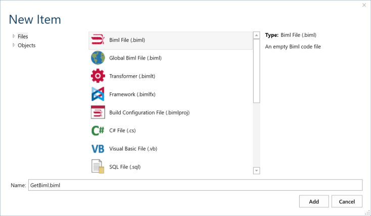

# Support Process

Varigence provides support with issues encountered through using BimlFlex to build out the Data Warehouse artifacts.

For Varigence to be able to provide the best possible support for issues encountered while using BimlFlex the following process is recommended.

## Creating a support case

BimlFlex support is provided through a dedicated email address:
[bimlflex-support@varigence.com](mailto:bimlflex-support@varigence.com)

The BimlFlex Support team will communicate as appropriate to resolve issues. Reply to the ticket email to update the ticket.

## Required information and data in a support case

For Varigence to be able to analyze and provide information for a case the included information needs to be detailed enough so that the context is clear and the steps to reproduce the scenario are available.

To be able to reproduce the issue it is also important that the metadata used for the model is provided. The metadata can be extracted from the database using the [BimlFlex Support Utility Application](support-utility-application.md) that provides a few functions for support assistance. Details on how to access the utility are included below.

For any issues relating to Extension Points or external scripting, it is also required that the project folder with all Biml-files are zipped up and included.

Once a case is opened you will get regular updates and communications from the BimlFlex support team that will ensure your issue is timely resolved.

## Accessing the Support Utility Application

More information on how to use the Utility is included in the [Support Utility Application](support-utility-application.md) documentation.

This Utility Application includes the latest versions of the Bundle and the databases.

The Utility can be used to:

* Deploy the most recent versions of the BimlFlex and BimlCatalog databases
* Deploy the latest version of the BimlFlex bundle file
* Capture the metadata for a project to file for sending to Varigence for support issues.

By obtaining the metadata and sending it as well as the full Biml output to BimlFlex support any issues can be analyzed and diagnosed directly.

### Gathering Metadata

Use the BimlFlex Support Utility Application to connect to the BimlFlex database and save the metadata into a json text file. This data can be provided to the Support team for analysis.

### Gathering project Biml

By adding a Biml Generator file to the project, the Biml from the project can be saved to a text file. This file can be provided to the Support team for analysis. This is achieved by manually creating a new Biml File in the project and add the following code to the document.



The new Biml File will be added and opened in BimlStudio.

```biml
<#=RootNode.GetBiml()#>
```

Adding the code and saving the file will automatically execute and provide the project Biml in the preview window.

 Expanded Result")

This generated Biml is a text representation of the entire project and everything that will be generated.