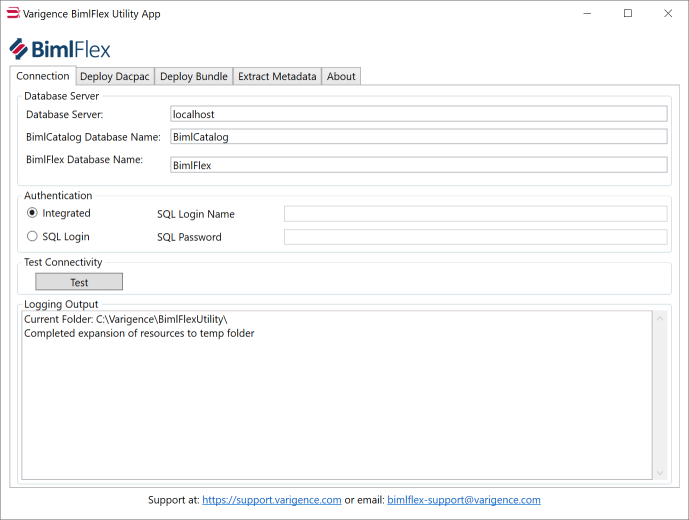
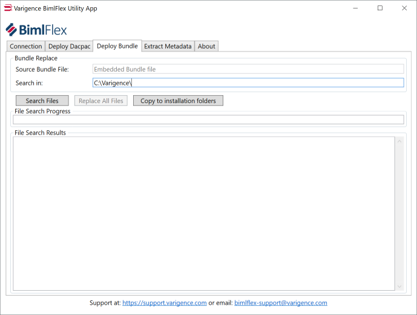
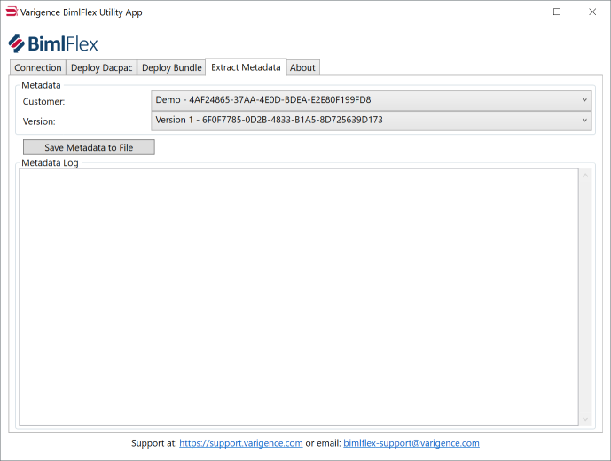
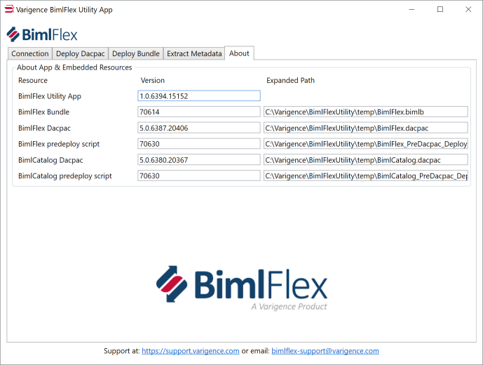

# BimlFlex Support Utility Application

The BimlFlex Support Utility Application can be used to deploy and interact with databases and Bundle files.

## Download

Please contact the BimlFlex support team at [bimlflex-support@varigence.com](mailto:bimlflex-support@varigence.com) for more information.

## Included functionality

* Embedded Bundle file
* Bundle file search and copy function
* Embedded database definition for BimlFlex metadata database
* Embedded database definition for BimlCatalog orchestration database
* Database deployment and upgrade function
* Metadata extraction function

The app is self-contained but requires a few external dll-files. Once executed it will extract the embedded Bundle, Dacpacs and Script files to a temp folder in the current folder for manual deployments. These files can be used for manual/scripted deployments.

## Connection

Define the database connections that will be used, either for existing databases or the new names for new databases.

## Deploy Dacpac

Use the Deploy Dacpac functions to deploy new versions of the databases or to update existing databases. The deployment function will update any existing database by running the pre-deployment script and deploying the Dacpac.

**Remember to backup any existing database before upgrading to a new version.**

## Deploy Bundle

Use the Bundle Deploy functions to copy the embedded Bundle to installation or project locations.

Copying to installation Program Files folders typically require the application to be running in administrator mode.

Using the search and replace function searches through folders for Bundle files so they can be replaced.

**Remember to back up any existing projects before upgrading to a new version.**

## Extract Metadata

Use the extraction function to capture the metadata from a project to a file for it to be sent to the BimlFlex Support team

## About

The About tab shows the Application version as well as the versions of the included resources.