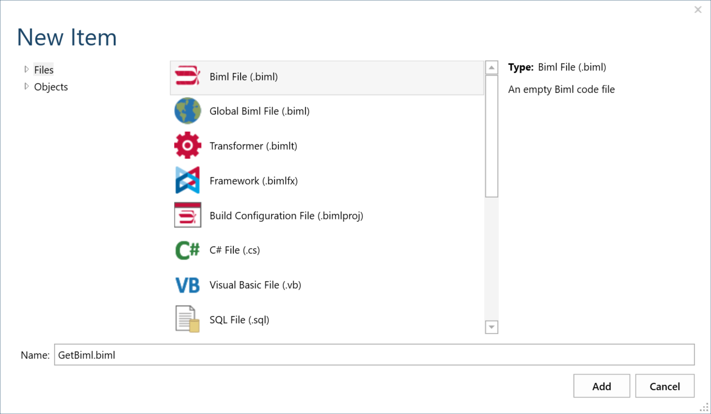
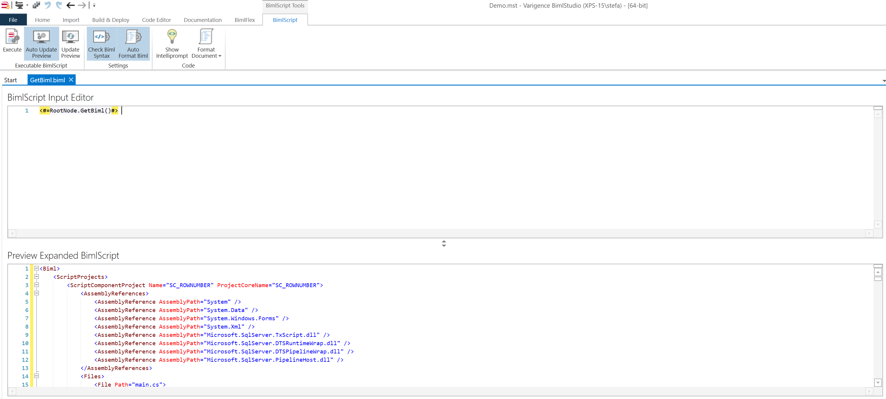

# Upgrade and Testing Process

BimlFlex is built on BimlStudio and contains the following components that are of interest when upgrading a component to a later version:

* BimlStudio Application
* BimlFlex component of BimlStudio
* BimlFlex Excel Add-in
* BimlFlex bundle file
* BimlFlex Metadata database
* BimlCatalog Orchestration database
* BimlFlex Custom SSIS Components

The BimlStudio application is distributed as a single, separate installer; the BimlFlex components are combined in a single separate installer. Some components are provided optimized for server deployment. Upgrades to databases and Bundles are distributed through the [Support Utility Application](support-utility-application.md).

## Upgrading BimlStudio and BimlFlex from the Varigence website

The current version of [BimlStudio is availble for download here](https://varigence.com/downloads/bimlstudiosetup.exe).

Other components are available on request from the BimlFlex Enterprise support team at [bimlflex-support@varigence.com](mailto:bimlflex-support@varigence.com).

## Preparation for upgrading an existing project

A current project with existing Extension Point script files and existing metadata needs planning and consideration before upgrading.

A new version of BimlFlex and its components can include fixes for any issues identified as well as new functionality. This is detailed in the [release notes](release-notes.md) that accompany the new version.

### 1. Do a database backup

Do a backup of the existing metadata database so that it is available in case a rollback is wanted.

### 2. Create a metadata dump

Create a metadata dump using the BimlFlex utility in case there is a need to send it to the BimlFlex support team. [More information on how to use the BimlFlex Support Utility Application](support-utility-application.md)

### 3. create an export of the Biml contents of the project

This can be achieved by manually creating a new Biml File in the project and adding the following code to the document.



The new Biml File will be added and opened in BimlStudio.

Code to add:

```biml
<#=RootNode.GetBiml()#>
```

Adding the code and saving the file will automatically execute and provide the project Biml in the preview window.



This generated Biml is a text representation of the entire project. This can be used to compare the result of different versions and Bundles so that fixes, new logic, and new functionality can be reviewed through a single text file.

It is possible to use a file comparison tool to compare the before and after version of the generated Biml to identify any changes.

### 4. Backup project files

The BimlStudio project and the Custom Extension Point files and any other local file contents that have been created should be backed up to a backup location so that a copy of the pre-upgrade project is available if needed.

### 5. Deploy updates to databases

The BimlFlex and BimlCatalog database definitions might have been updated. Review the release notes to see if there has been an update from the current in-use version. The update is provided either as a Dacpac file with a similar pre-upgrade SQL script or embedded in the BimlFlex Support Utility Application. Depending on the environment and preferences either approach can be used to upgrade the databases.

### 6. Deploy the new BimlBundle version

The BimlBundle file that contains the BimlFlex logic might have been updated. Review the release notes to see if there has been an update from the current in-use version. The update is provided either as a separate bundle file or embedded in the BimlFlex Support Utility Application. Depending on the environment and preferences either approach can be used to upgrade the projects and installation locations.

The bundle file is located in each installation folder for the BimlStudio and BimlFlex installations on the local computer where it has been installed. These files are used when creating a new project.

Each existing project has a local bundle file that needs to be updated if the new version should be used in that project. The bundle file needs to be copied both to the installation folders as well as to the project that is being upgraded for a complete upgrade.

Once these steps are completed the upgrade is complete and testing and reviewing the upgraded project starts.

### Reviewing the upgraded versions

Once the databases and Bundle file have been updated it is time to open the project in BimlStudio. Once the project has opened and downloaded, metadata applied, the BimlFlex solution is ready for testing.

1. review any errors or warnings

    There might have been updates to the logic applied by the Bundle. Review any error or warning messages in BimlStudio and review the release notes to see if any metadata or Extension Point behavior has changed.

1. recreate the Biml

    Rerun the `<#=RootNode.GetBiml()#>` command created earlier and save the new Biml code to a separate file.

    Compare the file contents using a favorite merge or compare tool and validate that any change in the output corresponds to an expected change driven by either a fix or a new functionality in the new Bundle. If the generated Biml is not meeting requirements, review the release notes to see if there is a documented reason for the new behavior.

1. test build and run

    Test the build once the new project is verified as generating Biml with expected functionality.

    Run the new builds and validate both logs and data to verify behavior in the development and test environments before upgrading production runs.

### Resolving issues

If there are unexpected behavior or issues with the upgrade, follow the guidelines in the [BimlFlex Support Process](support-process.md) to log a support ticket with the BimlFlex Support team at Varigence.