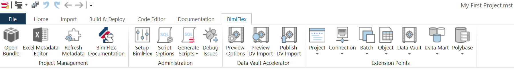
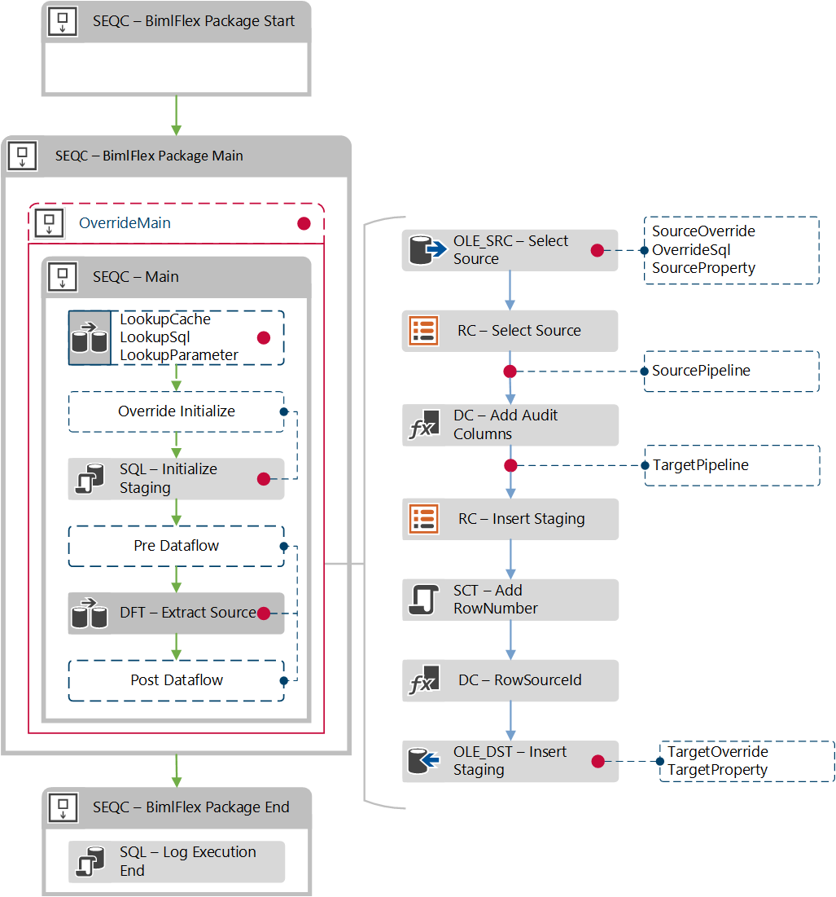

# Extension Points

<!-- TODO: Delete, superseded by EP document in concepts -->

Reference information is detailed in the [BimlFlex Extension Point Definitions](xref:bimlflex-extension-point-definitions) document

Extension Points are used to extend the default functionality of BimlFlex using standard Biml code. It can extend and override many different areas of the BimlFlex framework.

Extension Points have four key components:

* Extension Point directives that control what is injected and where
* Inheritance options code that defines any object inheritance
* Custom code that implements the required behavior
* Input and output path variables for connecting the Extension Point in the SSIS package.


Extension Points are created in BimlStudio. In the BimlFlex Ribbon tab there are several Extension Point areas with a large number of different Extension Points available. Each Extension Point template will generate a code block that targets a specific point of the project.



Creating an Extension Point file and applying the required target attribute is all that is needed for it to be included into the project. when BimlFlex builds the solution any Extension Point code is injected into the resulting Packages.

The Extension Points are saved as Biml files in the BimlStudio Project and should be treated as source code for the solution.

## Default BimlFlex behavior

Note that there are many features and functions built into BimlFlex that don't require Extension Points. Parameters, custom source queries with joins and filters, inherited tables and columns, data type expansions etc. are all available without the need for Extension Points.

## Extension Point Targets

Below is an example of where Extension Points can be added to the ETL structure. The red dots indicate injection points.



It is also possible to completely override the main container with an Extension Point. This can be used with pre-existing, bespoke packages. By importing the existing package into BimlStudio the Biml code version of the same package can be injected into the Extension Point.

## Extension Point Directives

Special attention should be paid when editing the directives of an extension point because a user must have them correctly defined before they will be able to test the output of their Biml code. The purpose of a directive is to indicate to the compiler exactly what the purpose of the Biml code is that you are writing and where it should be injected. To write a directive simply insert the appropriate line of code between the following tags <#@ #>

The following table outlines the attributes of these directives.

| Extension Point Directive Attribute | Attributes Description |
| ----------------------------------- | ---------------------- |
| bundle                              | File name of the bundle being used, for BimlFlex this is always `bimlflex.bimlb` |
| extensionpoint                      | Key defining the type of extension point |
| target                              | The name of the object that the extension point will be applied to |

The next directive is the property directive which is specific to the type of object you are trying to modify. Below is a table with the attribute definitions.

| Property Directive Attribute | Attributes Description |
| ---------------------------- | ---------------------- |
| name                         | Name of the entity this extension point targets: `sourceTable`, `targetTable`, `connection` etc. |
| type                         | This is the entity type: `string`, `BimlFlexModelWrapper.ObjectsWrapper`, `BimlFlexModelWrapper.ConnectionsWrapper`, etc. |

## Extension Point Inheritance Code

BimlFlex extension points can inherit the attributes and related items from an object. This is useful because, in some cases, properties relating to a certain object are required as part of what is needed to effectively do what we want to in an extension point.

Below are two of the required directives that need to be in place in order to use inheritance.

```biml
<#@ property name="table" type="BimlFlexModelWrapper.ObjectsWrapper"  #>
<#@ import namespace="Varigence.Biml.Flex"  #>
```

A small block of BimlScript code will enable us to gain access to the items we need. A BimlScript is a piece of C\# that is injected into a Biml file that gives us the ability to use Biml in a programmatic way. We will use C# methods to create variables that contain the objects and information we need.

First, we will need to write the first line that will allow us to obtain a copy of the targeted object. This is done by entering the following line.

```biml
<# CustomOutput.ObjectInherit = true; #>
```

Next, we will declare the variables we need to hold our information and use methods to obtain the objects of interest in this example. First, create a variable by using the `var` keyword and then giving the variable an appropriate name. In this example, we will get the source connection of a given table and add it as the value of the variable. Because we have already added the table as a property in our directive we can reference it directly.

```biml
<# var sourceConnection = EntityHelper.GetSourceConnection(table); #>
```

From here if we want to pull out any of the information about the object, we can insert it directly into our Biml code using the following tags: <#= #>. This will take the value stored in any variable, convert it to a string and insert in place of where the original BimlScript tags were.

For example:

```biml
<#=sourceConnection.Name#>
```

## Output Path and Input Path Variables - Optional

Output path variables hold the name of the current task that you are modifying. The input path variable contains the previous task's name in the control flow or data flow so that the task you are working on can reference the previous item in your Biml code and remain attached.

These two path variables are required when using extension points that either completely replaces tasks or when you are inserting a new task into an existing data flow or control flow.

If you are replacing or modifying a task at the end of a data flow or control flow then an output path variable is not required. In a similar fashion if you are replacing or modifying the first task in a control flow or data flow then an input path variable is not required.

We will see more examples of where we need to declare an output/input path variable later on.

```Biml
<# CustomOutput.OutputPathName = @"TaskName/SequenceContainerName"; #>
```

## Extension Points examples and reference

The Extension Points are covered in more detail in the [BimlFlex Extension Point Definitions](xref:bimlflex-extension-point-definitions) document
