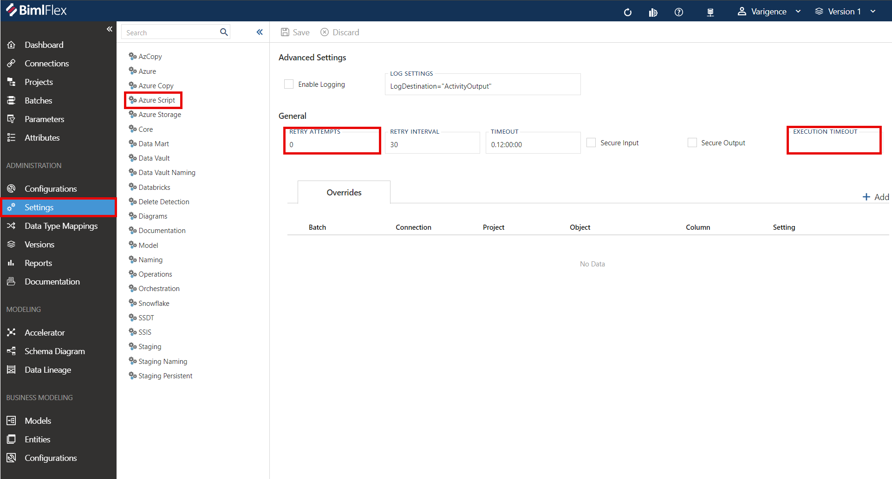

# Issue

When using Synapse in an Azure Data Factory pipeline, users may encounter an intermittent error within a stored procedure activity. The error message "The SQL Parameter is already contained by another SQLParameterCollection" might seem specific to SQL parameters, but can be somewhat misleading. Underlying this message is a potential bottleneck issue caused by multiple threads competing for access to a limited resource. This bottleneck leads to a timeout, which yields this error.  
 

# Cause

The cause of this error is a newly implemented setting within BimlFlex: "Script Block Execution Timeout." This setting limits individual script block execution times to 30 minutes by default.  
 

# Resolution

### Method 1: (for BimlFlex 2022 R3 and earlier) 

Open the script task within the Azure Data Factory pipeline, and inside the script task, navigate to the "Settings" tab. 

Enter a value greater than the default 30 minutes. Recommended starting values are 60 or 120 minutes. Repeat this process for every script execution task experiencing timeout issues.  
 

### Method 2: (for BimlFlex 2024 R1 and newer)

Access the new Script Block Execution Timeout feature by navigating to Settings > Azure Script. Within the "Advanced Settings" menu, set values for the global Execution Timeout and Retry Attempts fields. 

The Execution Timeout applies universally unless overridden for specific objects.  
 

To set timeouts for individual Objects or override the global timeout use the "+ Add" button on the right. Add a configuration to the data grid for customized timeouts at the Object level.  
 

# Workarounds

There are two strategic workarounds to be considered in special scenarios. **Note:** Consider these workarounds only under specific conditions, such as when there is unlimited access to free compute power.  
 

### **Option 1: Execute the Script on a Single Thread**

While this may extend the overall execution time, it eliminates the issue of shared resource access, as no resources are concurrently shared by other threads.

### **Option 2: August the Compute Capacity of the Servers Involved**

In environments where compute resources are metered, this approach may incur additional costs, but it can expedite thread access to shared resources, mitigating the specific timeout issue.  
 

# Conclusion

The new "Script Block Execution Timeout" configuration and its 30 minute default value can break Azure Data Factory pipelines that include multi-threaded Synapse queries. This setting is applied to each script block, but for scripts that only have one block, it effectively lowers the default timeout value from 12 hours to 30 minutes with no notification to users. Setting an explicit value allows the query to timeout only under desired conditions. Recent versions of the BimlFlex application, beginning with 2024 R1, allows users to set timeouts at global, object, and script levels.