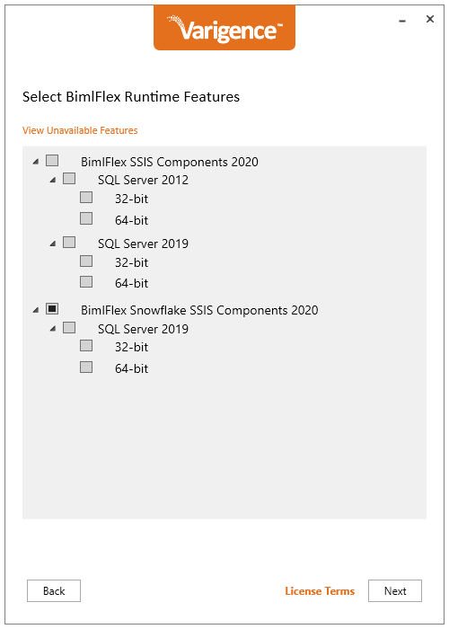

# Issue

When installing or upgrading BimlFlex Runtime Features using an older installer, not all SSIS versions might be listed for installation. Selecting View Unavailable Features reveals a list of BimlFlex Runtime components that could be installed.  
 

# Cause

By default, older BimlFlex installers only allow specific BimlFlex Runtime Features to be installed based on the reference architecture (x86 or x64) and versions of SQL Server detected on the host system by means of the following registry keys:

*   HKEY\_LOCAL\_MACHINE\\SOFTWARE\\Microsoft\\Microsoft SQL Server\\<version>\\DTS\\Setup
*   HKEY\_LOCAL\_MACHINE\\SOFTWARE\\WOW6432Node\\Microsoft\\Microsoft SQL Server\\<version>\\DTS\\Setup

Where <version> relates to a specific SSIS version:

*   100: SSIS 2008
*   110: SSIS 2012
*   120: SSIS 2014
*   130: SSIS 2016
*   140: SSIS 2017
*   150: SSIS 2019
*   160: SSIS 2022  
     

# Resolution

Run the Installer as per the normal installation process, ensuring that Run Solution is selected.  
  

On the Select BimlFlex Runtime Features screen, select View Unavailable Features to reveal all available install options.  
  

 

Right-click on the specific component required, and select Force Install. The component can be unselected by right-clicking on the component and selecting Undo Force Install. Repeat for all required components.  
  

 

Select the Back button, to return to the Select Biml Runtime Features screen, and select Next. Note the component(s) force installed will not be listed on the screen.

On the final screen, review pending actions and select the Update button to perform the installation. Click Finish to end the installer once the installation concludes successfully.  
 

# Conclusion

Users can overcome this limitation by following the step-by-step instructions and utilizing the "Force Install" option and successfully install the required components.