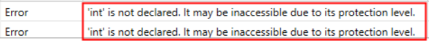

# Background

BimlStudio relies on a stack of software that is not distributed with the application since it is generally stable and distribution with BimlStudio is unnecessary. In unusual cases, breaking changes are introduced to the dependencies and installed without notice to users. When this happens, Varigence may release software patches allowing the software to work with updated versions of the dependency. In exceedingly rare cases, a patch itself may be prohibitively resource intensive to develop and distribute. Varigence Support suggests adopting a C#-based BimlStudio approach or BimlFlex solution to avoid further VB Script/BimlStudio trouble.   
 

# Issue

The user is getting build errors on code that has not been changed in a while. Specifically, built-in VB Script methods used in BimlStudio are now unreachable.  
 

 

The above code snippet was operational for years and unchanged when it suddenly began yielding build errors:   

The error message(s) received are shown above, and would be seen in the BimlStudio console.  
 

# Cause 

Updates to the underlying VB Compiler have changed the default behavior so that it no longer imports libraries that used to be imported by default. Due to the prohibitive size of a BimlStudio installer that includes its own VB compiler, there is currently no plan to prepare a BimlStudio distribution bundled with its own compiler.  
 

# Resolution

Unfortunately, there is no quick remedy for this issue. Users encountering this or similar errors should reach out to Varigence Support to request a patch that allows them to continue work in the short term. It is necessary to include the full text of all error messages from the console and indicate that the issue is related to the issue discussed in this article. As a long-term solution, it is recommend to migrate to BimlFlex, since it generates Biml without dependence on a VB Compiler.  
 

# Note

This is linked to issues with type inference errors which may be seen at the same time. See [Local Type Inference Error on BimlStudio](xref:kb-local-type-inference-error-on-bimlstudio) for more information on potentially related issues.