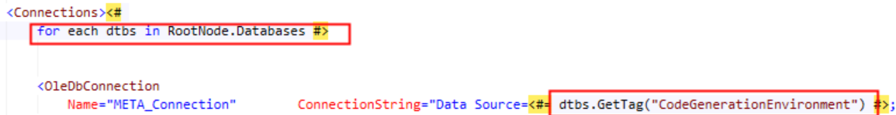

# Issue

When modifying an existing Biml script in BimlStudio, users may encounter a situation where previously accessible methods are unexpectedly not found during compile time, even when users have made no intentional updates or modifications to the environment for an extended period.

In this example, compilation fails with the message: "The public member GetTag for the type AstDatabaseNode could not be found."  
 

# Cause

The issue stems from a change in default behavior within the Visual Basic compiler. The compiler shifted from using local type inference by default to using late binding, which does not seamlessly support the use of extension methods. Consequently, extension methods that were previously recognized are no longer functional.

In the example above, GetTag is implemented as an extension method on the AstDatabaseNode class, so it is not available when using late binding.  
 

# Resolution

Two solutions address potential complications arising from the Visual Basic compiler's default use of late binding:  
 

### **Method 1:**

Turn on local type inference by using the OptionInfer property: 

    <Property Name="OptionInfer" Value="On" />

### **Method 2:**

Another solution is to avoid the need for local type inference entirely by initiating the variable as the desired type. Using the same example above, that code would look like:

    `for each dtbs As AstDatabaseNode in RootNode.Databases`

These adjustments should be applied to each file exhibiting errors related to local type inference.  
 

# Conclusion

Beginning with the 2024 R1 release, BimlStudio initiates the Visual Basic compiler explicitly using local type inference, which mitigates reliance on default behaviors. Users will need to manually contravene the default behavior of the Visual Basic compiler using the two methods above until they are able to update to the newer version. 

It is important to note that along with these compiler changes, a number of libraries are no longer imported by default. If import errors persist after attempting to resolve this error with the methods above, see: [Formerly Available Methods No Longer Accessible](xref:kb-formerly-available-methods-no-longer-accessible).