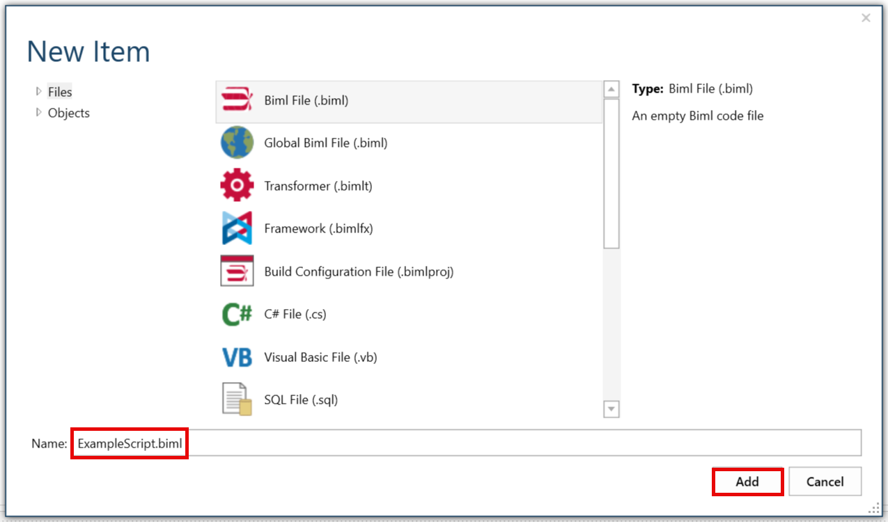

# Issue

Users wish to run additional Biml scripts after SSIS packages are rendered in BimlStudio. While this is non-standard behavior, users can apply custom logic that runs automatically after the Biml bundle due to peculiarities of their environment.   
 

# Resolution

Create a BimlScript with a high tier value so that it runs after the BimlScript that creates the tables but before the BimlScript that needs those tables to be removed.

Open the BimlFlex project in BimlStudio. 

In the "Logical View" pane, right-click on "Utilities" under the Library node and then click "Add BimlScript."

Rename the file as needed and click "Add."

Write the Biml script needed in the code editor that opens automatically. **Reminder:** Be sure to use a high tier value to guarantee that this script runs after all the other code generation script(s) have been executed.

In the example code provided below, a list of table names is used to filter results for removal. Any applicable conditional criteria can be used within the foreach loop. 

Note that: 

*   The template tier is set to \`999\` to ensure that this is the last code that runs in the solution. 
*   There is a try/catch around RemoveFromParent. While unnecessary for builds, in interactive mode where the Live view is updating in the background, this can prevent issues with objects being edited from the wrong background thread.

`<#@ template tier="999" #>   <#       var removeList = new [] {"Table2", "Table3"};`

    `foreach (var table in RootNode.Tables) {           if (removeList.Contains(table.Name)) {               try {                   table.RemoveFromParent();               } catch {}           }       }   #>`  
 

After adding the Biml that is needed, right-click the file in the Logical View pane, then click "Convert to Live BimlScript."

After converting, the file will disappear from Utilities. It can then be located in the "Project View" pane under the "addedBiml" folder.

**Note:** The Live Logical View may fall out of sync when making edits using this approach. It is always recommended to close and reopen the project when making any such edits.  
 

# Conclusion

This method is one way to extend the behavior of Varigence applications. Alternatively, users can develop a Powershell script that runs on the output of the build without getting into the mechanics of the Biml builds. 

BimlFlex and associated technologies typically generate everything needed for a successful deployment. Before attempting a resolution such as this one, consider whether the issue that this logic would solve might better be resolved or mitigated using more well-established patterns.