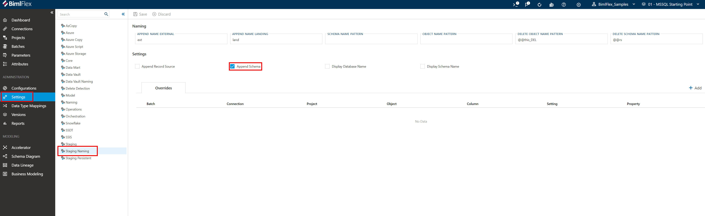
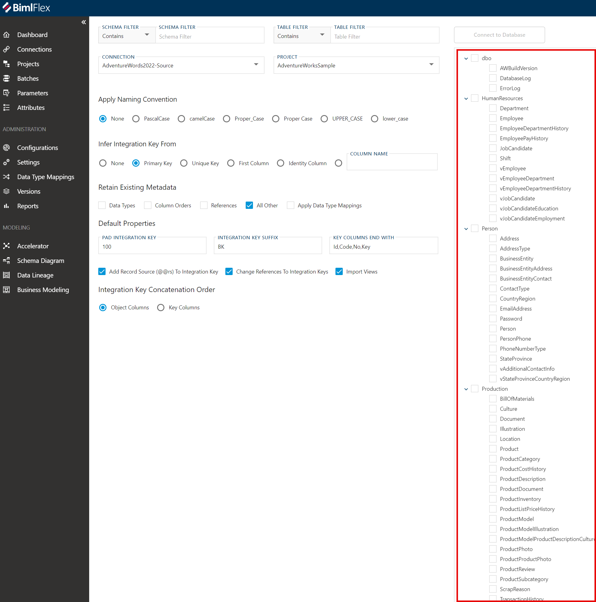
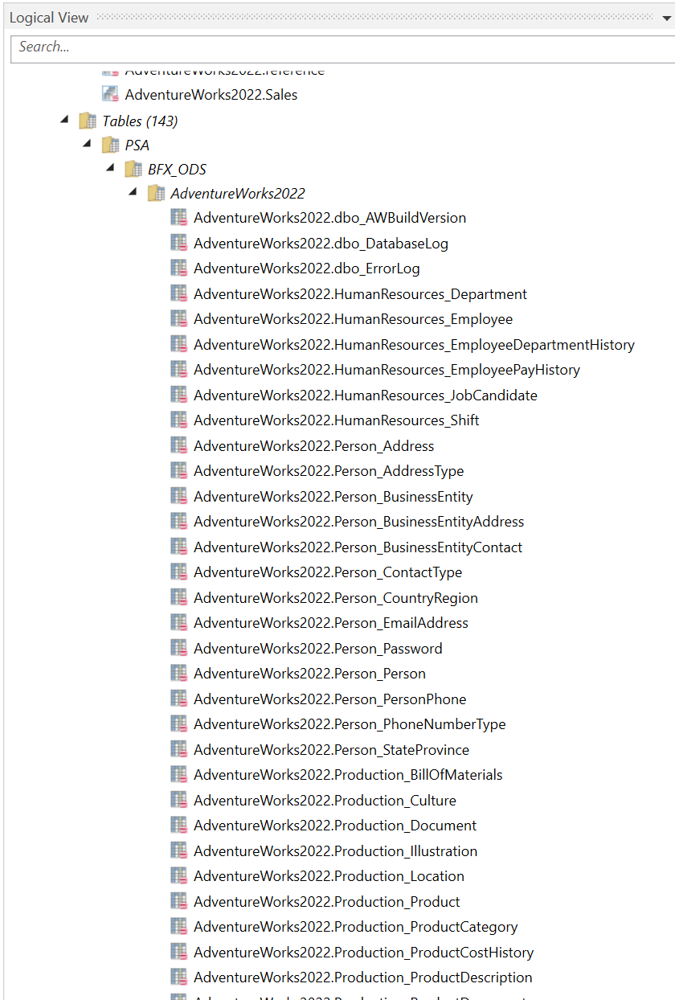

From Case [https://varigence-prod.crm.dynamics.com/main.aspx?appid=5e76663e-a3c2-ee11-907a-000d3a9eadbe&pagetype=entityrecord&etn=incident&id=c8ce319b-a8d5-ee11-9078-6045bdd9270b](https://varigence-prod.crm.dynamics.com/main.aspx?appid=5e76663e-a3c2-ee11-907a-000d3a9eadbe&pagetype=entityrecord&etn=incident&id=c8ce319b-a8d5-ee11-9078-6045bdd9270b)

**Issue**

  
The user would like to prepend the source object's schema name onto the corresponding object's name in the PSA layer.  
 

**Cause**

  
In this scenario, there are two schemas that have overlapping table names in the source system. Surfacing the schema in the name of the PSA layer object helps to reduce confusion when the user is building their solutions.  
 

**Solution**

  
To add the source schema name to the front of PSA objects, open the BimlFlex Settings menu, then click on "Staging Naming." Here, you should be able to check the Append Schema option.  
  
  
  
After doing this, refresh the build and you will see that the object names now include schema names.   
  
  
  
 

A database with tables and schemas like the above will yield the tables below.  
  
  

**Conclusion**  
  
Repeating database table names across different schemas should be avoided when possible since each table in a source system should store a unique type of information therefore each table should have a unique name. There are cases where it makes the most sense to have overlapping names or it was just a poor decision that would require more effort to undo than it's worth. In these cases, using the "Append Schema Name" setting is recommended.