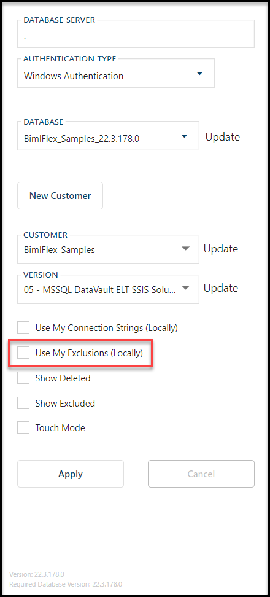
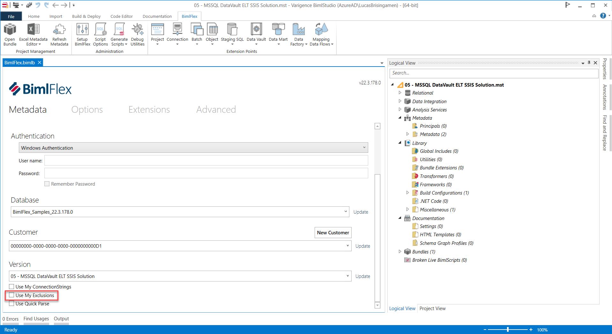

# Introduction

The **\[Use My Exclusions (Locally)\]** setting was introduced in BimlFlex to prevent multiple developers from interfering with each other's work while working on closely related items. Once **\[Use My Exclusions (Locally)\]** is enabled, all Entities marked as EXCLUDED are for the specific user only.  
 

# Issue

A number of users are working on the same Customer Project but do not want to disrupt each other's work.

# Resolution

Follow the below steps for properly setting or toggling your Local Exclusions to work without concern of affecting others. 

1.  Create the new **Entities** that any single developer will be working on.
2.  Access Local Exclusions and other settings by clicking the "Configure Database Connection" button in the BimlFlex ribbon menu. 
3.  With **\[Use My Exclusions (Locally)\]** OFF, set all the WIP as **EXCLUDED**. This is easiest to do if each developer has their own **Project**. In said scenario, the **Project** can be marked as _EXCLUDED_ and all the child **Objects** would be included through inheritance.
4.  Logging is as the developer, set **\[Use My Exclusions (Locally)\]** ON, set all the WIP as _EXCLUDED_ OFF.
5.  (Optional) Set any **Project** not required in the developers work to _EXCLUDED_.
    *   This will make it easier to work on the WIP.
6.  Building projects is done much the same way via the **\[Use My Exclusions\]** option in BimlStudio
    *   To build just product ready ensure **\[Use My Exclusions\]** is OFF
    *   To build only developer scoped work, set **\[Use My Exclusions\]** ON
7.  Once the WIP is ready to be included, with **\[Use My Exclusions (Locally)\]** OFF, set the new **Entities** as _EXCLUDED_ OFF.

  

  

# Note

See more in the documentation about [Working Concurrently](xref:bimlflex-ssis-concurrent-development)