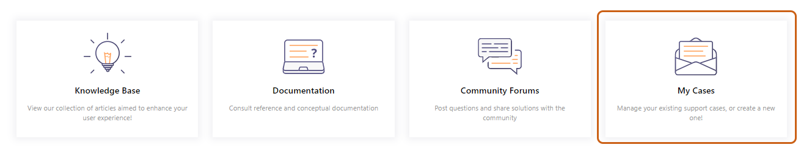
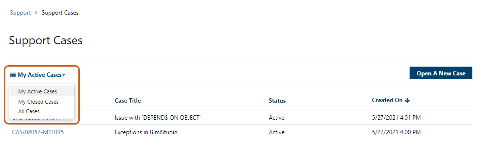
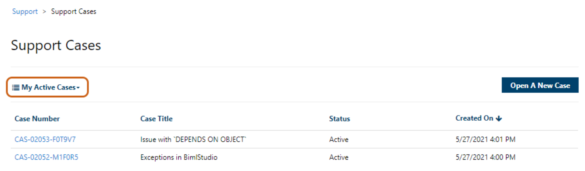
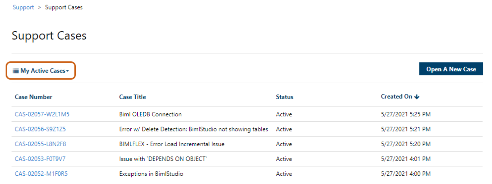
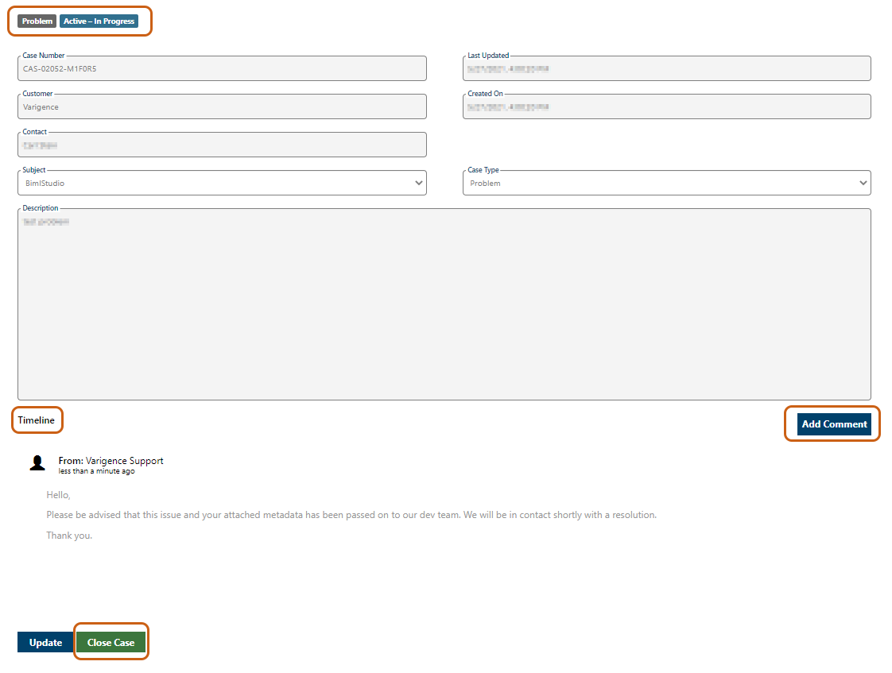

# Issue

As the manager or supervisor of a team of BimlFlex or BimlStudio users, you wish to monitor support tickets created by members of your team.   
 

# Resolution

At the specific request of a User, the web role permission of "Account Admin" can be applied to any user within an organization. Once this permission is applied, that user will have the ability to view any support case created by any other users within their same organization.   
 

# Process

**Contact support@varigence.com**  
  
The application of the "Account Admin" web role is an optional process initiated by a user. To begin the process, please send an email to [Varigence Support](mailto:support@varigence.com) requesting the Account Admin web role.

  
**Note:** The email domain from the requesting user must match the Organization which they are requesting to become an Account Admin for. We are unable to honor requests for Account Admin permissions that are received through the Support Portal at this time.  
  
Varigence Support, upon receipt of the request, will manually apply the Account Admin permission to the requesting user's account. Processing the request for this permission, as well as the time required for changes to sync and take effect, could take up to 24 hours.   
  
Should you require immediate assistance for an existing case please notify Support and the issue will be addressed routinely.   
  
**Permissions Granted**  
  
Once the Account Admin permission has been added to a user's account, Varigence Support will respond with a confirming email. As stated above, applying the permission and the time for changes to take effect could take up to 24 hours.   
  
**Note:** The Account Admin permission can be removed or transferred as simply as it is added, to accommodate any shifts in responsibilities or team members.   
  
**Accessing Your Support Cases**  
  
Users, whether they have the Account Admin permission or not, can access a list of their cases through the "My Cases" tab on the [Varigence Support Self-Service Portal](http://support.varigence.com).   
  
  
  
The Varigence Portal gives users the option to display All Active Cases, All Resolved Cases, or both by clicking the dropdown menu of view options.   
  
  
  
If the user has the Account Admin permission, "My Active Cases" and "My Closed Cases" will display cases for all users in their organization.  
  
**Example:** "My Active Cases" view of a user who is not an Account Admin:   
  
  
  
**Example:** "My Active Cases" view of a user who is an Account Admin:    
  
  
  
Access case details by clicking on the Case Number. This will direct the user to the Case Information screen containing all information from the initial Case submission, including the description of the issue and the user who submitted it, the product it relates to, case status, and the creation and update timestamps.   
  
The Timeline displays the communication with Varigence Support. Instead of exchanging emails, users and Support will communicate through the Portal comment system. Comments from Varigence Support will populate as they are entered, and users can supplement and respond by clicking the "Add Comment" button.   
  
Should it be determined that the user has resolved their issue or wishes to cancel their case, they may do so at any time by clicking the "Close Case" button.   
  

**Automatic Application of Web Role**

For future Biml users, the Account Admin web role permission will be automatically applied to the user who is involved in making the purchase, whether that be through the Varigence Store or the quote and invoice process with Varigence Support directly.