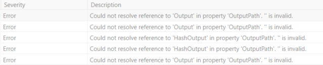

# Issue 

The following error(s) have been encountered in BimlStudio:  
  
"Could not resolve reference to '\[Hash\]Output' in property 'OutputPath'. '' is invalid."  
  
  

# Cause

This error can be received for numerous reasons. The most common cause of this error will be if there is a significant change in the metadata made through BimlFlex, while that same Logical Model is simultaneously open in BimlStudio.   
  
The less common, and more "situation-specific" causes could be, if there is a value in the generated Biml and can not be resolved, or be due to incorrectly set metadata, or triggered by an error in the Biml Templates.   
 

# Resolution 

**Method 1: Restart BimlStudio**  
  
When encountering this error, regardless of whether its origin was the common or less-common cause mentioned above, the immediate response should be to **close and re-open BimlStudio.** Many users have encountered this error only to begin the process of troubleshooting without first reloading the application. This situation results in users trying to solve an error that does not exist, while losing valuable time in the process.   
  
This is the most common resolution to the most common cause of this error.   
  
**Method 2: Toggle 'Use My Exclusions' in BimlStudio**  
  
If the above method does not resolve the issue, ensure that '_Use My Exclusions_' in BimlStudio has been checked/unchecked.   
  
Hot-swapping user settings or metadata, for example, setting various excludes in the BimlFlex application and then clicking '_Refresh_' **without** checking/unchecking '_Use My Exclusions_' in BimlStudio, can cause these errors.   
  
In BimlStudio, first select the **BimlFlex** tab, and click '_Open Bundle_.' Set or ensure the metadata settings for your project and then toggle the '_Use My Exclusions_' setting.  
  
  
  
Once completed, click '_Refresh Metadata_' in the ribbon to reload and clear the error(s).   
  
  
  
**Method 3: Contact Varigence Support**  
  
If the two above methods do not resolve your issue, then there exists a nuanced reason for your error that will need to be diagnosed by Varigence Support.   
  
Please contact us at [support@varigence.com](mailto:support@varigence.com) and be sure to attach your project metadata.