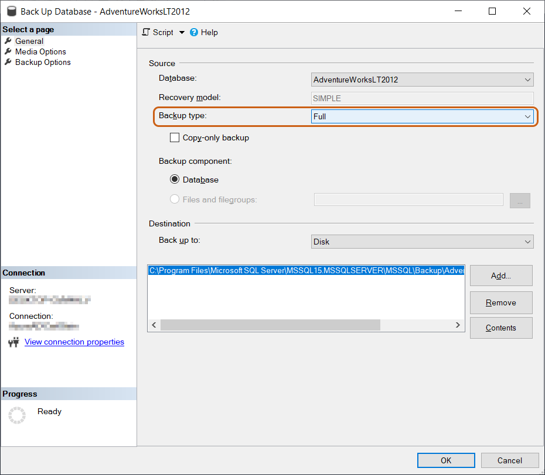

# Issue

Inevitably, users may encounter issues that require assistance with troubleshooting, whether the issue be a bug on the developer end, an error in the user's Biml code, or anything in between. In order to offer meaningful help, Varigence Support will need to consider the user's data source. Without access to a user's data source, it is nearly impossible for support to replicate the issue being experienced in order to offer meaningful resolution.   
 

# Solution

In situations like this, there are a number of things the user can do to provide Varigence Support with the data needed to expeditiously assess and resolve issues.  
  
**Method 1: Recreate the Issue Using a Public Dataset**   
  
Recreating the issue using a public dataset, such as Northwind or AdventureWorks, will prove to be the simplest method for support to diagnose the errors being experienced. 

The Northwind database can be found [here](https://docs.microsoft.com/en-us/dotnet/framework/data/adonet/sql/linq/downloading-sample-databases). 

The AdventureWorks database can be found [here](https://docs.microsoft.com/en-us/sql/samples/adventureworks-install-configure?view=sql-server-2017).   
  
**Method 2: Provide a Backup of Source/Target Datasets**  
  
In the event that the issue at hand cannot be replicated using one of the public datasets offered above, users can provide support with a backup of the source/target datasets. 

Take the following steps in order to create a backup in SQL Sever Management Studio 2017 (SSMS): 

Right-click on the database in the Object Explorer. From there, click "_Tasks"_ then "_Backup,"_ and the below window will appear: 

  
 

  
In this window, the database should already be pre-populated, and users should ensure that "Backup Type" is "Full." Choose the destination to save the backup to, and click "_OK_" once all selections have been confirmed. 

The resulting database backup .bak file is what should be shared with Varigence Support when opening a ticket specific to the error.  
  
**Method 3: Provide the DDL of the Source/Target Databases**   
  
Oftentimes, users are prevented from sharing a backup of the source/target databases due to the sensitive information contained within. Instead of a full backup database, as detailed above, just the DDL of the source/target databases can be provided. This will enable support to replicate the schema and replicate the issue. 

To provide DDL data through SQL Server Management Studio (SSMS), right-click on each pertinent table and select "_Script Table As..._" then selecting "_Create To..."_ and the resulting file is what should accompany any ticket created with Varigence Support.