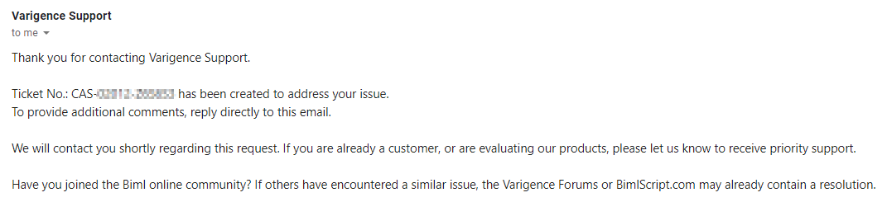
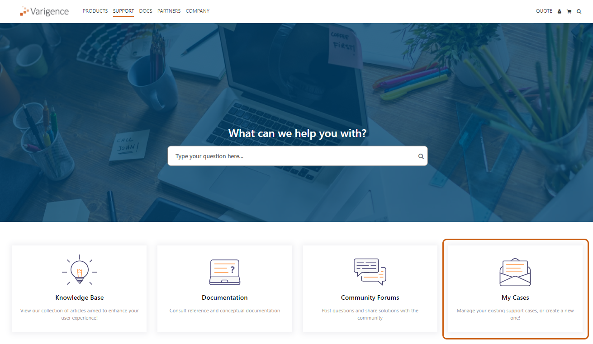
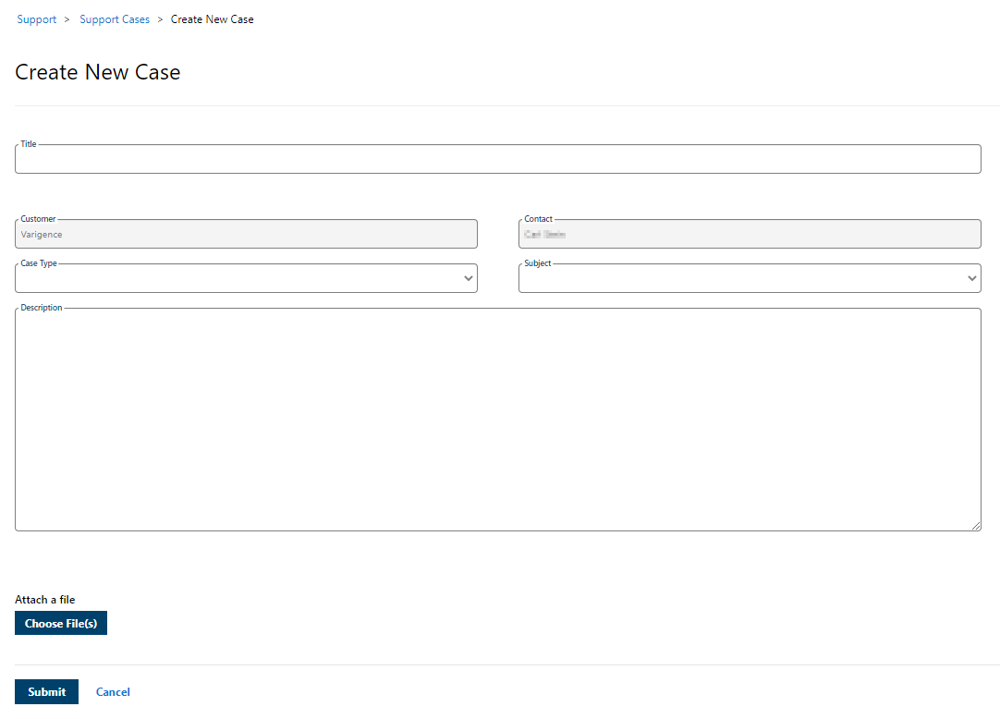
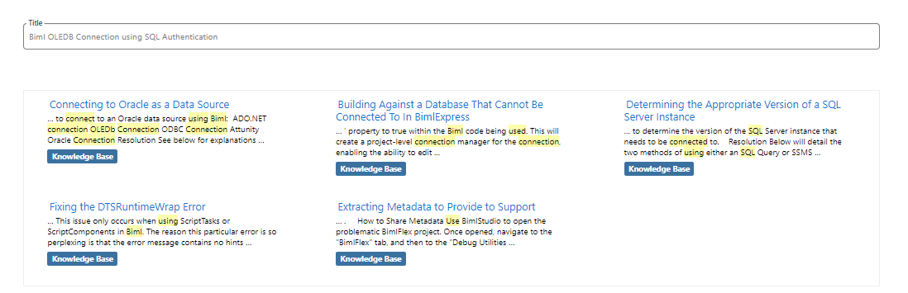
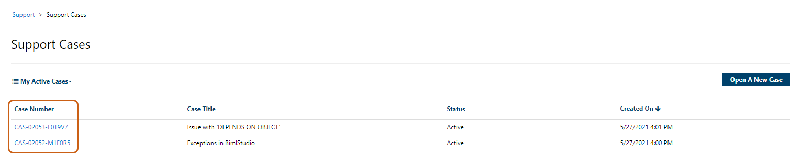
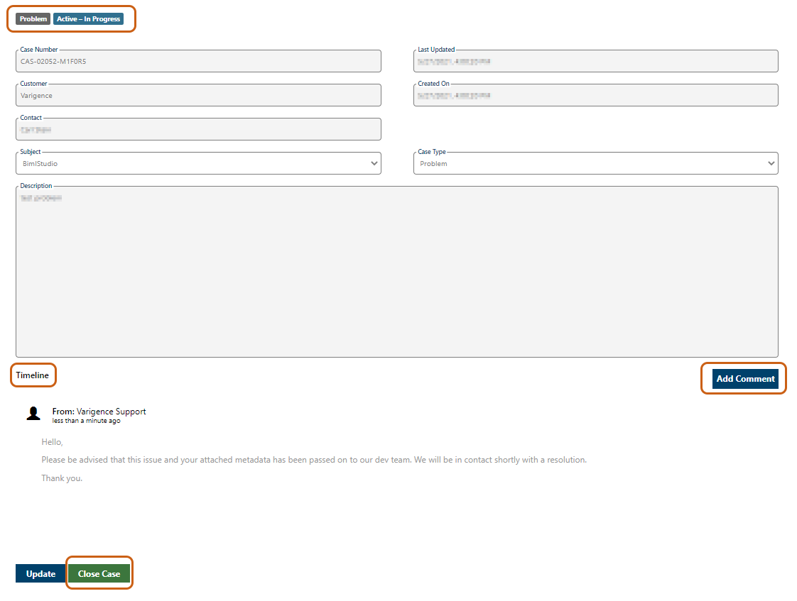

# Issue 

Regardless of the application being used, the user has encountered a bug, error, or requires assistance in producing the intended result of their solution.   
  
After reviewing the requisite resources mentioned in the Product Support Process article, it has been determined that a ticket must be opened with Varigence Support.   
 

# Resolution

Users have two methods of contacting Varigence Support in order to bring an issue to our attention, help Support diagnose the issue, and provide the user with a meaningful resolution.   
  
Both methods of contacting Varigence Support are detailed below.   
  
**Method 1: Open Case by Emailing Support Directly**  
  
Varigence Support can be contacted at [support@varigence.com](http://varigence.com) or, specific for BimlFlex issues, [support@bimlflex.com](http://bimlflex.com).   
  
Users will receive an automatic response with a unique Case Number associated with their case. This email will be the main channel of communication for Support and the user. It is common for users to have multiple, active, support tickets. Please refrain from opening a single ticket with multiple support issues. 

 
  
  
**Method 2: Open Case through Customer Support Portal**   
  
Varigence has recently redesigned its Customer Support Portal, located [here.](https://support.varigence.com/)  
  
Click "My Cases" to begin the process of creating your Support Case.   
  
 
  
If not already logged in, you will be prompted to log in to your Varigence Account.   
  
On the following screen, the "Customer" and "Contact" fields will be prepopulated based on the account which you are logged in to.   
  
Users will be required to enter:   
  
     - Title for your issue   
     - Identify "Case Type" as Question, Problem, or Request    
     - Identify "Subject" as BimlExpress, BimlStudio, or BimlFlex   
     - Provide the description of your issue. As with most technical support issues, the more details provided will only benefit Support in diagnosing your issue quicker.   
     - Attach any meaningful attachments, such as code snippets, images of error dialogs, or the metadata itself.   
  
 
  
Click "Submit" once completed.   
  
**Note:** As User's begin typing out their issue within the Title field, relevant Knowledge Base articles and support documentation will be displayed for the user's reference and self-help.  
  
 
  
Similar to creating a Support Case via email, users will be notified that their case has been created, and a unique Case Number will be assigned to the issue. The case, now created, will appear in the "My Active Cases" view.    
  
 
  
Access case details by clicking on the Case Number. This will direct the user to the Case Information screen containing all information from the initial Case submission, including the description of the issue and the user who submitted it, the product it relates to, case status, and the creation and update timestamps.   
  
The Timeline displays the communication with Varigence Support. Instead of exchanging emails, users and Support will communicate through the Portal comment system. Comments from Varigence Support will populate as they are entered, and users can supplement and respond by clicking the "Add Comment" button.   
  
Should it be determined that the user has resolved their issue or wishes to cancel their case, they may do so at any time by clicking the "Close Case" button.   
  
 
  
**Assisting Support**  
  
Providing relevant metadata for the project being worked on will _always_ be of benefit to the Varigence Support team. Please reference [Extracting Metadata to Provide to Support](xref:kb-extracting-metadata-to-provide-to-support) to ensure that we have everything we need to recreate your environment in order to more quickly provide the needed support.   
  
**Response Times**  
  
Resolution for issues could range from something as simple as correcting a syntax error, to something as complex as having to submit a bug request to be fix in a future patch for the application. Resolution is not always swift when it comes to processes as complex as data warehousing automation.  
  
**Support Availability**  
  
Please remember that support is prioritized for those users who have subscriptions where support is included, or for users who have actively maintained a contract for Support, Maintenance, and Upgrades (SMU). BimlExpress is a free offering, and as such, direct support cannot be offered or guaranteed for customers who only utilize BimlExpress or BimlStudio without an active SMU contract.