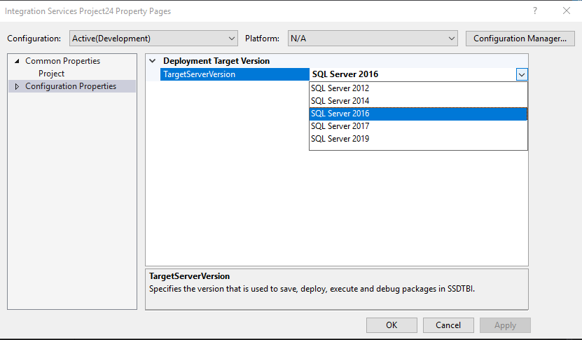
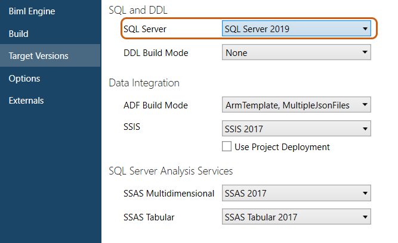
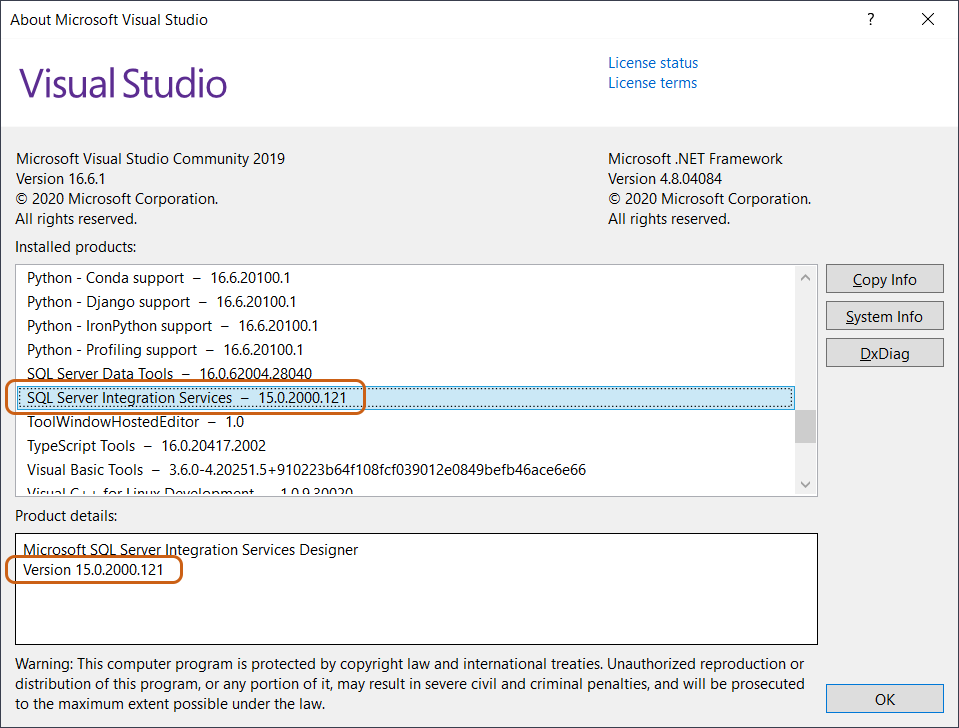

# Issue 

The following error has been encountered:  
  
  MSBUILD : error : Error:: Metadata file 'Microsoft.SqlServer.DTSRuntimeWrap,  
  Version=13.0.0.0, Culture=neutral, PublicKeyToken=89845dcd8080cc91, processorArchitecture=AMD64'  
  could not be found.  
 

# Cause

This issue only occurs when using ScriptTasks or ScriptComponents in Biml. The reason this particular error is so perplexing is that the error message contains no hints as to the actual problem. 

The error is caused by a mismatch between the version of SQL Server Integration Services (SSIS) installed on the machine, and the version of SSIS that is compatible with the version of SQL Server that the subject project is targeting. 

A common example of this might be a user using Visual Studio 2019 (VS2019), who has the appropriate SSIS installed for VS2019, but is targeting SQL Server 2017 for the project in BimlStudio.  
 

# Resolution 

To resolve the DTS RuntimeWrap Error, users may either change the target version of SQL Server to a compatible version or download the appropriate version of SSIS. Both solutions are detailed below.   
 

**Method 1: Change the Target Version of SQL Server**

  
In the scenario described above, the solution would involve changing the target version from SQL Server 2017 to SQL Server 2019. This method would see success due to the versions of SSIS that work for VS2019 are compatible with SQL Server 2017. 

If using BimlExpress, simply open the SSIS project and examine the top of the Solution Explorer to confirm the targeted version of SQL Server. The example below confirms that this particular project is targeting SQL Server 2017.   
 

 

To change the target server version in BimlExpress, right-click on the project in the Solution Explorer and select "_Properties."_ Next, click on "_Configuration Properties"_ and change the SQL Server version from within the drop-down menu.   
 

 

If using BimlStudio, click _"File"_ then _"__Project Settings."_ Select _"Target Versions"_ from the dialog that appears. This menu will display the targeted version of SQL Server. The SQL Server may be changed by simply by selecting from the drop-down menu. The example below confirms that this particular project is targeting SQL Server 2019.

 

**Method 2: Download the Appropriate Version of SSIS** 

  
The second method for resolution of the DTSRuntimeWrap Error is to download the appropriate version of SSIS that is compatible with the target server version. 

**\*Note:** Reference [this chart](https://sqlstudies.com/2015/04/27/what-sql-version-is-my-ssis-package/) to confirm which versions of Visual Studio match with which versions of SQL Server. 

To identify the current version of SSIS being used, from within Microsoft Visual Studio, select "_Help_" from the menu bar and then "_About Microsoft Visual Studio_." Scroll down the list of Installed Products to and select "SQL Server Integration Services" to display the installed version in the Product Details window.   
 

 

# Conclusion 

It will depend on which versions of SQL Server and SSIS are installed on the user's machine to confirm the mismatch in SQL and SSIS versions. Users will need to determine whether to change either their target SQL Server or the installed version of SSIS in order to match compatibility between the two services.  

Once compatibility has been confirmed, users should no longer encounter the DTSRuntimeWrap Error.