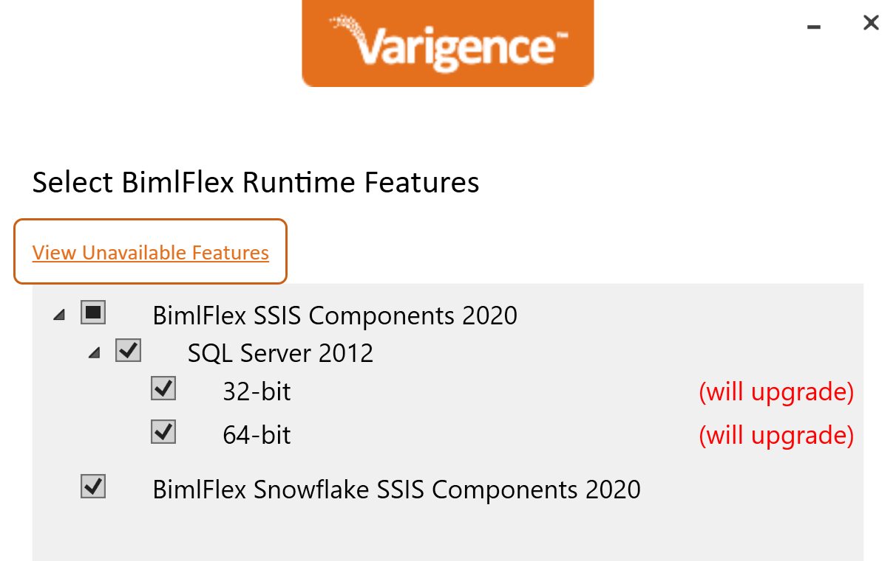
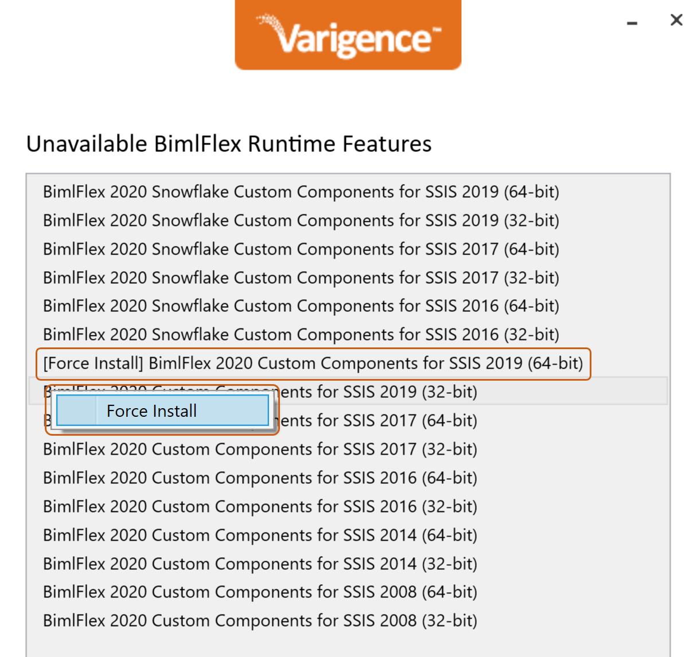

# Issue

Users are encountering an error within BimlFlex indicating that BimlFlex runtime features are unavailable.   
 

# Cause

When installing BimlFlex and other Varigence products, it is necessary to install SQL Server Integration Services (SSIS) custom components. To ensure that BimlFlex operates correctly, users must install a version of the components that is compatible with the target version of SSIS, otherwise users will encounter an error indicating that BimlFlex runtime features are unavailable.  
 

# Resolution 

Users are permitted to bypass this error by force installing the required features to compel compatibility. The solution below details the steps needed to circumvent the BimlFlex runtime feature being marked as unavailable.  
  
**Step 1: Examine the Registry Keys**  
  
For the SSIS components that match the bitness (32-bit vs 64-bit) of the host operating system, the installer checks for the existence of the following registry key:

HKEY\_LOCAL\_MACHINE\\SOFTWARE\\Microsoft\\Microsoft SQL Server\\<VERSION>\\DTS\\Setup  
  
The <VERSION> placeholder will take the following values for each target version of SSIS:  
  
SSIS 2008: 100  
SSIS 2012: 110  
SSIS 2014: 120  
SSIS 2016: 130  
SSIS 2017: 140  
SSIS 2019: 150  
  
When checking for the ability to install a 32-bit SSIS component on a 64-bit host, the installer will perform the same check against the following registry key:  
  
HKEY\_LOCAL\_MACHINE\\SOFTWARE\\WOW6432Node\\Microsoft\\Microsoft SQL Server\\<VERSION>\\DTS\\Setup  
  
To locate the registry keys manually, open "Regedit," (or any preferred registry editing tool) by searching for "regedit" from within the search bar in the taskbar. Regedit is also located at C:\\Windows on most machines.   
  
**Step 2: Force Installation**  
  
In the event that certain components have been marked as "unavailable," but need to be installed, perform the following actions.   
  
Click \`View Unavailable Features\` on the "Select BimlFlex Runtime Features" screen of the BimlFlex installer.   
  
  
  
Identify the Custom Components that are needed, and right-click to select the only option from the context menu, \`Force Install.\` Be sure to select both flavors of bitness for each Custom Component.   
  
Custom Components that have been selected for force installation will be tagged as such in the installation dialog.   
  
   
  
Forced installation of the unavailable components will enable compatibility between BimlFlex and SSIS, allowing users to avoid the BimlFlex Runtime Features being marked as unavailable.