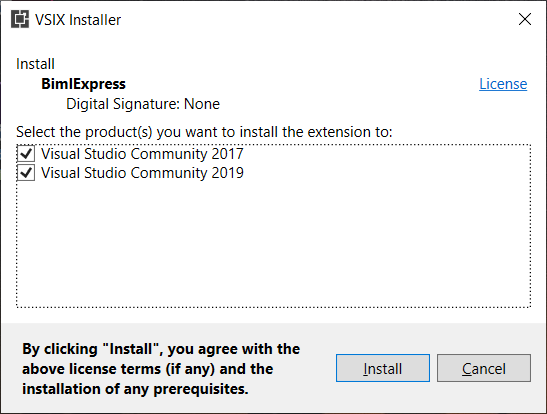

BimlExpress, the free Visual Studio add-in from Varigence, can be downloaded [here](https://varigence.com/bimlexpress). 

There are multiple methods of installation, all of which are detailed below.   
 

**Installing for Current User**

After downloading the BimlExpress installation file, navigate to the location where the file was saved. Double-click on the installation file ending in ".vsix." A VSIX installation dialogue box will appear and prompt users to select which version(s) of Microsoft Visual Studio to install the BimlExpress extension to. 

  
 
  
The installer package will run after selecting the desired Visual Studio versions and clicking "_Install._" A dialog box advising that installation was completed will appear after the process finishes. 

If currently running, Visual Studio will need to be closed and restarted for any BimlExpress changes to take effect.   
 

**Installing from Command Line**  
 

Use vsixinstaller.exe.  
 

**Installing for All Users**  
 

Use vsixinstaller.exe with the /admin switch.