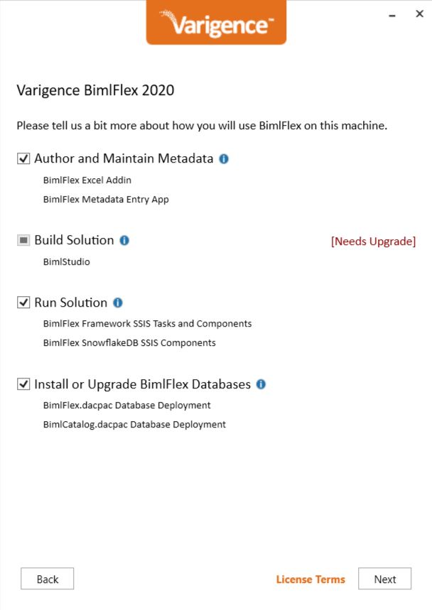
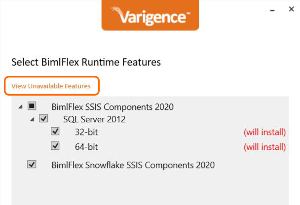
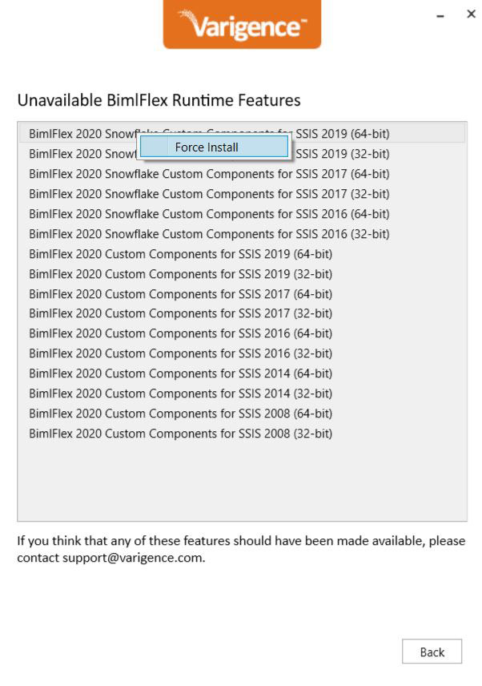

BimlFlex includes templates, metadata definitions, and tooling that enables users to build an end-to-end data solution without ever having to write a single line of code.

The latest version of BimlFlex can be downloaded [here](https://docs.varigence.com/bimlflex/release-notes/release-notes). 

**\*Note:** Unlike BimlExpress and BimlStudio, there are two installer packages for BimlFlex.

*   **BimlFlex Developer Installation** includes all parts of the BimlFlex product and framework. It is suited for:
    *   Modelers who use the BimlFlex App to create metadata that captures business and data models,
    *   Developers who build, test, and customize the resulting solution, and
    *   IT professionals who deploy and manage the generated solution
*   **BimlFlex Runtime Installation** includes the required runtime components for servers that will execute SSIS packages. This is generally only used for solutions that use SSIS as a runtime/orchestration engine and is installed by IT professionals when configuring runtime servers.

There are multiple methods of installation, all of which are detailed below.   
 

**Installing for Current User**   
  
After downloading the BimlFlex installation file, navigate to the location where it was saved. Double-click on the installation file ending in ".exe." The BimlFlex EULA dialogue box will appear, prompting user agreement of the terms or cancellation of the installation process. On the next screen, users will be able to request a trial product key by entering limited personal information, or enter a product key, if already in possession of one. 

The next screen will prompt users to select the applications and features to install. For a BimlFlex developer installation, select all options.

  
   
  
The next screen will prompt users to select the bitness versions. For most developer installations, choose to install both 32-bit and 64-bit versions of BimlFlex Excel Add-In and BimlFlex Metadata Entry. 

The next screen will confirm BimlStudio bitness versions also. Again, it is recommended to install both 32-bit and 64-bit. 

The next screen will allow users to select BimlFlex custom runtime features and SSIS components to install. These features will add additional functionality to SSIS packages. 

**\*Note:** Only identified and available versions are represented in the list. It is possible to force the installation of unavailable options. Click "_View Unavailable Features,"_ to display unavailable features.   
  
   
  
On the subsequent screen, right-click on any feature and select "_Force Install"_ to queue the feature for installation.    
  
 
  
The next screen will install and/or upgrade BimlFlex databases by adding the connection string(s) and clicking "_Add"_ to add the database to the upgrade tasks. Click "_Test"_ to test connection string(s) for any existing databases. 

**\*Note:** Backup all existing databases before upgrading! 

Next, choose to install or upgrade BimlCatalog Databases by, again, adding the connection string(s) and clicking "_Add"_ to add the new database to the upgrade tasks. Click "_Test"_ to test connection string(s) for any existing databases. 

**\*Note:** Backup all existing databases before upgrading!  

The final screen will review all pending installer actions. Click "_Upgrade"_ to allow the installation to occur. A dialogue box will acknowledge success after the installation concludes. Click "_Finish"_ to end the installer. 

Any open applications (Microsoft Excel, BimlFlex, BimlStudio) will need to be closed and restarted for any changes to take effect.   
 

**Installation Through the Command Line**   
  
Using the command line interface to install an application may help expedite the installation process by suppressing some or all of the dialogue boxes that normally appear during installation. There are numerous reasons that a user may prefer command line installation of BimlFlex, such as:

     1) Command line automation of installation. When trying to automate any process, it is necessary to be able to install without needing manually open an installer. 

     2) A need to force the installation of an unavailable feature. For example, installing the 64-bit Excel add-in when the 64-bit version of Excel is not installed, the UI will advise that that feature is unavailable. Using the command line will allow the user to bypass this restriction. Note that the installer GUI now allows the forced installation of unavailable features. 

     3) Other unexpected situations, such as firewall settings that may cause a license check to hang and become unresponsive. 

The process to install BimlFlex through the command line remains the same, regardless of the reason(s) that compel this method of installation.   
 

**Command Line Installation Process**  
  
The command that should be used to install BimlFlex through the command line is: 

BimlFlexDevSetup\_XX.XX.XX.exe-s -InstallFeature:BimlStudiox64,BimlStudiox86,BimlFlexApp\_X64,BimlFlexApp\_X86,BIMLFLEXSSIS2016\_X64,BIMLFLEXSSIS2016\_X86

**\*Note:** The .exe file needs to be replaced with the actual name of the installation file that exists on the computer.   
 

**Available Features Using the 'InstallFeature' Command**  
  
A list of all available features that can be installed via the 'InstallFeature' command can be found below.

**\*Note:** Letter casing is inconsequential for these commands. 

BimlStudio\_X86  
BimlStudio\_X64

BimlFlexApp\_X86  
BimlFlexApp\_X64

BIMLFLEXADDIN\_X86  
BIMLFLEXADDIN\_X64

BIMLFLEXSSIS2008\_X86  
BIMLFLEXSSIS2012\_X86  
BIMLFLEXSSIS2014\_X86  
BIMLFLEXSSIS2016\_X86  
BIMLFLEXSSIS2017\_X86  
BIMLFLEXSSIS2019\_X86

SNOWFLAKESSIS2016\_X86  
SNOWFLAKESSIS2017\_X86  
SNOWFLAKESSIS2019\_X86

BIMLFLEXSSIS2008\_X64  
BIMLFLEXSSIS2012\_X64  
BIMLFLEXSSIS2014\_X64  
BIMLFLEXSSIS2016\_X64  
BIMLFLEXSSIS2017\_X64  
BIMLFLEXSSIS2019\_X64

SNOWFLAKESSIS2016\_X64  
SNOWFLAKESSIS2017\_X64  
SNOWFLAKESSIS2019\_X64

\-S

In the command given above, note the "-s." This flag is short for "silent." When utilizing this command manually, it may appear as though the command did not execute properly or completely. However, giving a few minutes for installation to complete, a review of the "Program Files" directory should reveal a fresh installation of BimlFlex.   
 

**Using the 'UninstallFeature' Command**  
  
Similar to the 'InstallFeature' property described above, users can similarly use the 'UninstallFeature' command to uninstall components from your computer. This property accepts all of the same components listed above.