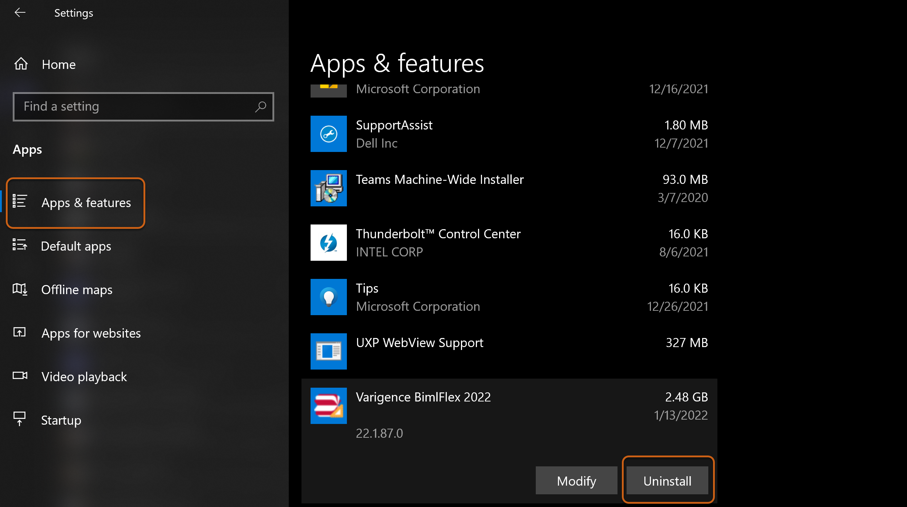
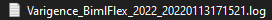

# Issue 

When installing or upgrading a Varigence application (BimlExpress, BimlStudio, or BimlFlex), an error was encountered which prevented successful installation.   
 

# Cause

There are numerous reasons that an installation can error out. An installation error could be the result of an invalid installer file, any number of known or unknown issues with a user's machine, or even as a result of the data within a user's environment (if upgrading). Resolving an installation error may or may not require involvement by Varigence Support.  
 

# Resolution 

There are two recommended methods for working through an installation error.   
  
**Method 1: Uninstallation Followed by Re-Installation**   
  
Oftentimes with installation errors, the most common practice is generally the most successful. It is recommended to: Uninstall the application. Restart your system. Reinstall the application. Restart your system again.  
  
To uninstall, first navigate to Windows Settings and then to "Apps and Features" in the left side menu. Scroll through the list of installed applications to "Varigence BimlFlex/BimlStudio" and select \`Uninstall\`. Restart your machine after uninstallation.

  
 
 

Ensure that you have downloaded the most recent installer files from a trusted source. Those files hosted through Varigence can be located at:   
  
[BimlFlex](https://docs.varigence.com/bimlflex/release-notes/release-notes)  
[BimlStudio](https://varigence.com/bimlstudio)  
[BimlExpress](https://www.varigence.com/bimlexpress)  
  
Restart the installation. Additional Knowledge Base articles on the installation process for each application can be found [here](https://support.varigence.com/knowledgebase/).  
  
In most cases installation will now complete successfully. If installation continues to fail, please continue reading.   
  
**Method 2: Provide Installation Logs to Varigence Support**  
  
If a user is still unable to upgrade or install Varigence applications after following the steps above, they will need to provide their installation logs to Varigence Support for diagnosis.   
  
Installation logs are kept in a user's Temp directory.  
  
To locate the Temp directory, navigate to the Windows search bar, type '%temp%' and press Enter. Locate the installer log named after the application being installed, for example: "Varigence\_BimlFlex\_2022\_xxx.log."

  
 
 

Varigence Support will need to review the installer log to locate the error for installation/upgrade. A case can be opened with Support through either [email](mailto:support@varigence.com) or the Customer Support Self-Service Portal.  
  
For more information on this process see "[Creating and Managing Support Cases](https://support.varigence.com/knowledgebase/article/KA-01022/en-us)."  
 

# Conclusion 

Installation errors can very commonly be resolved by uninstalling and application and reinstalling. For fringe cases where installation continues to fail, Varigence Support will need to review the installation logs to diagnosis where the failure is occurring.