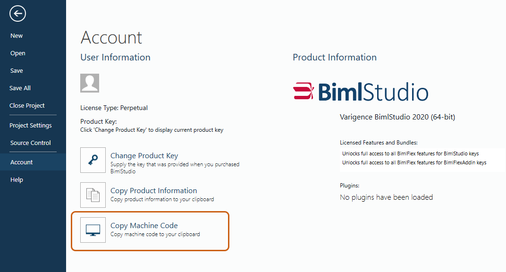
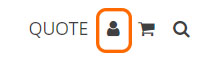
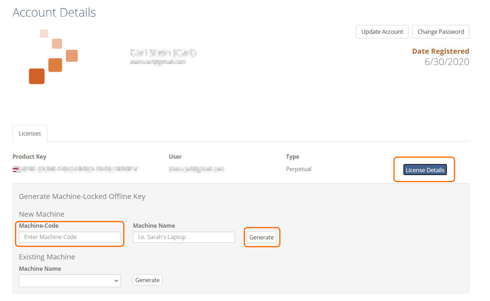
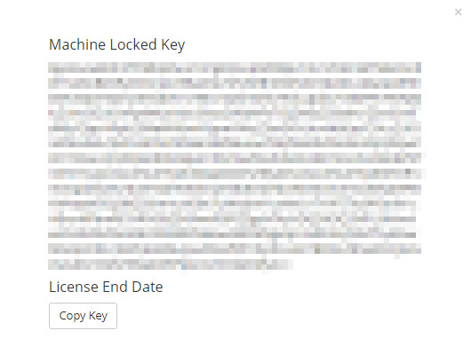

# Product Key Registration 

As with most software programs, all Varigence applications (BimlExpress, BimlStudio, and BimlFlex) require unique product keys to confirm usership and activate paid features. Product keys for BimlExpress, the free Visual Studio add-in, as well as trial key(s) for BimlStudio can be [requested online](https://www.varigence.com/get-trial-key). Non-trial product keys will be provided to users via confirmation email subsequent to having purchased a BimlStudio or BimlFlex license or subscription through the [Varigence store.](https://www.varigence.com/Store)  
 

# Issue

Some machines, whether they lack connection to the internet for security purposes, or operate behind firewall restrictions, may be unable to validate a product key by traditional online activation. Varigence provides offline product keys for such situations. 

Offline product key(s) can be generated directly through the Varigence website, and will require a specific "machine code" associated with the computer that will be running BimlStudio or BimlFlex.   
 

# Resolution

Users must first copy their specific "Machine Code" in order to generate an offline key. This process is different for BimlExpress and BimlStudio/BimlFlex. 

**For BimlExpress:** 

Open Visual Studio. In the menu bar, select: 

_Extensions_ > _BimlExpress_ > _About BimlExpress_ > "Copy Machine Code."

**For BimlStudio/BimlFlex:**

In BimlStudio, click:

_File_ > _Account_ > "_Copy Machine Code._"   
  
 
  
Next, log in to the Varigence Account associated with the Biml product key by going to the [account page](https://www.varigence.com/account). Alternatively, click the "Account" icon from the top-right corner of any Varigence web page. 

  
  
Once logged in and viewing the "Account Details" page, a list of all active Biml product keys will be displayed under the account profile. Click "_License Details"_ on the product key which requires an offline product key, paste the machine code copied from above in the "Machine-Code" field, provide a brief name for the machine being used (optional), and click "_Generate."_ 

  

A window will pop-up providing an offline product key specifically linked to the machine code provided.   
 

  

Copy the generated Machine Locked Key and paste the code into BimlExpress or BimlStudio to activate the product without having to connect to the internet.

Should the Machine Locked Key fail to generate, or any other errors are encountered, do not hesitate to contact [Varigence Support](mailto:support@varigence.com). Ensure that the machine code copied in the first step is provided to Varigence Support along with the initial ticket to ensure a prompt response.