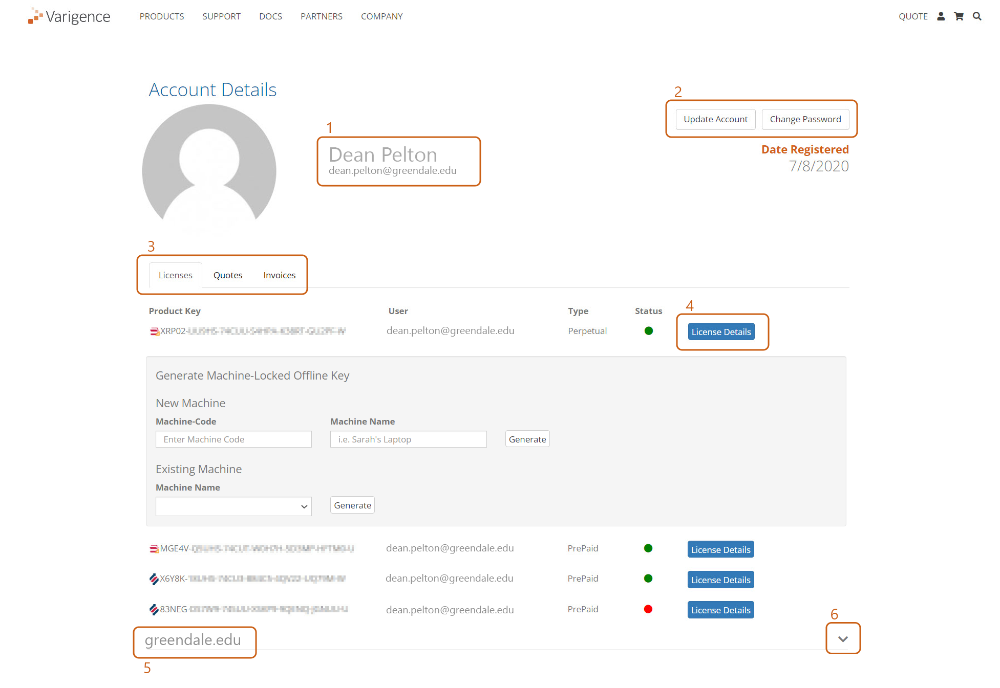

# Understanding the Varigence Account Portal

The Varigence Account Portal ("the portal") serves as a singular access point for users to view and manage licenses, generate offline keys, toggle subscriptions, re-assign product keys, and view quotes or invoices. Features available within the portal differ based on the permissions applied to an account.  
  
**Existing Accounts** 

Existing accounts can access and login to the portal [here](https://varigence.com/Account). Alternatively, click the "Account" icon in the top right of the page from anywhere on Varigence.com.    
  
 
  
**New Accounts**  
  
Register for a new Varigence account [here](https://varigence.com/account/register).   
  
**Note:** It is essential to register a Varigence account with the same email address that matches the email address associated with any given product key.   
  
_e.g._: "User X" creates an account with their email address UserX@gmail.com. However, User X's employer had previously assigned their product key to UserX@greendale.edu. When User X logs in, with their personal email address, they will _not_ see any of their assigned licenses. This will prevent the user from seeing and/or managing their license(s). 

# Account Details  
 

**1\. User Information**  
  
Displays the first name, last name, username, and email address of the user currently logged in.   
  
**2\. Account Management**  
  
"Update Account" allows users to edit their basic profile information: names, username, company, email address\*, and toggle settings for Varigence forum post alerts.   
"Change Password" allows users to do exactly that.   
  
**\*Note:** Changing an email address through the "Update Account" page will require users to re-verify the new email address, and will change the email that is used to log in. No other changes within the Update Account page will affect how a user logs in or require verification.   
  
**3\. Account Tabs**  
  
These tabs allow users to change views between:   
  
**Licenses,** assigned to the email address of that who is logged in  
**Quotes,** requested by a matching email address   
**Invoices,** associated with a matching email address  
  
The Account Details page defaults to the Licenses view upon login or refresh. More information on individual tabs offered below.  
  
**Licenses**  
  
This tab displays all licenses assigned to the email address of the user currently logged in.  
  
Some users may only have one license. For example, they may only own a singular license, or they may be one of many developers on a team, with each team member having been assigned their own license.  
Some users may have none, if they are an Account Admin\* who manages others, but does not actively use the application themself.  
Some users may have many, as some organizations prefer to register multiple licenses to a team lead or manager, who then doles out product keys to the team but does not reassign the keys.  
  
**\*Note:** More information on Account Admin features below.  
  
The Licenses tab lists, from left to right:  
  
a. The icon of the application. Icons are only for either BimlStudio or BimlFlex. Since BimlExpress keys are free and unlimited, they do not appear in the portal. BimlExpress keys cannot be reassigned. If a user needs to register a BimlExpress key to a new email, they should simply request a new BimlExpress key [here](https://www.varigence.com/get-trial-key).  
b. The product key. Each product key is unique.  
c. The name of the user who is currently assigned to that key. The email address will match the address of the user that is currently logged in.  
d. The product type. Possible product types are:  
d. **Perpetual:** Endless licenses that are only available for BimlStudio licenses.  
a  **Subscription:** Can be either monthly or annual. BimlFlex is only offered as a subscription.  
4. **Prepaid:** Set-length usage for either BimlStudio or BimlFlex. Trial keys will also be displayed as "PrePaid" in the list of licenses.  
e. The license status. This is a binary display that is either green (active) or red (expired/cancelled).  
f. Additional "License Details" button. More information below.  
  
**Quotes**  
  
 
  
The [Varigence Store](https://varigence.com/store) offers immediate checkout and key acquisition when paying by credit card. However, many organizations still prefer the traditional Quote > Purchase Order > Invoice method for purchases. Through the Varigence Store, users can add the products and quantity needed to their cart, and instead of checking out, generate a quote for their purchase and share as needed.  
  
Quotes requested through the Varigence Store will be emailed to users and simultaneously uploaded to the Varigence account with a matching email. Users can then download a PDF version of the quote or pay online within a credit card once approval is granted by their purchasing authority.  
  
**Invoices** Similar to Quotes, this tab will display invoices where the user is listed as the recipient.  
  
**Note:** Invoices will only be viewable by the recipient.  
  
_e.g._: UserX@greendale.edu is assigned a BimlFlex license purchased as a monthly subscription. The invoices are sent to, and paid by, Invoices@greendale.edu. Despite being the licensed user, User X will **not** have access to the Invoices through their portal. If Invoices@greendale.edu were to create a Varigence account, they would have zero licenses, but access to current and past invoices.  
  
**4\. License Details button**   
  
Clicking "License Details" will expand a window displaying more product key details and some management options.  
  
 
  
The primary feature offered within this window is the ability to self-generate machine-locked offline keys. Offline keys are frequently needed by organizations or environments where developers cannot authenticate the product keys due to either a firewall or the complete absence of internet connectivity.  
  
Offline keys are generated with an expiration date even if the product type is perpetual. Offline keys can be requested through Varigence Support (support@varigence.com) but can be self-generated much quicker through the portal if the users knows how to do so.  
  
More information on Self-Generating Offline Keys can be found [here](xref:kb-self-generating-offline-product-keys).  
  
Users may also pause/cancel an active subscription through the License Details menu. The background color of the expanded menu will be red if a subscription or trial is disabled/cancelled, and grey if it is otherwise active.  
  
**Note:** The sections listed up until this point will appear for all Varigence Accounts. The following sections only apply to users who have been requested and been granted "Account Admin" permissions.  
  
More information the Account Admin web role can be found [here](xref:kb-account-admin-web-role-permission).  
  
**5\. Admin Account** This collapsed menu will be labeled for the organization which the users is an admin of. The account title is (generally) the same as the email address domain. If the same user is admin of multiple accounts, perhaps a consultant, there will be multiple organization headers for all of the accounts that user administrates.  
  
**6\. Collapse/Expand Organization Licenses**  
  
Once expanded, all licenses assigned to _all users at the organization_ will be displayed.  
  
 
  
  
**Note:** If the Account Admin also has a product key assigned to them, those same keys will also appear in the Organization Licenses list. The duplication of product keys between the Licenses tab and those listed in the Organization Licenses list is expected.  
  
The Account Admin will be able to generate offline machine codes for other users and re-assign licenses between users.  
  
The Account Admin can select from an existing list of users within the organization, or create new users, and then assign a product key accordingly.  
  
 
  
Generating an offline machine code on behalf of another user is the same process described [here](xref:kb-self-generating-offline-product-keys), but requires that the Account Admin have the machine code of the user who needs an offline key, _not their own machine code._