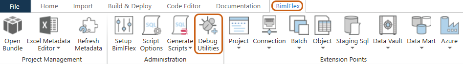
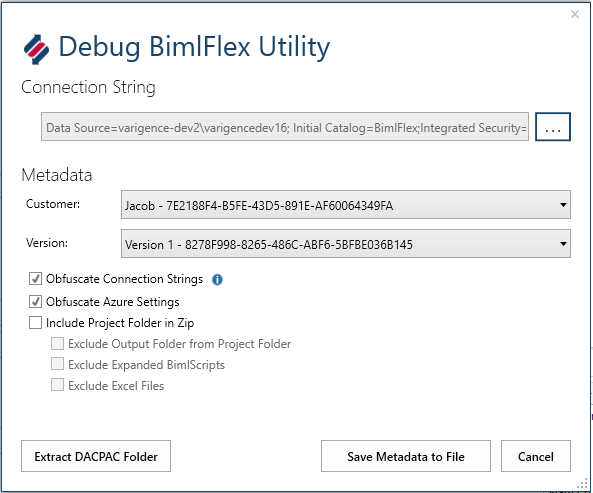
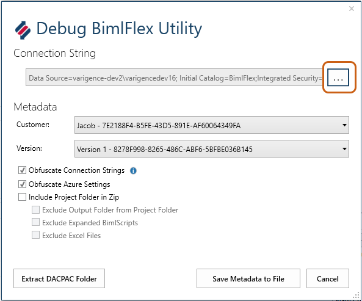
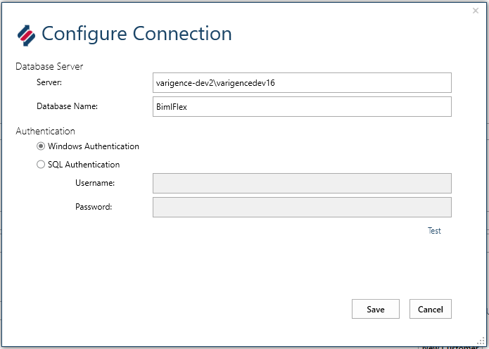
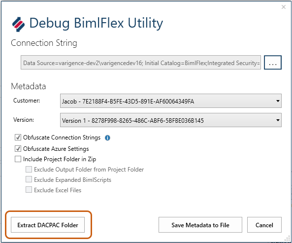
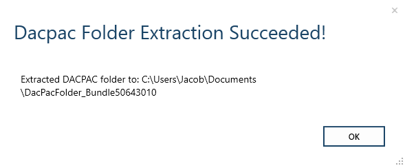

# Issue

Every BimlFlex project is different, as is the computing environment of BimlFlex users. It can be extremely difficult for support to diagnose errors and issues without the ability to replicate a user's environment, to experience those same errors. Varigence support documentation is expansive but it cannot realistically addresses errors and solutions for every instance. In such times, users may need to contact [Varigence Support](mailto:support@varigence.com) for assistance.   
 

# Resolution

Sharing metadata, more specifically _your_ metadata, will be paramount to providing Varigence support with the initial data needed to recreate an environment and resolve user-specific issues within BimlStudio and BimlFlex.    
 

# How to Share Metadata

Use BimlStudio to open the problematic BimlFlex project. Once opened, navigate to the "BimlFlex" tab, and then to the "Debug Utilities" ribbon button.   
 

 
  
A new window will launch, pre-populated with the selected project's connection.   
  
 
  
From this window, users can select "Customer UID_"_ and "Version UID_"_ of the metadata to be extracted and shared with Varigence Support. Users are also provided with options to obfuscate sensitive information such as Connection Strings and Azure Settings. Lastly, users must specify whether to include the contents of the Project folder, as well as the option to exclude certain files.

Once the appropriate data has been determined, click "_Save Metadata to File."_ Users will then be prompted to name and choose the location of the .zip file that will contain the selected metadata. 

The .zip file that has been created will be the file that is shared with Varigence Support from within the support ticket.   
 

# How To Share Metadata from a Non-Default Project Connection

To obtain metadata from a connection that differs from a default project connection, click the ellipsis button to the right of "Connection String" in the Debug BimlFlex Utility window.   
  
 
  
This will cause the Configure Connection window to open, allowing users to configure the desired connection to extract metadata from.   
  
 
Once the desired connection has been configured, users should then define the same options detailed above, such as obfuscating sensitive data, including Project folder contents, and excluding files from within. Click on "_Save Metadata to File"_ as before, designating a name and location for the metadata .zip file.   
 

Extraction of DACPAC Folder
---------------------------

The .zip file created above does not include the contents of the DACPAC folder inside of the Biml Bundle. To extract this folder, click the "_Extract DACPAC Folder"_ button at the bottom left of the Debug BimlFlex Utility dialog box.

 

Users will again be prompted to select an extract location, and a successful dialogue box will confirm the path of the extracted DACPAC folder.  
  
  
  
By providing the .zip file containing the project metadata and, optionally, the extracted DACPAC file, Varigence Support will be equipped with the necessary data to recreate a user environment, diagnose issues and errors, and provide meaningful feedback to quickly resolve these issues.